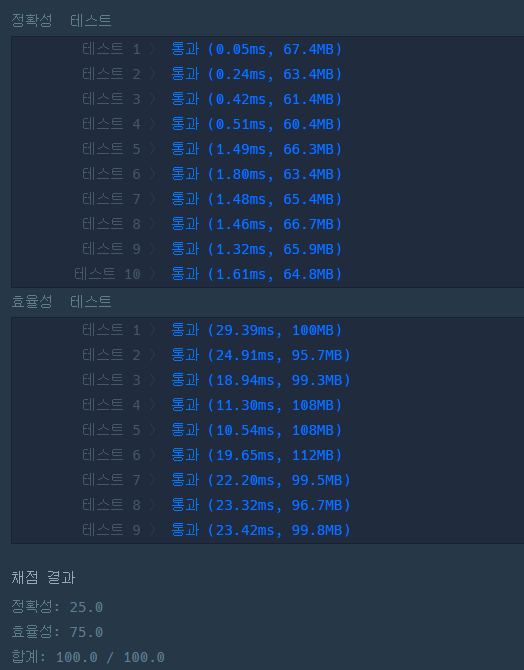

### 프로그래머스 Lv4 [행렬과 연산](https://school.programmers.co.kr/learn/courses/30/lessons/118670) (Java)

> **날짜:** 2026년 5월 15일  
> **알고리즘:** 자료구조, Deque  
> **언어:**  Java  
> **핵심 키워드:** Deque

## 📌 문제 개요

* 행렬에 적용할 수 있는 2가지 연산(`ShiftRow`, `Rotate`)을 효율적으로 처리해야 합니다.
* **ShiftRow:** 모든 행이 아래쪽으로 한 칸씩 밀려납니다. ($O(1)$ 혹은 최소한의 오버헤드로 처리 필요)
* **Rotate:** 행렬의 가장 바깥쪽 테두리에 있는 원소들을 시계방향으로 한 칸 회전시킵니다. 내부 원소들은 가만히 유지됩니다.
* 행렬의 최대 크기는 $50,000 \times 50,000$, 연산의 총개수는 최대 $100,000$개이므로 매번 배열을 실제로 돌리면 반드시 시간 초과가 발생합니다.

---

## 💡 풀이 핵심 (Core Logic)

* **행렬의 구조적 분리:**
* 행렬을 **`왼쪽 기둥(Left Column)`**, **`중간 영역(Mid Rows)`**, `오른쪽 기둥(Right Column)`의 3가지 영역으로 분리하여 관리합니다.
* `Left`와 `Right`는 각각 하나의 독립된 `Deque`로 관리하고, `Mid` 영역은 각 행을 `Deque`로 구성하여 관리합니다.

* **최적화된 연산 설계 ($O(1)$):**
* **ShiftRow:** 왼쪽 기둥, 오른쪽 기둥, 중간 행들의 묶음을 각각 맨 아래에서 빼서 맨 위에 넣는 포인터 조작만으로 해결합니다.
* **Rotate:** 최상단 중간 행(`Top`)과 최하단 중간 행(`Bottom`)의 양 끝값만 양쪽 기둥과 주고받는 형태로 테두리만 회전시킵니다.

---

## 📊 풀이 방식 비교 (Deque 중첩 vs Deque 배열 + 인덱스)

| 비교 항목 | Deque 중첩 구조 (`Deque<Deque>`) | Deque 배열 + 인덱스 구조 (`Deque[] + idx`) |
| --- | --- | --- |
| **구조 복잡도** | 직관적이고 단순함 | 포인터 연산 및 상/하단 인덱스 매핑 필요 |
| **ShiftRow 비용** | `midQue.addFirst(midQue.pollLast())`로 $O(1)$ 처리 | `idx = (idx - 1 + R) % R` 포인터 이동으로 $O(1)$ 처리 |
| **메모리/조회 이점** | 참조의 참조를 거쳐 탐색 오버헤드 있음 | 연속된 배열 공간 조회로 최종 복원 시 약간 더 유리 |
| **실수 가능성** | 매우 낮음 (자료구조가 알아서 처리) | 높음 (방향성과 인덱스가 꼬이기 쉬움) |

---

## 🛠 트러블 슈팅

### 순수 2차원 배열 인덱스 조작 시도 실패

* **문제:** 라이브러리 없이 오직 2차원 배열과 인덱스 포인터(`midLeft`, `midRight` 등) 조작만으로 문제를 해결하려 함.
* **원인:** `ShiftRow` 시 모든 행의 인덱스가 변하지만, `Rotate`는 오직 상단 행과 하단 행의 열 인덱스만 변화시킴. 전역 변수 하나로 열 인덱스를 관리하다 보니, `Rotate` 연산 한 번에 가만히 있어야 할 중간 행들의 데이터까지 한꺼번에 회전하여 행렬이 완전히 뒤틀림.
* **해결:** 부분 회전을 구현하려면 각 행마다 독립적인 헤드 포인터를 관리하는 배열(`int[] mColHead`)이 필수적임을 깨닫고 `Deque` 구조로 선회함.

---

## 🧠 회고 및 결론
 
이 문제는 Deque의 성질을 활용한 좋은 문제라고 생각한다. 

문제를 풀어보면 배열에서 값이 변하는 위치는 8곳이 된다. 따라서 Deque 라이브러리가 아닌 2차원 배열에 index를 관리하면 풀 수 있을 것이라 생각했다. 하지만 생각보다 관리해야하는 index가 많았고, 중간 기둥 부분의 index 관리를 놓치면서 풀이에 실패했다.

---

### 📂 소스 코드
*   [Solution Deque 풀이](./Solution.java)

---

### 🖥️ 실행 결과

---