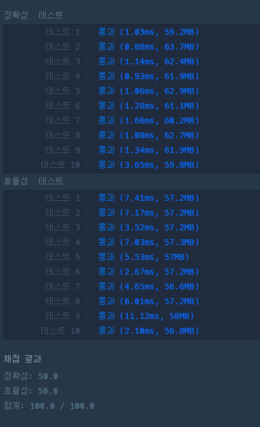
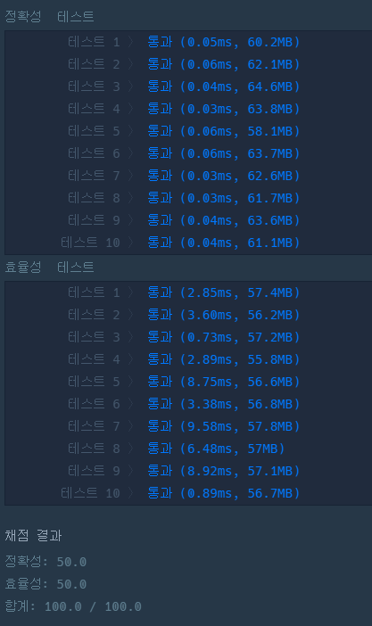
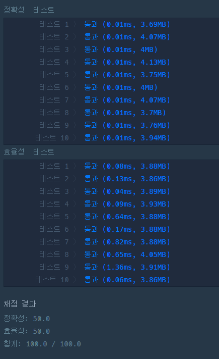

### 프로그래머스 Lv3 [코딩 테스트 공부](https://school.programmers.co.kr/learn/courses/30/lessons/118668) (Java, C++)

> **날짜:** 2026년 5월 18일  
> **알고리즘:** DP(동적 계획법), 다익스트라 
> **언어:**  Java, C++  
> **핵심 키워드:** DP(동적 계획법), 다익스트라 

## 📌 문제 개요

* **목표:** 주어진 모든 문제들을 풀 수 있는 최대 요구 알고력(`targetA`)과 최대 요구 코딩력(`targetC`)에 도달하는 데 필요한 **최소 시간**을 구하는 문제.

 

* **행동 선택지:**
1. 알고력 1분 공부 (시간 1 소모, 알고력 1 증가)
2. 코딩력 1분 공부 (시간 1 소모, 코딩력 1 증가)
3. 문제 풀기 (시간 소모, 특정 알고/코딩력 보상 획득 - **단, 요구 스탯을 충족해야 함**)

---

## 💡 풀이 핵심 (Core Logic)

*  **문제 접근:**
*  모든 문제를 풀 수 있는 알고력과 코딩력을 얻는 최단시간을 return해야합니다.
*  즉, 문제를 풀었는지 여부는 중요하지 않습니다.
  
 

*  **다익스트라:**
*  스탯 격자를 노드로, 공부와 문제 풀이를 간선으로 취급하여 우선순위 큐(PQ)로 최단 시간을 확정하며 탐색하는 방식입니다.

 

*  **DP(동적 계획법):**
*  과거 상태 역추적이 불가능하므로, 현재 스탯에서 미래에 갈 수 있는 다음 칸들의 시간을 먼저 최신화하는 DP방식 활용합니다.
*  중복 누적을 허용해야 하므로 순방향(앞에서부터)으로 밀며 최솟값을 누적합니다.

---

## 📊 풀이 방식 비교 (다익스트라 vs DP(동적 계획법))

| 비교 항목 | 다익스트라 (Dijkstra) | DP (시간 순서 Push DP) |
| --- | --- | --- |
| **핵심 메커니즘** | 비용이 가장 작은 스탯 노드부터 확정 탐색 | 초기 스탯부터 좌표 순서대로 미래 칸 갱신 |
| **자료 구조** | `PriorityQueue`, 스탯 객체, 방문 배열 | 정적 2차원 배열 (`int[][]`) 단 하나 |
| **상태 전이 방식** | 큐에서 꺼낸 현재 스탯 기준 주변 탐색 | 현재 좌표 `(i, j)`에서 미래 좌표로 값 밀어주기 |
| **오버헤드 요인** | Heapify(트리 정렬) 세금 및 객체 생성 GC 부담 | 모든 칸에서 100개의 문제를 전수 대조함 |

---

## 🛠 트러블 슈팅

1. 문제 의도 파악 실패

* 문제의 상한선을 지정하지 않아 최솟값을 찾는 과정에서 문제가 발생했습니다.
* 문제를 풀면서 경우의 수를 저장하는 DP 방식을 생각해봤지만, 어떤 문제를 푸는게 좋을지 우선 순위를 정하기 어려웠습니다.
* 정렬 후 백트래킹 + 가지치기 방식을 고려해보았지만, 시간 복잡도를 고려했을 때 불가능하다고 판단하였습니다.
* 이미 풀었던 문제 중 가장 효율이 좋은 문제를 유지하는 방법도 고려해보았지만, 코딩 난이도가 높다고 생각했습니다.

---

## 🧠 회고 및 결론

다익스트라 풀이는 이 문제를 그래프의 관점으로 변환하는 것이 어려웠다. DP 풀이는 DP로 접근은 하였지만, 정해를 떠올리는 것이 어려웠다.

보통 1차원 DP를 많이 활용하는데 기준점이 2개고, 기억해야하는 값이 시간 하나라는 것을 생각하고 접근해야하는 까다로운 유형이라고 생각한다. 

일단 Java언어로 직관적인 다익스트라를 사용해 문제를 해결하였고, c++을 사용해 DP 풀이를 구현해보았다. 이후 다익스트라 방식과 DP 방식을 비교하기 위해 Gemini를 활용해 Java언어로 변환하여 실행 결과를 비교하였다.

이번에는 아쉽게도 아이디어를 AI(Gemini)에게 받아 풀 수 있었지만, 다음에 비슷한 유형을 만나게 된다면 풀 수 있을것이라고 생각한다.

---

### 📂 소스 코드
*   [다익스트라 Java 풀이](./Solution.java)
*   [DP Java 풀이_with_Gemini](./Solution_dp.java)
*   [DP c++ 풀이](./Solution_dp.c++)
 
---

### 🖥️ 실행 결과

   다익스트라 Java   
   DP 풀이 - Java   
   DP 풀이 - c++ 

---