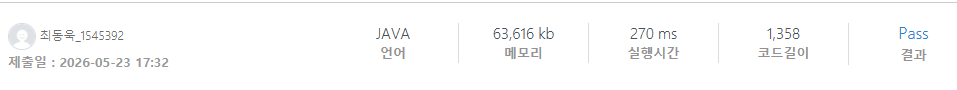

### SWEA 7534 [스택 장인](https://swexpertacademy.com/main/code/problem/problemDetail.do?contestProbId=AWopE0K61xADFARx) (Java)

> **날짜:** 2026년 5월 23일  
> **알고리즘:** Stack, 자료구조  
> **언어:**  Java  
> **핵심 키워드:** Stack 

## 📌 문제 개요

* 스택만을 이용해서 1부터 N까지의 수를 차례대로 넣고 빼서 늘어놓아 원하는 수열을 만들 수 있는지 판별
* 수열을 만들 수 있다면 push(+), pop(-)의 순서를 출력할 것
* 수열을 만들 수 없다면 NO를 출력할 것
* 1 ~ N 사이의 정수가 중복 없이 하나씩 주어짐

---

## 💡 풀이 핵심 (Core Logic)

* **Stack 이해도:**
  문제의 요건 대로 Stack을 잘 활용하는 것이 핵심입니다. 우선 현재 차례의 값 까지 Stack에 Push하고, 현재 값이 Stack의 Top에 위치한다면, pop을 하고 그렇지 않다면 NO를 출력하면 됩니다.

---

## 🧠 회고 및 결론

백준에도 같은 문제가 있다. 당시 백준에서는 실버로 알고 있는데, 상대적으로 SWEA에서는 난이도가 높게 측정된 감이있다. SWEA에서는 40개의 테스트케이스를 2초안에 모두 수행해야하다 보니 난이도가 약간 높게 잡힌것 같기도 하다.

---

### 📂 소스 코드
*   [Solution.java](./Solution.java)
 
---

### 🖥️ 실행 결과

---