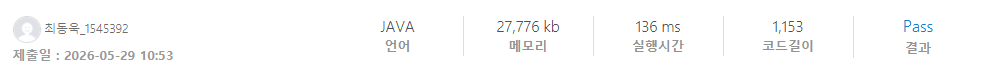

### SWEA 10033 [카드 뒤집기](https://swexpertacademy.com/main/code/problem/problemDetail.do?contestProbId=AXJZ8ua6CTkDFAU3) (Java)

> **날짜:** 2026년 5월 29일  
> **알고리즘:** 그리디, 수학  
> **언어:**  Java  
> **핵심 키워드:** 그리디, 수학

## 📌 문제 개요

* 앞면은 검은색(B), 뒷면은 흰색(W)로 칠해진 카드가 N개가 놓여있다.
* 다음 연산을 0회 이상 반복할 수 있다.
1. 왼쪽에서 $i$번째 카드는 윗면이 B, $i + 1$번째 카드는 윗면이 W인 경우 $i$를 선택할 수 있다.
2. 선택한 $i$번째 카드와 $i + 1$카드를 뒤집는다.
   
 

* 연산을 수행할 수 있는 최대 횟수를 구한다.

---

## 💡 풀이 핵심 (Core Logic)

* **규칙 찾기:**
* `BW`를 뒤집어 `WB`로 만드는 연산은, 문자열 관점에서 **'B'를 오른쪽으로 한 칸 이동시키고 'W'를 왼쪽으로 한 칸 이동시키는 과정**과 같다.
* `B`와 `W`끼리는 서로 순서가 바뀌지 않으므로, 최종 상태는 모든 `W`가 왼쪽, 모든 `B`가 오른쪽으로 모인 `WW...WBB...B` 형태가 된다.
* 따라서 어떤 순서로 연산을 수행하든 최종 연산 횟수는 동일하며, **각 'B' 카드가 자신의 오른쪽에 있는 'W' 카드의 개수만큼 누적해서 이동**하게 된다.
* 오른쪽에서부터 왼쪽으로 역순 탐색하며 `W`의 개수를 카운트하고, `B`를 만날 때마다 그동안 쌓인 `W`의 개수를 더해주면 $O(N)$에 해결할 수 있다.

---

## 🛠 트러블 슈팅

* **결과값 크기:**
* 문자열의 길이 $N$이 커질 경우(예: $N = 200,000$), 최악의 케이스(`BB...BW...WW`)에서 최대 연산 횟수가 약 $100,000 \times 100,000 = 10,000,000,000$(100억)에 달할 수 있다.
* 이는 Java의 `int` 표현 범위(약 21억)를 초과하여 오버플로우가 발생하므로, 정답을 누적하는 변수(`res`)는 반드시 **`long` 타입**으로 선언해야 한다.

---

## 🧠 회고 및 결론

규칙이 단순하여 반복문을 수행하면 금방 시간초과가 발생하는 것을 파악할 수 있다. 따라서 DP를 떠올릴 수도 있지만, 규칙을 발견하고 역순으로 탐색하면 쉽게 풀리는 문제다.

---

### 📂 소스 코드
*   [Solution.java](./Solution.java)
 
---

### 🖥️ 실행 결과

---