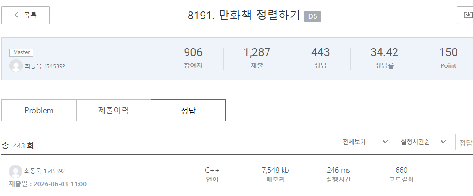

### SWEA 8191 [만화책 정렬하기](https://swexpertacademy.com/main/code/problem/problemDetail.do?contestProbId=AWwtYmX6hvsDFAWU) (c++)

> **날짜:** 2026년 6월 3일  
> **알고리즘:** 정렬, 그리디  
> **언어:**  c++  
> **핵심 키워드:** 정렬, 카운팅

---

## 📌 문제 개요

* **N권의 만화책:** $1$권부터 $N$권까지의 만화책이 책장의 한 행에 무작위 순서($S_i$)로 엉망으로 꽂혀 있다.
* **정렬 규칙 (민영이의 행동):**
* 책장의 **왼쪽 끝에서 오른쪽 끝으로** 순서대로 쭉 훑으며 지나간다.
* 이동 중 현재 내가 '다음에 아래쪽 행에 꽂아야 할 올바른 순서의 책'을 발견하면 아래쪽 행으로 옮긴다. (처음엔 $1$권을 찾고, $1$권을 옮기면 다음엔 $2$권을 찾는 방식)
* 오른쪽 끝에 도달했을 때 아직 옮기지 못한 책이 있다면, **다시 왼쪽 끝으로 돌아와** 위의 과정을 반복한다.

* **목표:** 모든 책을 순서대로 아래쪽 행에 다 옮기기 위해, 책장을 처음부터 끝까지 총 몇 번 훑어야 하는지(회차)를 구하라.

---

### 🎨 예시 분석 ($N=6$, 초기 순서 = `[4, 3, 5, 1, 2, 6]`)

민영이가 책장 앞에서 책을 한 권씩 확인하며 정렬하는 과정이다.

* **1회차 훑기 (목표: 1권부터 시작)**
* `4`, `3`, `5`는 순서가 아니므로 패스한다.
* `1`권 발견 $\rightarrow$ 아래 행으로 이동 (이제 다음 목표는 `2`권)
* `2`권 발견 $\rightarrow$ 아래 행으로 이동 (이제 다음 목표는 `3`권)
* `6`권은 순서가 아니므로 패스한다.
* *1회차 결과:* `1`, `2`권 이동 완료.
 

* **2회차 훑기 (다시 맨 앞으로 돌아와서 목표: 3권부터 시작)**
* `4`권 패스 $\rightarrow$ `3`권 발견 $\rightarrow$ 아래 행으로 이동 (이제 다음 목표는 `4`권)
* `5`권, `6`권은 순서가 아니므로 패스한다.
* *2회차 결과:* `3`권 이동 완료.
 

* **3회차 훑기 (다시 맨 앞으로 돌아와서 목표: 4권부터 시작)**
* `4`권 발견 $\rightarrow$ 이동 (다음 목표: `5`권)
* `5`권 발견 $\rightarrow$ 이동 (다음 목표: `6`권)
* `6`권 발견 $\rightarrow$ 이동 (모든 책 정렬 완료!)
* *3회차 결과:* `4`, `5`, `6`권 이동 완료.
 

👉 **최종 결론:** 책들을 총 **3번** 훑어야 정렬을 끝낼 수 있다.

---

## 💡 풀이 핵심 (Core Logic)

* **연속성의 법칙:** 숫자가 1씩 증가하는 연속된 번호 순서대로 책을 옮긴다. 즉 한 번 훑을때 연속된 숫자를 만나면 모두 책을 옮긴다.
* **그리디 카운팅:** 순방향으로 탐색하면서 $i-1$번이 이전에 등장했는지 체크하면 된다. 등장하지 않았다면 현재 번호를 시작으로 새롭게 훑는 회차가 진행되므로 cnt를 1 증가시킨다.

---

## 🧠 회고 및 결론

원리만 이해하면 굉장히 쉬운 문제다. 보통 책정리 문제는 LIS로 출제되는 경우가 많아 이 문제 역시 LIS인가 싶었지만, 그냥 그리디 카운팅 문제였다.

 

가볍게 문제를 해결하면서 최종 1위까지 달성하였다.(2026/6/3 기준)

---

### 📂 소스 코드
*   [Solution.c++](./Solution.c++)
 
---

### 🖥️ 실행 결과

---