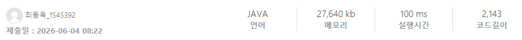

### SWEA 11593 [애너그램 랭킹](https://swexpertacademy.com/main/code/problem/problemDetail.do?contestProbId=AXfRiB5KKW8DFAS5) (Java)

> **날짜:** 2026년 6월 4일  
> **알고리즘:** 수학, 조합론  
> **언어:**  Java  
> **핵심 키워드:** 카운팅, 조합론

요청하신 양식의 톤앤매너(핵심만 명확하게 짚고 넘어가는 개발 블로그 스타일)에 맞춰 깔끔하게 정리했습니다.

---

## 📌 문제 개요

* **애너그램(Anagram):** 주어진 문자열 $S$의 알파벳 구성(문자 종류와 개수)을 그대로 유지하면서 순서만 바꾼 문자열을 의미한다.
* **사전 순 비교:** $S$의 애너그램 중, $S$보다 사전 순으로 앞에 오는(작은) 문자열의 개수를 구해야 한다.
* **제한 조건:** 문자열 $S$의 길이는 20 이하의 대문자로만 구성되며, 중복된 알파벳이 존재할 수 있다.

---

## 💡 풀이 핵심 (Core Logic)

* **자리수 좁히기 (Digit DP 스타일):** 첫 번째 자릿수부터 마지막 자릿수까지 순차적으로 탐색(1중 루프)하며 $S$보다 사전 순으로 작은 문자열을 확정해 나간다. 현재 자리가 확정되면 남은 자릿수와 알파벳 모수가 좁혀진다.

* **사전 순 작은 문자 배치:** 현재 자리에 올 원래 문자($S[i]$)보다 사전 순으로 작은 알파벳들을 하나씩 임의로 배치해 본다(2중 루프). 조건에 맞는 알파벳을 발견하면 개수를 1개 차감하고 다음 연산으로 넘긴다.

* **중복 원소가 있는 순열 (조합론):** 작은 알파벳을 배치한 후, 남은 자릿수들을 채울 수 있는 경우의 수는 중복 순열 공식($\frac{N!}{c_1! \times c_2! \times \dots}$)을 따른다. 매번 26개의 알파벳 카운팅 배열을 돌며(3중 루프) 분모의 팩토리얼 값을 나누어 가짓수를 구하고 정답에 누적한다. 연산이 끝나면 백트래킹 형태로 다시 카운트를 복구한다.

* **64비트 정수형(long) 사용:** 문자열 최대 길이가 20이므로 분자 계산 시 최대 $20!$까지 커질 수 있다. $20! \approx 2.43 \times 10^{18}$로, 일반 `int` 범위를 초과하므로 반드시 `long` 타입을 사용하여 오버플로우를 방지해야 한다.
  
---

## 🛠 성능 최적화 인사이트 (Performance Insights)

* **팩토리얼 테이블 Memoization:** 매 연산마다 팩토리얼을 처음부터 구하면 비효율적이므로, 프로그램 시작 시 `long[] factorial` 배열에 $0!$부터 $20!$까지 미리 계산해 두고 $O(1)$로 조회하여 전체 시간 복잡도를 $O(N \times 26^2)$의 고정된 상수로 묶어둔다.

## 🧠 회고 및 결론

전형적인 수학 문제다. 팩토리얼을 미리 구해두면 중복 연산을 줄일 수 있다.

---

### 📂 소스 코드
*   [Solution.java](./Solution.java)
 
---

### 🖥️ 실행 결과

---