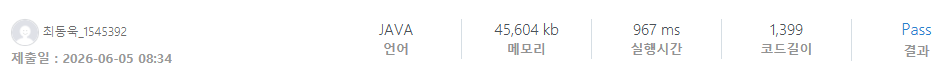

### SWEA 10204 [초밥 식사](https://swexpertacademy.com/main/code/problem/problemDetail.do?contestProbId=AXMCcO16Vi8DFAWv) (Java)

> **날짜:** 2026년 6월 5일  
> **알고리즘:** 정렬, 그리디  
> **언어:**  Java  
> **핵심 키워드:** 정렬, 그리디, 기회 비용

## 📌 문제 개요

* **게임 이론과 최적 전략:** 두 사람이 번갈아가며 접시를 선택할 때, 각자 자신의 이득을 극대화하고 상대방의 이득을 최소화하는 최적의 전략을 구해야 한다.
* **최대 격차 확보:** 게임이 끝났을 때 “(정연이의 행복도) - (현용이의 행복도)” 값을 최대화(정연 입장) 또는 최소화(현용 입장)하는 방향으로 진행된다.
* **대규모 데이터 처리:** 접시의 수 $N$이 최대 100,000개이므로, 일반적인 게임 이론의 상태 압축(Bitmask)이나 DP(동적 계획법)로는 해결할 수 없어 $O(N \log N)$ 이하의 효율적인 알고리즘이 요구된다.

---

## 💡 풀이 핵심 (Core Logic)

* **상대적 기회비용 산출:** 어떤 접시 $i$를 정연이가 먹으면 $+a_i$의 효과를 보고, 현용이가 먹으면 $-b_i$의 효과를 본다. 따라서 해당 접시를 선점함으로써 얻는 상대적 격차(기회비용)는 $a_i - (-b_i) = a_i + b_i$로 두 사람 모두에게 동일하다.
* **그리디(Greedy) 정렬 기법:** 두 사람 모두 상대방에게 큰 타격을 주면서 동시에 내 이득을 챙길 수 있는 **$a_i + b_i$ 가치가 가장 큰 접시부터** 우선적으로 선점해야 한다. 따라서 모든 접시를 $a_i + b_i$ 기준으로 내림차순 정렬한다.
* **교차 선택 시뮬레이션:** 내림차순 정렬된 접시들을 순회하며 인덱스가 짝수(0-indexed)일 때는 정연이가 가져가므로 결과에 $a_i$를 더하고, 홀수일 때는 현용이가 가져가므로 결과에서 $b_i$를 차감하여 정답을 도출한다.

---

## 🧠 회고 및 결론

기회 비용을 생각하는 발상이 까다로운 문제였다. 내가 언제 가장 이익을 얻을 수 있을까를 많이 고민해보았다. 이전에 백준에서 비슷한 유형의 그리디 문제를 푼 경험이 있어 비슷하게 접근을 하였지만, 문제를 풀고 나니 조금 다른 유형이었음을 알았다.

---

### 📂 소스 코드
*   [Solution.java](./Solution.java)
 
---

### 🖥️ 실행 결과

---