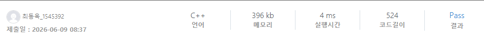

### SWEA 1265 [달란트2](https://swexpertacademy.com/main/code/problem/problemDetail.do?contestProbId=AV18R8FKIvoCFAZN) (c++)

> **날짜:** 2026년 6월 9일  
> **알고리즘:** 수학, 그리디 
> **언어:**  c++  
> **핵심 키워드:** 수학, 그리디

## 📌 문제 개요

* **문제 상황:** 총 $n$개의 달란트가 주어진다. 이 달란트를 $p$개의 묶음으로 나누어 각 묶음의 달란트 개수를 모두 곱했을 때, 그 곱이 최대가 되도록 분할해야 한다.

---

## 💡 풀이 핵심 (Core Logic)

* **달란트 묶음:** 달란트 10개를 3 묶음으로 나누는 방법은 (1, 1, 8), (2, 2, 6) 등 다양하게 존재한다. 곱을 최대로 만드는 묶음은 (3, 3, 4)가 된다. 
  
* **수학 아이디어 도출:** 달란트 10개를 2 묶음으로 나눈다고 가정하면 (1, 9)는 9, (2, 8)은 16, (3, 7)은 21, (4, 6)은 24, (5, 5)는 25로 묶을 수 있다. 곱이 가장 큰 묶음은 (5, 5)로 최대한 균등하게 분할 했을 때 곱이 커진다는 것을 확인할 수 있다.

* **최대한 균등하게 분할하는 그리디:** 달란트를 묶음 수로 나눈 몫은 각 묶음에 들어가는 최소 달란트이며, 나머지 값을 1개씩 묶음에 분배하면 된다.

---

## 🧠 회고 및 결론

D5라고 하기엔 간단한 문제다. 아마 초창기에 수학적 발상에 그리디 증명 때문에 난이도 측정이 된 것 같은데, 문제 수가 많아진 지금 D4로 조정해도 되지 않을까 싶긴 하다.

---

### 📂 소스 코드
*   [Solution.cpp](./Solution.cpp)
 
---

### 🖥️ 실행 결과

---