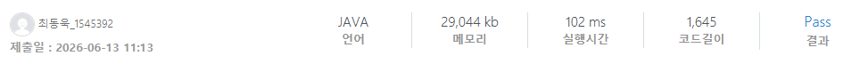

### SWEA 10806 [수 만들기](https://swexpertacademy.com/main/code/problem/problemDetail.do?contestProbId=AXTC4piqD_IDFASe) (Java)

> **날짜:** 2026년 06월 13일  
> **알고리즘:** 재귀  
> **언어:** Java  
> **핵심 키워드:** 재귀, 역산

## 📌 문제 개요

* **초기 상태:** 두 변수 $X = 0, D = 1$이 주어진다.
* **사용 가능한 연산:** 다음 두 가지 작업 중 하나를 선택해 반복 수행할 수 있다.
1. $X$에 $D$를 더한다. ($X \leftarrow X + D$, **비용 1 발생**)
2. $D$에 주어지는 $A_1, A_2, \dots, A_N$ 중 하나를 곱한다. ($D \leftarrow D \times A_i$, **비용 없음**)

* **목표:** $D$를 곱하는 횟수와 상관없이, $X$의 값을 정확히 목표치 $K$로 만들기 위해 **$X$에 $D$를 더하는 횟수(1번 연산)의 총합을 최소화**하라.

---

## 💡 풀이 핵심 (Core Logic)

* **다항식 역산 (Top-down):** 정방향으로 $X$를 키워가면 $D$의 변화 조건이 너무 다양해지며, 범위를 제한할 수 없다. 역으로 $k$를 감소시키며 1이 되는 조건을 찾으면 결과값을 재사용하며 불필요한 D연산을 압축할 수 있다.
* **나머지 점프 (State Compression):** 1씩 빼며 기어가는 선형 탐색을 하면 10억 스케일에서 무조건 시간 초과가 난다. $K$를 $A_i$로 나누었을 때의 나머지($K \pmod{A_i}$)를 '해당 단계에서 $X += D$를 수행한 비용'으로 한 번에 계산해 누적하고, 몫($K / A_i$)의 단계로 단숨에 순간이동(Jump)한다. 숫자가 배수로 쪼개지므로 탐색 깊이는 최대 30층 이하($O(\log K)$)로 압축된다.
* **메모이제이션 (Memoization):** 서로 다른 연산 경로를 거쳐 동일한 중간 `target` 숫자에 도달하는 중복 방문이 빈번하게 발생한다. `Map<Integer, Integer>` 자료구조를 활용해 각 상태에 도달하는 최소 연산 횟수를 기록하고, 이미 방문한 상태는 연산 횟수 비교 후 처리한다.

---

## 🧠 회고 및 결론

이런 유형은 역방향 연산을 기억하면 좋다. 정방향으로 풀 경우 $D$를 더하는 연산 범위를 제한할 수 없고, K를 넘어가는 경우의 예외처리가 필요하다. 또한 숫자의 범위가 큰 관계로 기존의 자료형 범위를 넘어갈 위험성이 존재한다.

---

### 📂 소스 코드
*   [Solution.java](./Solution.java)
 
---

### 🖥️ 실행 결과

---