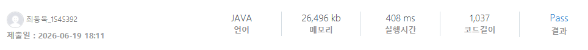

### SWEA 8558 [동현이의 망한 옷가게](https://swexpertacademy.com/main/code/problem/problemDetail.do?contestProbId=AW1Bu6Lq2iwDFARC) (Java)

> **날짜:** 2026년 6월 19일  
> **알고리즘:** 그리디  
> **언어:**  Java  
> **핵심 키워드:** 그리디

## 📌 문제 개요

* **제한 조건 및 입력 스케일:** * 테스트 케이스의 수 $T$가 주어지며, 손님의 수 $N$은 최대 $10^5$이다.
* 각 손님이 보유한 초기 소지금 $A_i$는 최대 $10^9$의 범위를 가진다.

* **최적화 목표:** * "가진 돈이 0원이 되면 안 된다"는 제약 조건을 만족하면서 동현이가 판매할 수 있는 옷의 총개수(최대 정수량)를 산출한다.
* 누적 판매량이 `int` 자료형의 표현 한계를 초과할 수 있으므로, 대용량 정수 연산 처리가 요구된다.

---

## 💡 풀이 핵심 (Core Logic)

* **초기 상태의 1원 수렴 처리:** * 최초 가격 $C=1$일 때, 첫 번째 손님 $A_0$의 소지금을 $1$원짜리 옷으로 최대한 깎아내면 남은 소지금은 무조건 **$1$원**으로 수렴한다.
* 이 연산은 초기값 분리를 통해 단 한 번의 연산($A_0 - 1$)으로 압축되며, 실질적인 가격 빌드업의 시작점인 $C=2$의 마지노선을 형성한다.

* **나머지 1 강제 수렴 메커니즘:**
* 동현이는 매 라운드 가격을 유연하게 올려칠 수 있으므로, 어떤 큰 값이 들어오든 이전 라운드까지 조정된 가격들을 조합하여 **최종 남은 금액을 무조건 $1$원으로 강제 수렴**시킬 수 있다.
* 따라서 모든 손님에 대해 기본적으로 $(A_i - 1) / C$ 연산을 통해 소지금을 $1$원만 남기고 전부 옷을 사는 데 탕진하도록 설계한다.

* **정밀한 타이밍 제어 (val == cost 임계점 판정):**
* 모든 값을 $1$로 만드는 이 필승 전략에서 **유일하게 불가능한 순간은 오직 `val == cost`인 상황**이다.
* 만약 현재 가격 $C$와 손님의 돈 $A_i$가 일치한다면, $C$원으로 옷을 사는 순간 손님의 돈은 **$0$원**이 되어 규칙을 위반하게 된다.
* 또한, $A_i < C$인 상황은 발생할 수 없다. 왜냐하면 $C$보다 작은 값들은 이미 앞선 라운드에서 $0$원이 되어 탈락했어야 하는 모순이 생기기 때문에, $C$보다 작은 유효한 소지금은 애초에 존재할 수 없다.
* 결론적으로 `val == cost`가 되는 충돌 타이밍에만 정확하게 $C$를 $1$ 증가시켜 해당 가격을 영원히 배제하고 다음 상한선을 통제한다. 이로써 불필요한 분기문 및 실시간 나머지 연산($\%$)을 완전히 배제한 $O(N)$ 단방향 최적화가 성립한다.

---

## 🧠 회고 및 결론

간단하면서도 정밀한 요건을 충족해야하는 그리디 문제였다. 모든 금액을 1원만 남긴다는 발상과 1원을 만들지 못하는 순간을 찾는것이 풀이의 핵심이다.

---

### 📂 소스 코드
*   [Solution.java](./Solution.java)
 
---

### 🖥️ 실행 결과

---