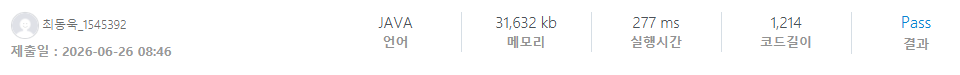

### SWEA 4050 [재관이의 대량 할인](https://swexpertacademy.com/main/code/problem/problemDetail.do?contestProbId=AWIseXoKEUcDFAWN) (Java)

> **날짜:** 2026년 6월 26일  
> **알고리즘:** 그리디  
> **언어:**  Java  
> **핵심 키워드:** 그리디, 정렬

## 📌 문제 개요

* **상황:** 옷 매장에서 3벌의 옷을 구매할 때마다 그중 가장 저렴한 한 벌의 가격을 면제해 주는 3대 1 세일 행사를 진행한다. 3벌을 초과하여 구매하더라도 3벌씩 묶어서 계산하면 동일한 할인을 적용받을 수 있다.
* **문제점:** 옷을 어떻게 3벌씩 그룹화하느냐에 따라 면제받는 금액이 달라지므로, 전체 지불 금액의 차이가 발생한다.
* **목표:** 사고자 하는 옷의 벌 수 $N$과 각 옷의 가격 $C_i$가 주어질 때, 할인을 최대로 받아 최종적으로 지불해야 하는 최소 금액을 구한다.

---

## 💡 풀이 핵심 (Core Logic)

* **그리디 알고리즘(Greedy Algorithm)과 정렬:** 가장 큰 할인을 받기 위해서는 비싼 옷들을 우선적으로 3벌씩 묶어야 한다. 옷의 가격 배열을 내림차순(또는 오름차순 정렬 후 역순 탐색)으로 정렬한 뒤, 인덱스 기준으로 3번째(인덱스 2, 5, 8, ...)에 위치한 옷들의 가격이 각 묶음에서 가장 저렴한 옷이 되므로 이 값들을 면제 금액으로 제외한다.
* **자료형 선택 (Integer Overflow 방지):** 옷의 벌 수 $N$은 최대 100,000개이며, 각 옷의 가격 $C_i$ 역시 최대 100,000이다. 모든 옷의 가격을 합산하거나 최종 지불 금액을 계산하는 과정에서 정수형 데이터 타입(`int`)의 표현 범위를 초과할 수 있으므로, 결과 변수는 64비트 정수형(`long`)으로 선언하여 오버플로우를 방지해야 한다.

---

## 🧠 회고 및 결론

내림차순 정렬 후 3의 배수 위치를 제외한 합을 구하면 되는 간단한 문제다.

---

### 📂 소스 코드
*   [Solution.java](./Solution.java)
 
---

### 🖥️ 실행 결과

---