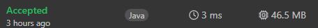

### LeetCode 6 [Zigzag Conversion](https://leetcode.com/problems/zigzag-conversion/description/) (Java)

> **날짜:** 2026년 6월 29일  
> **알고리즘:** 문자열, 수학  
> **언어:**  Java  
> **핵심 키워드:** 규칙 찾기

## 📌 문제 개요

* **상황:** 주어진 문자열 `s`를 `numRows`만큼의 행에 대해 지그재그(Zigzag) 패턴으로 배치하고, 각 행을 순서대로 읽어 병합한 결과를 반환해야 한다.
* **문제점:** 문자열을 실제로 2차원 배열에 배치할 경우 불필요한 메모리 할당 및 복사 비용이 발생한다. 특히 문자열의 최대 길이가 1,000으로 제한되어 있으나, 효율적인 인덱스 제어 없이 구현할 경우 성능이 저하될 수 있다.
* **목표:** 지그재그 패턴의 수학적 주기성을 활용하여, 문자열의 인덱스만으로 각 행에 위치할 문자를 순차적으로 추출하고 이를 효율적으로 재조합한다.

---

## 💡 풀이 핵심 (Core Logic)

* **주기성(Cycle) 기반 인덱스 제어:** 지그재그 패턴은 $2 \times (\text{numRows} - 1)$의 주기로 반복되는 구조를 가진다. 이 주기를 활용하여 각 행(`i`)마다 다음 문자의 위치를 산술 연산만으로 직접 접근한다.
* **상태 기반의 경로 추적:** 각 행에서 다음 문자를 찾을 때, '내려가는 거리'(`add[0]`)와 '올라가는 거리'(`add[1]`)를 변수로 관리한다. 루프 내에서 이 두 값을 비트 연산(`bit ^= 1`)을 통해 토글함으로써, 복잡한 조건문 없이 순차적으로 문자를 선택하고 `StringBuilder`에 추가한다.

---

## 🧠 회고 및 결론

우선 이 문제를 풀 때 숫자들의 간격에 집중했다. 지그재그로 배치한다면 특정 숫자가 반복적으로 나타날 것이라고 생각했고, 행마다 규칙의 변화를 체크한 후 문제를 해결하였다.

물론 이 문제는 숫자의 범위가 작기 때문에 2차원 배열을 만들고, 지그재그 문자열을 배치하는 방식으로도 풀 수는 있다. 이 경우 String 배열이 아닌 char 배열을 사용해 메모리를 절약하고, 주어지는 문자열에 포함되지 않는 값(숫자, 특수 문자 등)으로 배열을 초기화하면 된다. 하지만 이렇게 하면 불필요한 메모리 소모량이 많아지고, 초기값 초기화, 지그 재그 문자열 배치, 출력값 생성 과정에서 조건 문 등 불필요한 연산이 너무 많아진다.

---

### 📂 소스 코드
*   [Solution.java](./Solution.java)
 
---

### 🖥️ 실행 결과

---