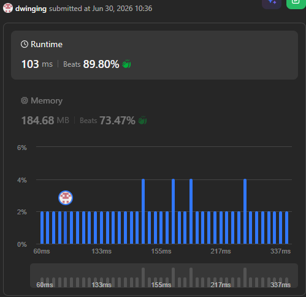

### LeetCode 2920 [Maximum Points After Collecting Coins From All Nodes](https://leetcode.com/problems/maximum-points-after-collecting-coins-from-all-nodes/description/) (Java)

> **날짜:** 2026년 6월 30일  
> **알고리즘:** 트리, DFS, 연결리스트, DP 
> **언어:**  Java  
> **핵심 키워드:** 트리, DFS, DP

## 📌 문제 개요

* **상황:** $0$번 노드를 루트로 하는 $n$개의 노드로 구성된 무방향 트리 구조가 주어진다. 각 노드에는 특정 개수의 동전(`coins[i]`)이 배치되어 있으며, 부모 노드의 동전을 먼저 수집해야만 자식 노드의 동전을 수집할 수 있다는 제약 조건 하에 모든 동전을 수집해야 한다.
* **문제점:** 동전을 수집하는 두 번째 방식(동전 개수를 반토막 내어 수집)을 선택할 경우, 해당 노드의 하위 서브트리에 속한 모든 자식 노드의 동전 개수가 영구적으로 절반(`floor(coins[j] / 2)`)으로 감소한다. 이러한 영향이 하위 노드로 누적되므로, 단순한 탐색으로는 상태 공간이 비대해져 메모리 초과 및 시간 초과가 발생할 수 있다.
* **목표:** 부모 노드로부터 누적된 반토막 연산의 횟수가 하위 노드에 미치는 영향도를 파악하고, 각 노드에서의 최적의 선택을 조합하여 최종적으로 얻을 수 있는 총점의 최댓값을 구한다.

---

## 💡 풀이 핵심 (Core Logic)

* **상태 공간 압축을 통한 DP 설계:** 동전의 최댓값은 $10,000$으로 제한된다. 정수를 $2$로 계속 나누는 연산(`floor(coins[i] / 2)`)의 특성상, 최대 $14$번 이상 나누게 되면 동전의 개수는 무조건 $0$으로 수렴한다. 이를 활용하여 DP 테이블의 상태를 `dp[노드 번호][누적 나누기 횟수]`로 정의하고, 두 번째 차원의 크기를 $15$로 제한함으로써 상태 공간을 $O(N \times 14)$로 극단적으로 압축한다.
* **하향식(Top-down) 트리 DP와 역주행 방지:** 무방향 그래프 형태로 간선이 주어지므로 재귀 호출 시 부모 노드로 되돌아가는 무한 루프를 방지해야 한다. 별도의 `visited` 배열을 사용하는 대신, DFS 인자로 직전 부모 노드의 번호(`p`)를 전달하여 `if (child != p)` 조건문만으로 사이클을 차단하고 자식 노드 방향으로만 탐색을 강제한다.
* **서브트리 점수의 독립적 누적:** 현재 노드에서 1번 방식을 선택한 경우와 2번 방식을 선택한 경우의 점수를 각각 `val1`, `val2` 변수에 할당한다. 이후 자식 노드들을 순회하며 각 선택지에 따른 서브트리의 DFS 반환 값을 독립적으로 합산(`+=`)하여 누적한 뒤, 두 결과 중 최댓값을 반환하여 메모이제이션을 수행한다.

---

## ⚙️ 시간과 공간의 트레이드오프 (Time-Space Trade-off) 분석

### 1. 가변 크기 할당 방식 (Dynamic Allocation inside DFS)

* **메커니즘:** 각 노드의 실제 깊이에 맞춰 DFS 재귀 함수 내부에서 DP 배열을 동적으로 생성하는 방식 (`dp[node] = new int[depth + 1]`).
* **단점 (속도 저하의 원인):**
* **DFS 내부 객체 오버헤드:** 기저 조건을 통과한 후 DFS 함수 내부에서 매번 `new` 연산자가 호출된다. 트리 전체 노드 수($N = 10^5$)만큼 재귀가 돌 때마다 새로운 배열 객체가 힙(Heap) 영역에 생성되므로, 메모리 할당 및 포인터 생성 비용이 누적되어 실행 속도가 저하된다.
* **가비지 컬렉션(GC) 부하:** 재귀 과정에서 수만 개의 임시 배열 객체가 생성되므로 자바의 가비지 컬렉터가 수거해야 할 대상이 늘어나고, 이로 인해 CPU 연산 자원이 낭비된다.
* **메모리 파편화 및 캐시 미스:** 배열들이 메모리 공간상에 불연속적으로 배치된다. 이 때문에 CPU가 자식 노드의 DP 상태를 참조할 때 캐시 지역성(Locality)을 활용하지 못해 물리 메모리 접근이 늘어나며 데이터 로딩 속도가 느려진다.

### 2. 고정 크기 선언 방식 (Static Allocation at Initialization)

* **메커니즘:** 코인이 0이 되는 수학적 임계치인 15를 상수로 고정하고, 프로그램 시작 시점에 단 한 번 배열을 전체 할당하는 방식 (`new int[N][15]`).
* **장점 (실행 속도 극대화):**
* **단 1회의 힙 할당:** DFS 재귀로 진입하기 전 메인 메서드 초입에서 메모리 할당이 끝난다. DFS 함수 내부에서는 추가적인 배열 생성 연산이 발생하지 않으며, 오직 인덱스를 통한 고속 참조 및 쓰기 연산만 수행된다.
* **캐시 지역성 최적화:** 배열이 메모리의 연속된 블록에 물리적으로 배치되므로, CPU 캐시 적중률(Cache Hit Rate)이 높아져 루프 및 자식 노드 참조 속도가 빨라진다.
* **단점 (공간 오버헤드):**
* 깊이가 얕은 리프 노드들까지 크기 15의 공간을 가지게 되어 약 6MB 수준의 공간적 낭비가 발생한다.

---

## 🛠 트러블 슈팅

### 정수 나눗셈 내림(Truncation)으로 인한 데이터 손실

* **원인:** 초기 구현 시, 코드 복잡도를 줄이기 위해 `dev=1` 상태에서 현재 노드의 코인을 `dev`번 나눈 값(`val1`)을 구한 뒤, 1번 방식(그대로 수집)의 점수를 역산하기 위해 `val2 = val1 * 2 - k` 공식을 사용하였다. 그러나 자바의 정수 나눗셈 연산은 소수점 아래를 버리므로, 코인 개수가 홀수인 경우(예: 코인 3개, `dev=1`일 때 `3 / 2 = 1`이 되고, 여기에 2를 곱하면 `2`가 됨) $1$점이 영구적으로 소실되는 버그가 발생하였다.
* **해결:** `dev` 인자의 시작점을 `0`으로 명확히 교정하였다. 현재 노드가 부모로부터 받은 누적 영향도를 바탕으로 순수한 현재 코인 상태(`currentCoin = coins[node] >> dev`)를 먼저 정의한 뒤, `val1 = currentCoin - k` 및 `val2 = currentCoin / 2`와 같이 각 선택지의 연산식을 완전히 독립 분리하여 정수 손실 가능성을 원천 차단하였다.

---

## 🧠 회고 및 결론

까다로운 포인트가 많았지만 재미있는 문제였다. 탑다운 DP 구조 설계까지는 무난했으나, 연산 횟수의 상한선을 이용해 상태 공간을 압축하는 핵심 아이디어는 놓쳤다.

풀이 과정에서 정수 나눗셈 내림 손실 오류로 인해 디버깅의 시간이 조금 걸렸지만, 오랜만에 트러블 슈팅을 작성하게 되는 사례가 되었다.

---

### 📂 소스 코드
*   [Solution.java](./Solution.java)
 
---

### 🖥️ 실행 결과

---