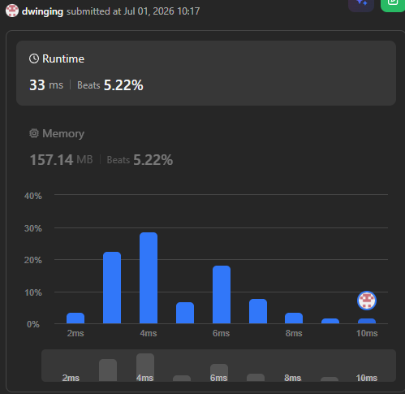
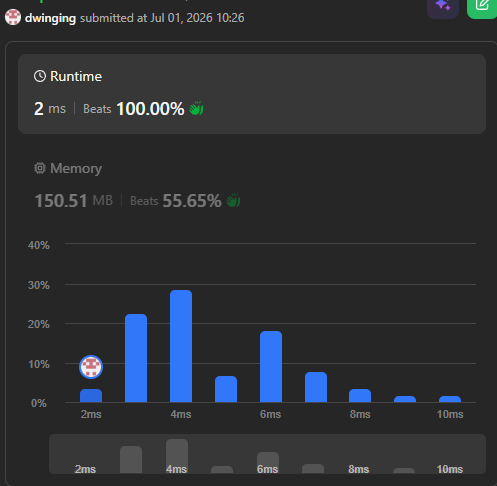

### LeetCode 3584 [Maximum Product of First and Last Elements of a Subsequence](https://leetcode.com/problems/maximum-product-of-first-and-last-elements-of-a-subsequence/description/) (Java)

> **날짜:** 2026년 07월 01일  
> **알고리즘:** DP, 두 포인터  
> **언어:**  Java  
> **핵심 키워드:** DP, 두 포인터

## 📌 문제 개요

---

## 💡 풀이 핵심 (Core Logic)

---

## 📊 풀이 방식 비교 ( vs )

---

## 🧠 회고 및 결론
 

---

### 📂 소스 코드
*   [DP 풀이 - java](./Solution1.java)
*   [두 포인터 풀이 - java](./Solution2.java)
   
---

### 🖥️ 실행 결과

   DP 풀이  

   두 포인터 풀이

---