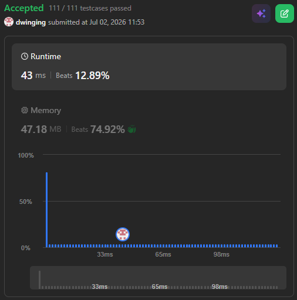
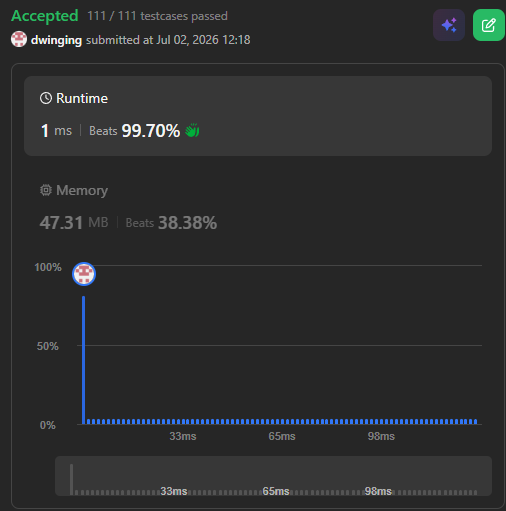

### LeetCode 45 [Jump Game II](https://leetcode.com/problems/jump-game-ii/description/) (Java)

> **날짜:** 2026년 7월 2일  
> **알고리즘:** DP, 그리디 
> **언어:**  Java  
> **핵심 키워드:** DP, 그리디 

## 📌 문제 개요

* 주어진 0-indexed 정수 배열 `nums`의 시작점(인덱스 $0$)에서 출발하여 마지막 원소(인덱스 $n-1$)에 도달하기 위한 **최소 점프 횟수**를 구하는 최적화 문제다.
* 배열의 각 원소 `nums[i]`는 해당 위치에서 전방으로 도약할 수 있는 **최대 점프 거리**를 나타낸다. 즉, 현재 인덱스가 $i$일 때 $0 \le j \le nums[i]$ 및 $i + j < n$을 만족하는 임의의 인덱스 $i + j$로 이동할 수 있다.
* 제약 조건상 항상 마지막 인덱스에 도달할 수 있는 테스트 케이스만 주어지며, 단일 경로 탐색 과정에서 발생하는 불필요한 중복 연산을 제거하고 시간 및 공간 복잡도를 최적화하는 스케줄링 능력이 요구된다.

---

## 💡 풀이 핵심 (Core Logic)

### 1. 다이내믹 프로그래밍을 통한 모든 경로 완전 탐색 ($O(N^2)$)

* 초기 위치인 인덱스 $0$에서 출발하여 각 발판마다 이동할 수 있는 모든 후속 위치의 최소 점프 횟수를 반복 갱신하는 상향식(Bottom-up) DP 방식이다.
* 특정 인덱스 $i$에 도달할 수 있음이 확인되면(`dp[i] != 0`), 해당 위치의 최대 도약 거리 `val` 범위 내에 있는 모든 인덱스 `i + j`를 순회하며 최솟값을 누적한다.
* 직관적이고 직렬적인 전개 구조를 가지나, 동일한 하위 인덱스를 다수의 상위 발판에서 중복 방문 및 비교 연산하게 되므로 배열의 크기가 커질수록 연산 비용이 가파르게 증가한다.

### 2. 탐욕법 기반 영토 확장 및 중복 제거 ($O(N)$)

* 현재까지 누적된 점프 횟수로 도달할 수 있는 경계선을 구역(Window) 단위로 관리하는 탐욕법(Greedy) 알고리즘이다.
* 현재 점프 단계에서 접근 가능한 인덱스 범위 `[near, far]` 내부의 발판들을 순회하며, 다음 도약 시 도달 가능한 절대 인덱스의 최댓값 `farthest`를 갱신한다.
* 현재 구역의 탐색이 완료되면 다음 구역의 시작점을 지난 구역의 끝 다음 칸(`near = far + 1`)으로 밀어버리고, 구역의 끝점을 갱신된 최댓값(`far = farthest`)으로 바톤 터치한다. 이 과정에서 한 번 검사한 인덱스는 두 번 다시 조회하지 않으므로 중복 스캔이 원천 차단된다.

---

## 📊 풀이 방식 비교 ( DP 완전 탐색 vs 그리디 중복 제거 )

| 비교 항목 | DP 완전 탐색 (1번 풀이) | 그리디 중복 제거 (2번 풀이) |
| --- | --- | --- |
| **알고리즘 성격** | 상태 배열 기반 최솟값 덮어쓰기 완전 탐색 | 구역 경계 제어를 통한 단방향 스캔 탐욕법 |
| **시간 복잡도** | $O(N^2)$ (최악의 경우 중첩 루프로 인한 연산 수렴) | $O(N)$ (배열 내 모든 원소를 정확히 단 1회씩만 순회) |
| **공간 복잡도** | $O(N)$ (크기 $N$의 `dp` 배열 할당 필요) | $O(1)$ (구역 제어를 위한 변수 4개로 제한) |
| **메모리 오버헤드** | 대규모 데이터 입력 시 힙 영역 내 추가 배열 할당으로 가비지 컬렉션 유발 | 기본 원시 타입 변수만 유지하므로 메모리 오버헤드 전무 |
| **데이터 접근 흐름** | 현재 인덱스에서 갈 수 있는 미래의 모든 칸을 순차적으로 전진 갱신 | 현재 도달 가능한 영토를 일괄 스캔 후, 다음 영토로 건너뛰며 정산 |
| **최종 평가** | 구현이 직관적이나 대규모 입력 데이터셋에서 시간 초과 예외를 발생시킴 | 불필요한 중복 연산과 추가 공간을 완벽히 배제하여 런타임 성능을 극대화함 |

---

## 🧠 회고 및 결론

보통은 도달할수 없는 경우도 포함되어있어, 백트래킹, DP, 다익스트라 등을 활용하는 유형이라서 다양한 풀이를 고민해보았다. 

우선은 가장 직관적인 DP로 문제를 해결했다. 이전에 도착했다는 뜻은 점프 횟수가 적은 방법이 있다는 의미이고, 도착한 적이 없다는 것은 현재 위치는 점프로 도달이 불가능하다는 뜻이다. 생각을 해보면, 현재 위치의 점프 횟수가 0이 아니라면 모든 위치에서 점프가 가능하고, 모든 위치는 도달이 가능하다.

따라서 DP는 비효율적인 풀이이기도 하다.

실제로 결과에서 시간차이가 많이 나왔고, 중복 연산을 줄이는 방법이 있다는 것을 알게되었다.

---

### 📂 소스 코드
*   [DP 풀이](./Solution_dp.java)
*   [그리디 풀이](./Solution_greedy.java)
 
---

### 🖥️ 실행 결과

   DP 풀이   
   그리디 풀이

---