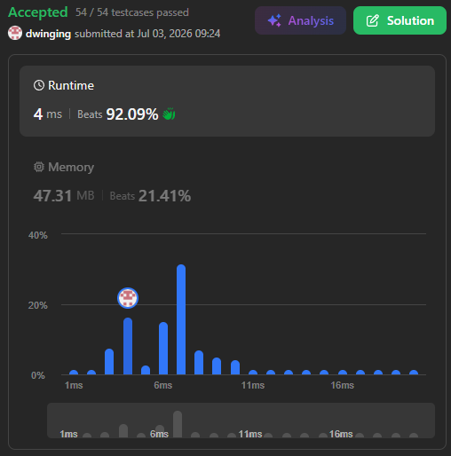

### LeetCode 207 [Course Schedule](https://leetcode.com/problems/course-schedule/description/) (Java)

> **날짜:** 2026년 7월 3일  
> **알고리즘:** 그래프 이론, 위상 정렬 
> **언어:**  Java  
> **핵심 키워드:** DFS, 위상 정렬

## 📌 문제 개요

* 전체 과목의 수 `numCourses`와 선행 수강 관계를 나타내는 2차원 배열 `prerequisites`가 주어질 때, 제시된 모든 과목을 이수할 수 있는 지 여부를 판별하는 **의존성 검증 및 사이클 판별 문제**다.
* 배열의 원소 `prerequisites[i] = [ai, bi]`는 과목 `ai`를 수강하기 위해 반드시 과목 `bi`를 먼저 이수해야 함을 의미하며, 이는 유향 그래프(Directed Graph)에서 노드 `bi`로부터 노드 `ai`로 향하는 단방향 간선 $bi \to ai$로 모델링된다.
* 만약 과목 간의 선행 관계에 순환(Cycle) 구조가 존재하면 상호 간의 제약 조건에 갇혀 어떤 과목도 먼저 시작할 수 없게 되므로, 그래프 내에 유향 순환(Directed Cycle)이 존재하는지 여부를 완벽히 추적하여 유효성을 판별해야 한다.

---

## 💡 풀이 핵심 (Core Logic)

### 1. 위상 정렬을 통한 진입 차수 기반 순차 제거 (Kahn 알고리즘)

* 각 노드로 들어오는 간선의 개수를 나타내는 **진입 차수(In-degree) 배열**을 활용하여 그래프의 선행 의존성을 계층적으로 해소하는 방식이다.
* 선행 조건이 없는(진입 차수가 0인) 과목들을 탐색의 시작점으로 삼아 큐(Queue)에 삽입한 후, 연결된 후속 과목들의 진입 차수를 실시간으로 감소시킨다. 이 과정에서 새롭게 진입 차수가 0이 되는 노드를 큐에 추가하며 전진한다.
* 탐색이 종료된 시점에 큐에서 꺼내진 총 노드의 개수가 전체 과목 수 `numCourses`와 일치하면 모든 코스를 완료할 수 있는 것으로 판단하며, 일치하지 않을 경우 그래프 내에 해소되지 않는 사이클이 존재하는 것으로 확정한다.

### 2. 깊이 우선 탐색 및 상태 배열 기반 메모이제이션 (DFS 사이클 판별)

* 그래프의 임의의 노드에서 출발하여 연결된 경로를 끝까지 추적하고, 역추적(Backtracking) 과정에서 노드의 탐색 상태를 기록하는 방식이다.
* 단일 경로 내에서의 중복 방문을 판별하기 위해 각 노드의 상태를 세 가지(**0: 미방문, 1: 현재 경로 탐색 중, 2: 검증 완료**)로 세분화하여 제어한다.
* 탐색 과정 중 `1(Visiting)` 상태인 노드를 다시 조우할 경우, 현재 순환 경로 내에 사이클이 생성된 것으로 간주하여 즉시 탐색을 종료하고 실패를 반환한다. 하위 노드의 검증이 안전하게 끝나면 해당 노드를 `2(Visited)` 상태로 전환하여 이후 타 경로에서의 중복 연산을 차단하는 메모이제이션 메커니즘을 수행한다.

---

## 📊 풀이 방식 비교 ( 위상 정렬 진입 차수 제어 vs DFS 상태 배열 메모이제이션 )

| 비교 항목 | 위상 정렬 진입 차수 제어 (1번 풀이) | DFS 상태 배열 메모이제이션 (2번 풀이) |
| --- | --- | --- |
| **알고리즘 성격** | 진입 차수 배열 감소 기반의 반복적 제거 (Kahn 방식) | 깊이 우선 탐색 및 3단계 상태 역추적 백트래킹 |
| **시간 복잡도** | $O(V + E)$ (모든 정점과 간선을 단 1회씩 정밀 순회) | $O(V + E)$ (모든 정점을 상태에 따라 최대 1회 완전 탐색) |
| **공간 복잡도** | $O(V + E)$ (그래프 인접 리스트 및 진입 차수, 큐 배열) | $O(V + E)$ (그래프 인접 리스트, 상태 배열 및 재귀 콜 스택) |
| **메모리 오버헤드** | 고정 크기 배열로 큐 구현 시 포인터 연산만 발생하여 오버헤드 최소화 | 깊은 의존성 그래프 구조에서 재귀 호출로 인한 시스템 콜 스택 누적 위험 존재 |
| **데이터 접근 흐름** | 진입 차수가 0인 노드부터 수평적으로 영토를 확장하며 차수 정산 | 하나의 경로를 끝까지 하향 탐색한 후, 거꾸로 올라오며 안전성 마킹 |
| **가독성 및 직관성** | 의존성이 풀리는 과정이 직렬적으로 드러나며 중첩 loop로 레벨화 가능 | 교차·순방향 간선 예외 처리를 위해 3가지 상태 전이 설계가 필요하여 상대적으로 복잡함 |

---

## 🧠 회고 및 결론

이 문제는 결국에 주어진 그래프에 사이클 존재하는지 확인해보라는 뜻이다. 사이클을 판별하는 로직은 Union-Find, DFS, BFS 등 다양한 방식이 있지만, 이 문제는 선행 조건이 주어진 방향 그래프로, DFS 또는 위상 정렬을 활용하는 것이 적합하다.
DFS와 위상 정렬 풀이 중에서 위상 정렬 풀이를 선택했다. DFS로 문제를 해결해볼까 생각은 했지만 가독성, 코드 난이도를 고려했을 때 위상 정렬이 적합하다고 판단했다.

---

### 📂 소스 코드
*   [Solution.java](./Solution.java)
 
---

### 🖥️ 실행 결과

---