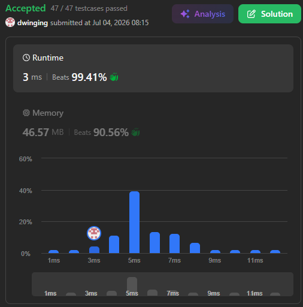

### LeetCode 210 [Course Schedule II](https://leetcode.com/problems/course-schedule-ii/description/) (Java)

> **날짜:** 2026년 7월 4일  
> **알고리즘:** 그래프 이론, 위상 정렬  
> **언어:**  Java  
> **핵심 키워드:** 위상 정렬

## 📌 문제 개요

* 전체 과목의 수 `numCourses`와 선행 수강 관계를 나타내는 2차원 배열 `prerequisites`가 주어질 때, 모든 과목을 예외 없이 수강하기 위한 유효한 순서를 정렬하거나 수강 불가능 여부를 판별하는 **의존성 해소 및 유향 사이클 판별 문제**다.
* 배열의 원소 `prerequisites[i] = [ai, bi]`는 과목 `ai`를 수강하기 위해 반드시 과목 `bi`를 먼저 이수해야 함을 의미하며, 이는 유향 그래프(Directed Graph)에서 노드 `bi`로부터 노드 `ai`로 향하는 단방향 간선 $bi \to ai$로 모델링된다.
* 만약 과목 간의 선행 관계에 순환(Cycle) 구조가 존재하면 상호 간의 제약 조건에 갇혀 어떤 과목도 먼저 시작할 수 없게 되므로, 그래프 내에 유향 순환(Directed Cycle)이 존재하는지 여부를 완벽히 추적하여 진입 차수가 0인 노드가 고갈될 경우 빈 배열(`new int[0]`)을 반환해야 한다.

---

## 💡 풀이 핵심 (Core Logic)

### 1. 유향 그래프 모델링 및 진입 차수(In-degree) 제어

* **간선 방향성 설정:** 과목 $b_i$를 이수해야 $a_i$를 수강할 수 있으므로, 그래프의 인접 리스트는 $b_i \to a_i$ 방향의 단방향 간선으로 구성된다.
* **의존성 수량화:** 각 노드 $a_i$로 들어오는 간선의 개수를 나타내는 진입 차수 배열(`cnt[a_i]`)을 구축하여, 해당 과목을 수강하기 전에 선행되어야 하는 남은 과목 수를 직관적으로 관리한다.

### 2. Kahn 알고리즘 기반 위상 정렬 (Topological Sort) 수행

* **진입점 탐색:** 선행 제약이 없는(진입 차수가 0인) 과목들을 최초 탐색의 시작점으로 삼아 자체 구현한 정적 큐(`que`)에 순차적으로 삽입한다.
* **의존성 실시간 제거:** 큐에서 과목 `cur`을 꺼내어 수강 처리(정렬 배열에 확정)하고, 해당 과목이 선행 조건이었던 후속 과목들(`list[cur]`)의 진입 차수를 실시간으로 1씩 감소시킨다 (`--cnt[next]`).
* **동적 전진:** 진입 차수를 감산하는 과정에서 모든 선행 조건이 해소되어 진입 차수가 0이 되는 노드(`cnt[next] == 0`)를 즉시 큐의 후면에 추가(`que[tail++]`)하며 탐색 파이프라인을 전진시킨다.

### 3. 정적 포인터를 활용한 최종 유효성 검증

* 위상 정렬 탐색이 종료된 시점에 큐의 리드 포인터와 라이트 포인터가 교차하며, 이때 최종적으로 적재된 총 노드의 개수(`tail`)는 사이클에 포함되지 않고 정상 처리된 과목의 총합을 의미한다.
* **성공 (`tail == numCourses`):** 모든 과목이 모순 없이 정렬되었으므로 별도의 변환 없이 큐 배열 자체를 유효한 정답 순서로 반환한다.
* **실패 (`tail < numCourses`):** 그래프 내에 해소되지 않는 순환 의존성(Cycle)이 존재하여 특정 시점 이후 진입 차수가 0인 노드가 공급되지 않은 상태이므로, 명세에 따라 즉시 크기가 0인 빈 배열(`new int[0]`)을 반환한다.

---

## 🛠 성능 최적화 인사이트 (Performance Insights)

### 커스텀 정적 배열 큐(Primitive Array Queue) 지향

* **GC 오버헤드 원천 차단:** `Queue<Integer> queue = new LinkedList<>()`와 같은 표준 컬렉션 API를 사용할 경우, 매 노드 삽입 시마다 내부 래퍼 객체(`Integer`) 생성 및 링크드 노드 할당으로 인한 가비지 컬렉션(GC) 부하가 발생한다. 크기 `N`짜리 1차원 `int[]` 배열을 미리 할당하고 두 개의 포인터(`head`, `tail`)로만 제어함으로써 메모리 할당 효율을 극대화한다.
* **공간 복사 비용 제로(Zero-Copy):** 탐색에 사용되는 `que` 배열 그 자체가 최종 위상 정렬 결과를 담는 컨테이너 역할을 수행한다. 위상 정렬이 성공적으로 완료(`tail == n`)되면, 별도의 자료구조 변환이나 메모리 복사 연산 없이 큐 배열 자체를 그대로 반환하여 $O(N)$의 추가 공간 오버헤드를 소모하지 않는다.

---

## 🧠 회고 및 결론

전형적인 위상 정렬 패턴의 문제다. 비슷한 유형의 문제인 [Course Schedule](https://leetcode.com/problems/course-schedule/description/) 와 차이점은 방문 순서를 출력해야한다는 점이다. 이 문제 역시 이전 문제와 동일하게 DFS 풀이가 가능하지만, 예외 처리가 필요하고 코드 구현 난이도가 올라간다.

커스텀 큐의 장점이 극대화된 문제라고 생각한다. BFS에서 큐는 방문하는 위치를 임시 저장하는 용도로 주로 활용된다. 하지만, 이를 다르게 생각하면 큐에 저장되는 값은 방문 순서를 의미한다. 따라서 별도의 추가 배열 사용 없이 커스텀 큐를 구현하면, 방문하는 위치와 방문 순서를 동시에 관리할 수 있다는 장점이 있다.

---

### 📂 소스 코드
*   [Solution.java](./Solution.java)
 
---

### 🖥️ 실행 결과

---