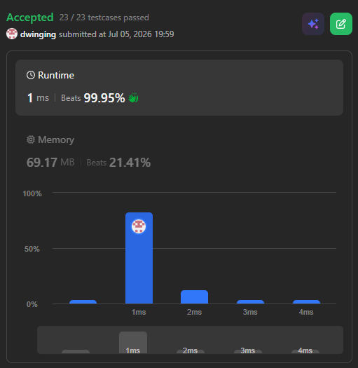

### LeetCode 209 [Minimum Size Subarray Sum](https://leetcode.com/problems/minimum-size-subarray-sum/description/) (Java)

> **날짜:** 2026년 7월 5일  
> **알고리즘:** 두 포인터, 누적 합 
> **언어:**  Java  
> **핵심 키워드:** 두 포인터, 누적 합

## 📌 문제 개요

* 양의 정수로 구성된 배열 `nums`와 양의 정수 `target`이 주어질 때, 하위 요소들의 합이 `target` 이상이 되는 **연속된 부분 배열(Subarray)의 최소 길이**를 구하는 문제다.
* 만약 배열의 전체 요소를 합산하더라도 `target`을 충족하지 못하는 등, 조건에 부합하는 부분 배열이 존재하지 않을 경우 명세에 따라 `0`을 반환해야 한다.
* 원본 배열의 순서를 유지하되 중간 요소를 건너뛸 수 있는 부분 수열(Subsequence)과 달리, 반드시 **연속된 구간**만을 취급해야 하므로 선형 시간 복잡도 내에 구간을 조절하는 포인터 제어 메커니즘이 요구된다.

---

## 💡 풀이 핵심 (Core Logic)

### 1. 투 포인터(Two Pointers) 기반의 슬라이딩 윈도우 유동적 확장

* **우측 포인터 확장:** 탐색의 우측 경계를 나타내는 `right` 포인터를 점진적으로 증가시키며 현재 윈도우의 누적 합(`sum`)에 `nums[right]`를 누적한다.
* **조건부 좌측 포인터 축소:** 누적 합이 `target` 이상이 되는 순간(`sum >= target`), 최적의 최소 길이를 갱신하기 위해 좌측 경계인 `left` 포인터를 전진시킨다. 탐색 과정에서 `sum`이 `target` 미만이 될 때까지 `sum -= nums[left++]`를 수행하며 윈도우 크기를 동적으로 축소한다.

### 2. $O(N)$ 시간 복잡도 달성 및 조기 탈출(Early Exit) 최적화

* 모든 요소는 `right` 포인터에 의해 최대 한 번 누적되고, `left` 포인터에 의해 최대 한 번 감산되므로 전체 탐색의 시간 복잡도는 $O(N)$으로 수렴한다.
* `right` 포인터가 배열의 끝(`n`)에 도달한 시점에서 누적 합이 `target` 미만인 경우, 이후 `left` 포인터를 이동시켜 구간을 좁히더라도 합이 증가할 가능성이 없으므로 즉시 루프를 탈출(`break`)하여 불필요한 연산을 방지한다.

---

## 🧠 회고 및 결론

그냥 저냥 자주 나오는 두 포인터 문제다. 누적 합 + 이분 탐색 풀이도 알아두면 좋다.

---

### 📂 소스 코드
*   [Solution.java](./Solution.java)
 
---

### 🖥️ 실행 결과

---