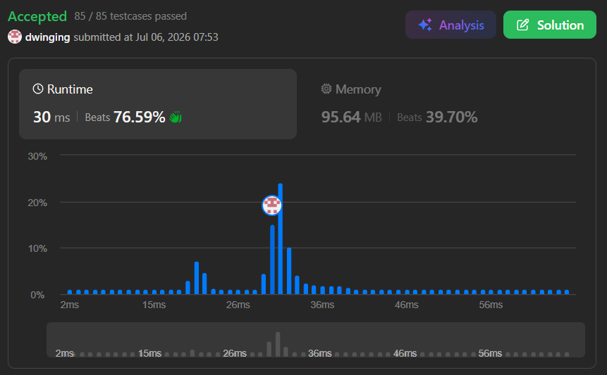

### LeetCode 128 [Longest Consecutive Sequence](https://leetcode.com/problems/longest-consecutive-sequence/description/) (Java)

> **날짜:** 2026년 7월 6일  
> **알고리즘:** 자료구조, Union-Find 
> **언어:**  Java  
> **핵심 키워드:** 자료구조 

## 📌 문제 개요

* 정렬되지 않은 정수 배열 `nums`가 주어질 때, 요소들이 연속적인 순서로 나열될 수 있는 **가장 긴 연속된 수열(Consecutive Elements Sequence)의 길이**를 반환하는 문제다.
* 값의 범위가 $-10^9$에서 $10^9$로 매우 광활하여 고정 크기 배열을 통한 카운팅 정렬(Counting Sort) 구현이 불가능하므로, **$O(N)$ 시간 복잡도**와 공간 제약을 동시에 충족하는 효율적인 자료구조 활용이 강제된다.
* 원본 배열을 정렬하는 $O(N \log N)$ 오버헤드를 배제하고, 입력된 데이터들의 선형적 연결 관계를 상수의 시간 내에 탐색하고 확장하는 최적화 메커니즘이 요구된다.

---

## 💡 풀이 핵심 (Core Logic)

### 1. HashSet을 활용한 공간 최적화 및 탐색 분기 제한

* **Sparse 데이터의 집합화:** $2 \times 10^9$에 달하는 광활한 값의 도메인 중, 실제로 입력받은 최대 $10^5$개의 고유한 원소만을 `HashSet`에 동적 할당하여 메모리 초과(OOM)를 원천 차단하고 `contains()` 연산을 평균 $O(1)$에 수행한다.
* **연속 수열의 '시작점' 판별 분기:** 임의의 숫자 `num`에 대해 `num - 1`이 집합 내에 존재하는지 역방향 조회를 수행한다. 존재하지 않을 경우에만 해당 `num`을 새로운 연속 수열의 진짜 시작점(Head)으로 인정하여 정방향 탐색 루프를 트리거한다.

### 2. 불필요한 재탐색 억제를 통한 엄격한 선형 시간 $O(N)$ 보장

* 시작점으로 판별된 노드에 한해서만 `while` 루프를 가동하여 `next + 1`이 존재할 때까지 정방향 포인터를 점진적으로 전진시키며 길이를 누적한다.
* 이 메커니즘을 통해 배열 내의 모든 요소는 수열의 시작점인지 확인하는 과정에서 1회, 수열을 확장하는 과정에서 최대 1회 조회되므로, 전체 요소의 총 방문 횟수가 최대 $2N$번으로 엄격히 제한되어 최종 $O(N)$ 시간 복잡도 내에 수렴한다.

---

## 🧠 회고 및 결론

Union-Find에 연결리스트를 떠올렸다. 하지만, 구현난이도가 높았고, Gemini에게 물어보니 HashSet을 활용하는 대표적인 풀이가 있다고 알려주었고, 새로운 방식을 배울 수 있었다.

---

### 📂 소스 코드
*   [Solution.java](./Solution.java)
 
---

### 🖥️ 실행 결과

---