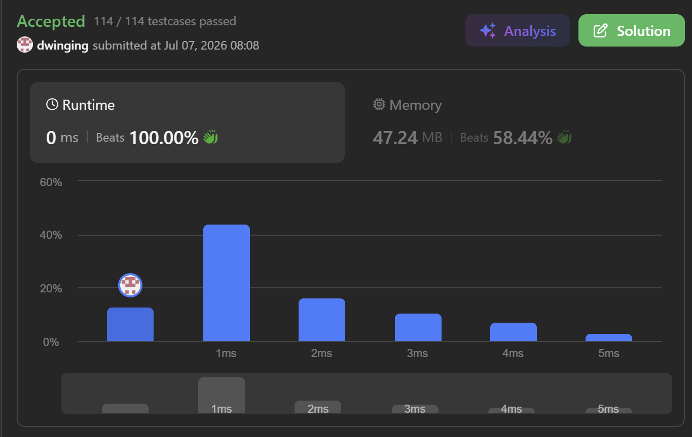
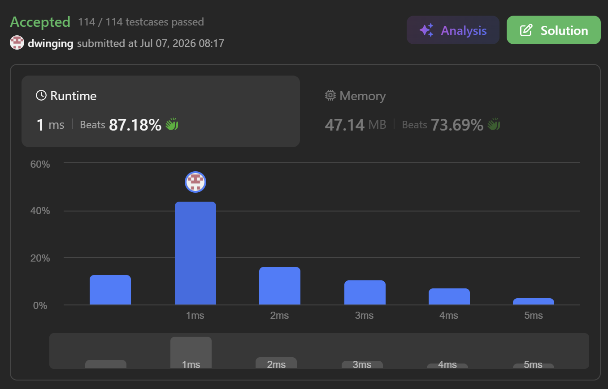

### LeetCode 547 [Number of Provinces](https://leetcode.com/problems/number-of-provinces/description/) (Java)

> **날짜:** 2026년 7월 7일  
> **알고리즘:** 그래프 탐색, 분리 집합 
> **언어:**  Java  
> **핵심 키워드:** BFS, DFS, Union-Find

## 📌 문제 개요

* 주어진 $N \times N$ 크기의 인접 행렬 `isConnected`를 바탕으로 서로 연결된 도시들의 독립된 집합의 개수, 즉 그래프의 '연결 요소(Connected Component)'의 총합을 구하는 문제다.
* 행렬의 원소 `isConnected[i][j] = 1`은 도시 $i$와 도시 $j$가 양방향으로 직접 연결되어 있음을 나타내며, $i$와 $j$가 연결되고 $j$와 $k$가 연결되면 $i$와 $k$ 역시 간접적으로 연결된 것으로 간주한다.
* 그래프 내부의 모든 정점을 누락 없이 탐색하면서 개별 연결 요소를 식별하되, 정적 데이터 구조의 특성을 고려하여 불필요한 중복 스캔과 메서드 호출 오버헤드를 최소화하는 런타임 최적화 성능이 요구된다.

---

## 💡 풀이 핵심 (Core Logic)

### 1. BFS(너비 우선 탐색)를 통한 연결 요소 완전 탐색 ($O(N^2)$)

* 방문하지 않은 임의의 도시에서 출발하여 갈 수 있는 모든 연결된 도시를 큐(Queue)를 통해 레벨 단위로 확장 탐색하는 방식이다.
* 자바 내부 객체 생성 비용 및 동적 메모리 할당을 방지하기 위해 고정 크기의 1차원 기본 자료형 배열로 큐(`que`)를 선언하고, 인덱스 포인터 제어를 통해 원시 실행 성능을 극대화한다.
* 1차원 불리언 배열 `visited`를 활용해 이미 확인한 도시의 재방문을 원천 차단하므로, 하나의 연결 요소 탐색이 완료될 때마다 카운트를 누적하여 정확한 개수를 도출할 수 있다.

### 2. 유니온 파인드(서로소 집합)를 통한 동적 집합 병합 ($O(N^2 \cdot \alpha(N))$)

* 초기 상태에서 모든 도시를 각각의 독립된 집합(원소 자신을 부모로 설정)으로 두고, 관계 행렬을 순회하며 연결된 두 도시를 하나의 집합으로 합치기(`Union`)하는 방식이다.
* 두 도시의 최상위 루트 노드가 다를 경우 집합을 병합하고 초기 전체 도시 수($N$)에서 $1$씩 차감하여 최종 연결 요소의 수를 연산한다.
* 탐색 과정에서 트리의 높이를 평탄화하는 경로 압축(Path Compression) 기법을 적용하여 `Find` 연산의 상환 시간 복잡도를 $O(\alpha(N))$으로 억제하나, 인접 행렬의 특성상 동일 간선에 대한 중복 호출 제어와 재귀 메서드 스택 할당에 따른 추가 오버헤드가 발생한다.

---

## 📊 풀이 방식 비교 ( BFS vs Union-Find )

| 비교 항목 | BFS 탐색 (1번 풀이) | 유니온 파인드 (2번 풀이) |
| --- | --- | --- |
| **알고리즘 성격** | 선형 배열 기반의 큐 제어 및 인접 행렬 단방향 완전 탐색 | 트리 구조 기반의 부모 노드 추적 및 서로소 집합 병합 |
| **시간 복잡도** | $O(N^2)$ (방문 배열을 통해 모든 행렬 원소를 효율적으로 스캔) | $O(N^2 \cdot \alpha(N))$ (최악의 경우 대칭 행렬 중복 순회 및 재귀 오버헤드 포함) |
| **공간 복잡도** | $O(N)$ (크기 $N$의 `visited` 배열 및 `que` 배열 할당) | $O(N)$ (크기 $N$의 `parents` 트래킹 배열 할당) |
| **메모리 오버헤드** | 프리미티브 배열 포인터 연산 구조로 런타임 힙 메모리 자원 소모 최소화 | `Find` 연산 수행 시 발생하는 깊은 재귀 호출로 인해 실행 스택 오버헤드 가중 |
| **데이터 접근 흐름** | 시작 노드로부터 연결된 경로를 끊김 없이 추적하여 하나의 연결 요소를 완전히 소거 | 행렬 내부의 단일 간선을 순차적으로 검증하며 실시간으로 집합 관계를 재조정 |
| **최종 평가** | 정적 행렬 데이터 구조에 최적화되어 있으며 낮은 런타임 오버헤드와 연산 최적화 효율이 우수함 | 구현 알고리즘의 연산 비용이 상대적으로 무거우며, 정적 그래프 특성상 추가적인 메서드 호출 제어 비용이 동반됨 |

---

## 🧠 회고 및 결론

집합의 개수를 구하는 유명한 유형이다. BFS, DFS, Union-Find 등 다양한 알고리즘을 적용할 수 있고, 각 알고리즘의 장단점과 효율성을 고려했을 때 BFS 방식이 가장 적합하다고 판단했다.

Union-Find 알고리즘 연습을 위해 BFS 외에도 추가로 코드를 작성했다.

---

### 📂 소스 코드
*   [Solution - BFS](./SolutionBFS.java)
*   [Solution - Union-Find](./SolutionUnionFind.java)
 
---

### 🖥️ 실행 결과

   BFS 풀이   
   UnionFind 풀이

---