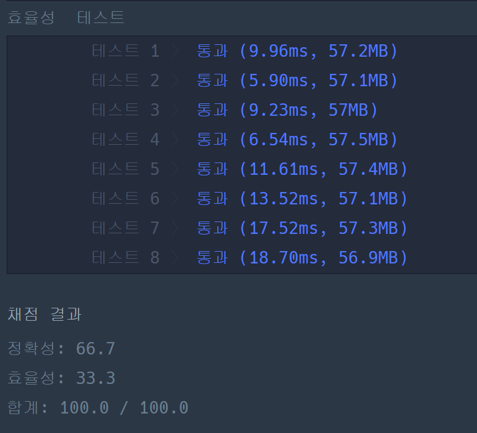

### 프로그래머스 Lv4 [쿠키 구입](https://school.programmers.co.kr/learn/courses/30/lessons/49995) (Java)

> **날짜:** 2026년 7월 8일  
> **알고리즘:** 누적 합, 이분 탐색, 두 포인터 
> **언어:**  Java  
> **핵심 키워드:** 누적 합, 이분 탐색, 두 포인터, 고정 피벗과 선형 탐색

## 📌 문제 개요

* 주어진 일렬로 나열된 $N$개의 과자 바구니 배열 `cookie`에서 조건 $A[l] + \dots + A[m] = A[m+1] + \dots + A[r]$ ($1 \le l \le m < r \le N$)을 만족하는 두 개의 연속되고 서로 이웃한 구간 합이 같아지는 경우를 찾는 문제다.
* 조건을 만족하는 구간 쌍이 존재할 때, 한 명이 받을 수 있는 최대 과자 수(구간 합의 최댓값)를 반환해야 하며, 조건을 만족하는 구간을 형성할 수 없는 경우 `0`을 반환해야 한다.
* 배열의 길이 $N$이 최대 $2,000$으로 주어지므로, 브루트 포스 기반의 $O(N^3)$ 접근법은 시간 초과를 유발한다. 따라서 구간 합 연산을 최적화하고 탐색 범위를 효과적으로 제어하는 효율적인 알고리즘 설계가 요구된다.

---

## 💡 풀이 핵심 (Core Logic)

### 1. 누적 합(Prefix Sum) 배열을 통한 구간 합 연산의 최적화 ($O(1)$)

* 임의의 구간 합을 반복문 없이 즉각적으로 도출하기 위해, 원본 배열을 1회 순회하며 누적 합 배열을 구축한다. 자바 내부의 추가적인 공간 할당 오버헤드를 최소화하기 위해 원본 `cookie` 배열을 누적 합 배열로 덮어써서 활용한다.
* 누적 합 배열 상에서 $m+1$번부터 $r$번까지의 우측 구간 합(둘째 아들의 과자 수)은 `cookie[r] - cookie[m]` 형태로 단 $O(1)$ 만에 연산된다.

### 2. 고정 피벗 선형 확장과 단조성을 활용한 이분 탐색 ($O(N^2 \log N)$)

* 첫째 아들의 마지막 바구니 인덱스이자 두 구간의 경계선이 되는 피벗 $i$를 고정($0 \le i < n-1$)하고, 둘째 아들의 마지막 바구니 인덱스 $r$을 선형으로 확장($i+1 \le r < n$)하며 우측 구간 합 `secondSum`을 먼저 확보한다.
* 좌측 구간 합(첫째 아들의 과자 수)은 시작점 $l$이 오른쪽으로 이동할수록 구간의 크기가 줄어들어 합이 감소하는 단조성(Monotonicity)을 띤다. 이를 활용하여 $0$부터 $i$ 범위 내에서 구간 합이 `secondSum`과 정확히 일치하는 시작점 $l$이 존재하는지 이분 탐색($O(\log N)$)으로 저격한다.
* 탐색 과정 중 `secondSum`이 현재까지 기록된 최댓값 `res`보다 작거나 같으면 이분 탐색 과정을 과감히 건너뛰는 가지치기(Pruning)를 적용하여 실행 런타임을 대폭 단축한다.

---

## 📌 문제 개요

* 주어진 일렬로 나열된 $N$개의 과자 바구니 배열 `cookie`에서 조건 $A[l] + \dots + A[m] = A[m+1] + \dots + A[r]$ ($1 \le l \le m < r \le N$)을 만족하는 두 개의 연속되고 서로 이웃한 구간 합이 같아지는 경우를 찾는 문제다.
* 조건을 만족하는 구간 쌍이 존재할 때, 한 명이 받을 수 있는 최대 과자 수(구간 합의 최댓값)를 반환해야 하며, 조건을 만족하는 구간을 형성할 수 없는 경우 `0`을 반환해야 한다.
* 배열의 길이 $N$이 최대 $2,000$으로 주어지므로, 브루트 포스 기반의 $O(N^3)$ 접근법은 시간 초과를 유발한다. 따라서 구간 합 연산을 최적화하고 탐색 범위를 효과적으로 제어하는 효율적인 알고리즘 설계가 요구된다.

---

## 💡 풀이 핵심 (Core Logic)

### 1. 누적 합(Prefix Sum) 배열을 통한 구간 합 연산의 최적화 ($O(1)$)

* 임의의 구간 합을 반복문 없이 즉각적으로 도출하기 위해, 원본 배열을 1회 순회하며 누적 합 배열을 구축한다. 자바 내부의 추가적인 공간 할당 오버헤드를 최소화하기 위해 원본 `cookie` 배열을 누적 합 배열로 덮어써서 활용한다.
* 누적 합 배열 상에서 $m+1$번부터 $r$번까지의 우측 구간 합(둘째 아들의 과자 수)은 `cookie[r] - cookie[m]` 형태로 단 $O(1)$ 만에 연산된다.

### 2. 고정 피벗 선형 확장과 단조성을 활용한 이분 탐색 ($O(N^2 \log N)$)

* 첫째 아들의 마지막 바구니 인덱스이자 두 구간의 경계선이 되는 피벗 $i$를 고정($0 \le i < n-1$)하고, 둘째 아들의 마지막 바구니 인덱스 $r$을 선형으로 확장($i+1 \le r < n$)하며 우측 구간 합 `secondSum`을 먼저 확보한다.
* 좌측 구간 합(첫째 아들의 과자 수)은 시작점 $l$이 오른쪽으로 이동할수록 구간의 크기가 줄어들어 합이 감소하는 단조성(Monotonicity)을 띤다. 이를 활용하여 $0$부터 $i$ 범위 내에서 구간 합이 `secondSum`과 정확히 일치하는 시작점 $l$이 존재하는지 이분 탐색($O(\log N)$)으로 저격한다.
* 탐색 과정 중 `secondSum`이 현재까지 기록된 최댓값 `res`보다 작거나 같으면 이분 탐색 과정을 과감히 건너뛰는 가지치기(Pruning)를 적용하여 실행 런타임을 대폭 단축한다.

---

## 🛠 트러블 슈팅

### 1. 실시간 배열 변형에 따른 데이터 상태 오염 및 인덱스 동기화 오류

* **문제 상황:** 추가 메모리 공간을 아끼기 위해 바깥쪽 투 포인터 루프가 전진함에 따라 `cookie[left + 1] += cookie[left]` 공식을 통해 실시간으로 원본 배열을 누적 합으로 갱신하며 탐색을 시도하였다. 이로 인해 배열의 전반부는 '누적 합', 후반부는 '원본 값'을 유지하는 기괴한 혼종 상태가 발생하였다.
* **원인 분석:** 우측 구간 합(`val`)을 구하기 위해 후반부 원소를 더해나가는 과정에서, 포인터 이동에 따라 이미 누적 합으로 변형된 `cookie[left + 1]`을 차감(`val -= cookie[left + 1]`)하여 우측 구간 합 자체가 완전히 오염되었다. 또한, 이분 탐색 내부에서 좌측 구간 합을 계산할 때 기준점 인덱스의 성격(원본 데이터 vs 누적 합 데이터)이 실시간으로 변조되어 정확한 탐색 범위를 지정할 수 없었다.
* **해결 대안:** 탐색과 배열 변형을 동시에 처리하는 복잡한 제어 방식을 폐기하고 아키텍처를 단순화하였다. 루프 진입 전 **초기에 전체 배열을 완벽한 정적 누적 합 배열로 1회 선행 변환**해 둔 뒤 원본처럼 참조하는 구조로 선회하였다. 이를 통해 데이터 상태를 일관되게 유지하여 데이터 오염을 원천 차단하고 인덱스 계산의 안전성을 확보하였다.

### 2. 이분 탐색 경계 조건 처리 미흡 및 탐색 누락

* **문제 상황:** 이분 탐색 루틴 구현 시 반복문 조건식을 `while (left < right)`로 설정하여 특정 케이스에서 정확한 정답이 존재함에도 `0`을 반환하는 논리적 오류를 인카운터하였다.
* **원인 분석:** 탐색 범위가 단 하나의 원소(즉, `left == right`)로 축소되었을 때, 해당 지점이 조건을 만족하는 정답점임에도 불구하고 조건식이 거짓이 되어 루프를 빠져나왔다. 이로 인해 경계 끝점에 위치한 최적의 구간을 검증하지 못하고 누락하는 현상이 발생하였다.
* **해결 대안:** 이분 탐색의 종료 조건을 `while (left <= right)` 등호 포함 형태로 교정하여 탐색 범위가 단일 원소 구간으로 좁혀졌을 때도 `mid` 지점의 구간 합 검증이 누락 없이 명확히 수행되도록 예외 처리를 완료하였다.

---

## 🧠 회고 및 결론

문제를 처음 봤을 때 두 포인트를 응용한 풀이를 떠올렸다. 일단 $l$ ~ $m$, $m + 1$ ~ $r$ 2개의 구간을 사용하지만, 크게 생각하면 $l$ ~ $r$로 볼 수 있고, 두 포인터에 중간 피벗을 두는 형태로 접근을 시도했다.

이 경우의 문제점은 $m + 1$ ~ $r$ 구간을 탐색하는 것은 쉽지만, 자칫 잘못하면 누락되는 범위가 생길 수 있기 떄문에 $l$을 변경하는 시점이 까다로웠다.

두 포인터 구조는 유지하되, 누적 합과 이분 탐색을 함께 활용하는 방식을 떠올렸다. 오른쪽은 두 포인터를 활용해 값을 갱신하고, 좌측은 $0$ ~ $m$ 범위 내에서 우측과 같은 값이 있는지 이분 탐색을 수행하면 효율적으로 결과값을 구할 수 있다고 생각했다.

이분 탐색을 하기 위해서는 누적합이 필수라고 판단하였고, 최종적으로 누적 합, 이분 탐색, 두 포인터 형태의 코드를 작성하게 되었다.

---

### 📂 소스 코드
*   [Solution.java](./Solution.java)
 
---

### 🖥️ 실행 결과

---