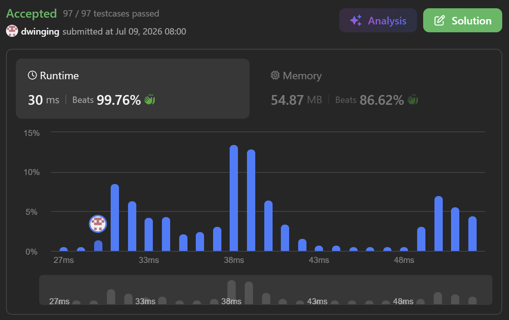

### LeetCode 630 [Course Schedule III](https://leetcode.com/problems/course-schedule-iii/description/) (Java)

> **날짜:** 2026년 7월 9일  
> **알고리즘:** 정렬, 그리디, 우선순위 큐 
> **언어:**  Java  
> **핵심 키워드:** 정렬, 그리디, 우선순위 큐

## 📌 문제 개요

* 주어진 $n$개의 온라인 강의 정보 `courses`를 바탕으로, 정해진 마감 기한(`lastDay`)을 준수하면서 수강할 수 있는 **최대 강의 개수**를 구하는 문제다.
* 각 강의는 `[duration, lastDay]` 형태로 주어지며, 연속해서 `duration`일 동안 수강해야 하고 반드시 `lastDay` 이내에 종료되어야 한다.
* 한 번에 하나의 강의만 수강할 수 있으며, 1일 차부터 시작하여 마감 기한과 소요 시간의 제 조건을 만족하는 최적의 스케줄링 동적 구성 능력을 요구한다.

---

## 💡 풀이 핵심 (Core Logic)

### 1. 마감 기한(`lastDay`) 기준의 오름차순 정렬

* 선택의 여유가 적은(마감 기한이 촉박한) 강의를 우선적으로 검토하기 위해 인풋 배열을 `lastDay` 기준으로 정렬한다. 이는 탐색의 기준 축을 명확히 하여 이후 소급적 판단을 가능하게 하는 기반이 된다.

### 2. 소급적 그리디(Retrospective Greedy)와 Max Heap의 결합

* 기본적으로 정렬된 순서대로 강의를 수강 목록에 추가하며 누적 시간(`time`)을 갱신한다.
* 만약 현재 강의를 추가했을 때 마감 기한을 초과한다면(`time + next > day`), 기존에 선택한 강의 중 **소요 시간(`duration`)이 가장 긴 강의**를 취소하고 현재 강의로 대체하는 소급 연산을 수행한다.
* 자바의 `PriorityQueue`를 최대 힙(Max Heap)으로 구성하여 현재까지 선택된 강의들의 `duration`을 관리함으로써, 최댓값 조회 및 삭제 연산을 $O(\log N)$에 처리하여 실행 효율을 극대화한다.
* 이 대체 과정은 강의의 총 개수를 유지하면서도 누적 시간을 줄여주므로, 향후 더 많은 강의를 수강할 수 있는 최적의 타임 슬롯 공간을 확보하게 해준다.

---

## 🛠 트러블 슈팅

### 1. 문제 상황

* 누적 시간이 마감 기한을 초과하여 기존의 가장 긴 강의를 큐에서 제거(`pq.poll()`)한 후, 현재 검토 중인 새 강의(`next`)의 소요 시간을 누적 시간(`time`)에는 정상 반영하였으나 **우선순위 큐(`pq`)에 삽입(`add`)하는 과정을 누락**함.

### 2. 원인 분석 및 해결

* 큐에 새 강의의 소요 시간이 누적되지 않으면서 자료구조 내부의 데이터 상태와 실제 수강 현황 간의 불일치가 발생하였고, 이후의 교체 검토 연산에서 왜곡된 최댓값이 참조되는 현상이 나타남.
* `else` 블록 내에서 기존 요소를 추출한 직후, 새롭게 채택된 `next` 값을 `pq.add(next)`를 통해 명시적으로 다시 삽입해 주어 데이터 정합성을 확보함.

---

## 🧠 회고 및 결론

스케줄링 문제로 그리디 알고리즘에 우선순위 큐를 사용하는 대표적인 유형이다. 코딩테스트에서 자주 등장하는 유형은 아니지만, 해당 개념을 알아두면 다른 문제에 응용하거나 풀이 발상을 떠올리는데 도움이 된다.

---

### 📂 소스 코드
*   [Solution.java](./Solution.java)
 
---

### 🖥️ 실행 결과

---