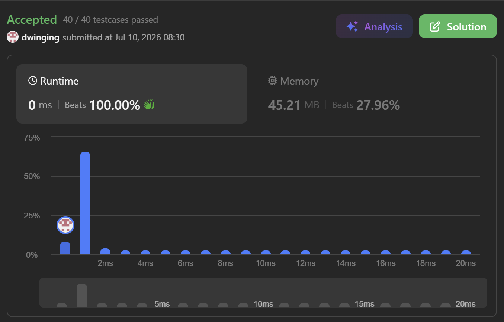

### LeetCode 684 [Redundant Connection](https://leetcode.com/problems/redundant-connection/description/) (Java)

> **날짜:** 2026년 7월 10일  
> **알고리즘:** 그래프 탐색, 트리, 분리 집합  
> **언어:**  Java  
> **핵심 키워드:** DFS, Union-Find

## 📌 문제 개요

* 노드 개수가 $n$개인 트리 구조에서 **정확히 하나의 추가 간선**이 삽입되어 사이클(Cycle)이 발생한 무방향 그래프가 주어진다.
* 그래프의 정점은 $1$부터 $n$까지의 번호를 가지며, $n$개의 간선 정보가 담긴 2차원 배열 `edges`가 제공된다.
* 그래프를 다시 트리 구조로 복원하기 위해 제거해야 하는 단 하나의 무효 간선을 찾아 반환해야 한다. 만약 사이클을 해제할 수 있는 정답 후보가 여러 개 존재할 경우, 입력 배열 `edges`에서 **가장 마지막에 등장하는 간선**을 반환한다.

---

## 💡 풀이 핵심 (Core Logic)

### 1. 분리 집합(Disjoint Set)을 통한 연결성 관리

* 초기 상태에서 각 노드는 자기 자신을 부모로 갖는 독립된 집합으로 간주된다.
* 간선 배열을 순방향으로 순회하며, 간선으로 연결된 두 노드가 동일한 집합에 속해 있는지 `Find` 연산을 통해 확인한다.
* 두 노드의 루트 노드가 다르다면 두 집합을 하나로 합치는 `Union` 연산을 수행하여 트리 구조를 점진적으로 조립해 나간다.

### 2. 단일 사이클 감지 및 즉각적 후보 도출

* 본 문제는 $n$개의 노드와 $n$개의 간선으로 구성되어 있어 그래프 내에 정확히 하나의 사이클만 존재한다.
* `Union` 연산 과정에서 두 노드의 루트 노드가 이미 동일한 것으로 판별되면, 해당 간선이 **사이클을 최종적으로 형성하는 폐곡선의 완성 고리**임을 의미한다.
* 입력 배열을 순방향으로 탐색하므로, 사이클을 완성시키는 최초의 간선을 포착하는 즉시 제어 흐름을 분기(break)하여 가장 마지막에 위치한 무효 간선 후보를 확정할 수 있다.

---

## 🧠 회고 및 결론

이 문제는 그래프에서 싸이클이 발생하는 순간을 판단하는 문제다. 싸이클 판별에 보통 DFS로직을 많이 적용하지만, 이 문제는 간선 입력 순서 중 마지막에 순서의 간선을 반환해야한다는 조건이 있다.

따라서 이 문제는 대표적인 Union-Find 문제로, 입력 받은 간선을 순서대로 간선을 연결하면서 사이클이 발생한 시점에 탐색을 종료하면 된다.

---

### 📂 소스 코드
*   [Solution.java](./Solution.java)
 
---

### 🖥️ 실행 결과

---