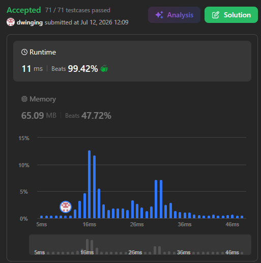

### LeetCode 310 [Minimum Height Trees](https://leetcode.com/problems/minimum-height-trees/description/) (Java)

> **날짜:** 2026년 7월 12일  
> **알고리즘:** 트리, 위상 정렬  
> **언어:**  Java  
> **핵심 키워드:** 트리, 위상 정렬

## 📌 문제 개요

* **문제명:** Minimum Height Trees (MHTs)
* **설명:** $0$부터 $n - 1$까지 번호가 매겨진 $n$개의 정점을 가진 무방향 트리 그래프가 주어진다. 특정 정점을 루트로 선택하여 트리를 구성할 때, 트리의 높이(루트에서 가장 먼 리프 노드까지의 간선 개수)가 최소가 되는 루트 정점들의 목록을 반환해야 한다.
* **제약 조건:**
  * $1 \le n \le 2 \times 10^4$
  * `edges.length` $== n - 1$
  * 사이클이 없는 연결 그래프(트리)임이 보장된다.

---

## 💡 풀이 핵심 (Core Logic)

### 1. 리프 노드 제거(Trim Leaves) 전략

* 트리의 높이를 최소화하는 루트 노드는 구조적으로 트리의 중심(Center)에 위치한다.
* 모든 정점에서 탐색을 시작하는 대신, 연결된 간선이 1개뿐인 외곽의 리프 노드(Degree $\le 1$)부터 단계별로 제거해 나가며 중심을 향해 좁혀 들어가는 방식을 취한다.
* 트리의 대수적 성질에 따라, 최종적으로 남는 중심 정점의 개수는 항상 **1개 또는 2개**로 수렴한다.

### 2. 정적 배열 큐를 이용한 메모리 및 분기 최적화

* 별도의 객체 지향형 `Queue` 라이브러리를 사용하지 않고, 정적 정수 배열(`int[] que`)과 인덱스 포인터(`head`, `tail`)를 활용하여 롤링 큐를 직접 구현함으로써 가비지 컬렉션(GC) 오버헤드를 최소화한다.
* 초기 진입 및 내부 갱신 과정에서 노드의 차수를 변경할 때 `cnt[i] -= 2` 연산을 일관되게 적용하여, $n = 1$과 같은 단일 정점 예외 상황을 별도의 분기문 없이 자연스럽게 흡수하도록 안전장치를 설계한다.
  
---

## ⏱️ 복잡도 분석

* **시간 복잡도:** $\mathcal{O}(n)$
  * 각 정점과 간선을 인접 리스트로 구성하는 데 $\mathcal{O}(n)$, 외곽에서부터 중심 노드로 진입하며 모든 정점을 정확히 한 번씩만 큐에 삽입 및 제거하므로 선형 시간 내에 연산이 종료된다.
* **공간 복잡도:** $\mathcal{O}(n)$
  * 그래프 구조를 저장하기 위한 인접 리스트 배열 및 정점의 차수를 기록하는 `cnt` 배열, 그리고 정적 큐 배열 할당에 $n$에 비례하는 메모리 공간이 사용된다.
  
---

## 🧠 회고 및 결론

MHT를 만들 수 있는 정점은 최대 2개라는 것을 파악하기가 어려웠다. 해당 원리만 파악하면 이후에는 위상 정렬을 활용해 간단하게 해결 할 수 있는 문제다.

---

### 📂 소스 코드
*   [Solution.java](./Solution.java)
 
---

### 🖥️ 실행 결과

---