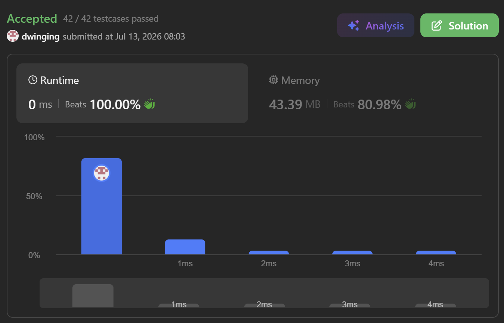
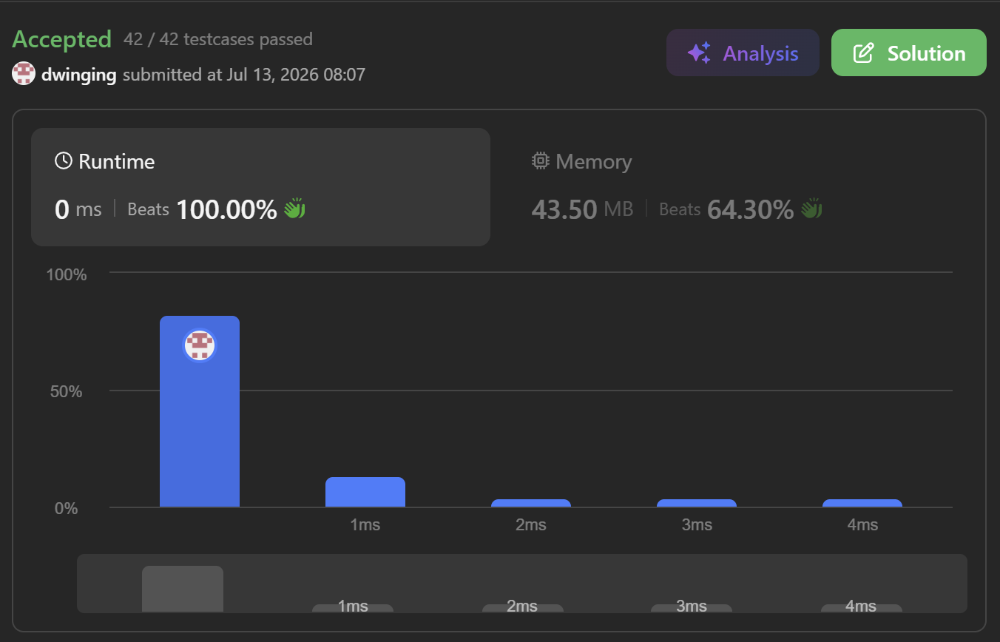

### LeetCode 63 [Unique Paths II](https://leetcode.com/problems/unique-paths-ii/description/) (Java)

> **날짜:** 2026년 7월 13일  
> **알고리즘:** DP  
> **언어:** Java  
> **핵심 키워드:** DP

## 📌 문제 개요

본 문제는 $m \times n$ 크기의 격자(Grid) 내에서 장애물을 피해 좌측 상단 `(0, 0)`에서 우측 하단 `(m - 1, n - 1)`까지 이동할 수 있는 서로 다른 경로의 총 개수를 구하는 문제입니다.

로봇은 매 순간 **우측(Right)** 또는 하측(Down)으로만 이동할 수 있으며, 장애물이 위치한 칸(`1`)은 통과할 수 없습니다. 반환해야 하는 총 경로의 수는 $2 \times 10^9$ 이하임이 보장됩니다.

---

## 💡 풀이 핵심 (Core Logic)

### 1. 동적 계획법(Dynamic Programming)을 통한 부분 문제 분할

특정 칸 `(i, j)`에 도달할 수 있는 경우의 수는 그 직전 상태인 **위쪽 칸 `(i - 1, j)`에서 아래로 내려오는 경로의 수**와 **왼쪽 칸 `(i, j - 1)`에서 오른쪽으로 이동하는 경로의 수**의 합과 같습니다.
장애물이 없는 칸(`0`)에 한하여 다음과 같은 점화식이 성립합니다.

$$dp[i][j] = dp[i-1][j] + dp[i][j-1]$$

### 2. 패딩(Padding)을 활용한 인덱스 경계 예외 처리

배열의 크기를 `m` 또는 `n`보다 1만큼 크게 설정하는 패딩 격자를 활용합니다. 이를 통해 격자의 첫 번째 행과 첫 번째 열에서 발생하는 인덱스 하한선 경계 예외(`Out of Bounds`)를 별도의 조건문(분기) 없이 하나의 일관된 루프 구조 내에서 처리할 수 있습니다.

---

## 🛠 성능 최적화 인사이트 (Performance Insights)

### 1. 1차원 공간 압축 (Space Compression)

2차원 DP 테이블 `[m + 1][n + 1]` 전체를 유지할 필요 없이, $O(n)$ 크기의 1차원 배열만으로 상태를 관리합니다. 공간 복잡도를 $O(m \times n)$에서 $O(n)$으로 압쇄하여 메모리 사용량을 최소화합니다.

### 2. 롤링 어레이(Rolling Array) 구조의 값 누적 Mechanism

바깥쪽 루프가 행을 따라 내려갈 때, 1차원 배열의 특정 인덱스 `dp[j]`는 다음과 같은 이중적 상태를 가집니다.

* **갱신 전 `dp[j]`:** 이전 행(위쪽)에서 계산 완료되어 내려온 경로의 수
* **갱신 후 `dp[j - 1]`:** 현재 행의 직전 열(왼쪽)에서 계산 완료된 경로의 수

따라서 `dp[j] += dp[j - 1]` 연산을 수행하면 기존의 위쪽 데이터에 방금 계산된 왼쪽 데이터를 누적하여 덮어쓰는 구조가 되므로, 별도의 임시 배열이나 복사 연산 없이 최적화된 연산 속도를 보장합니다.

---

## 🧠 회고 및 결론

이동 가능한 경우의 수를 구하는 일반적인 DP 문제다. 보통 2차원 배열로 많이 풀어왔는데, 1차원 배열로 DP 배열 압축이 가능하다는 것을 새롭게 알게 되었다. 

---

### 📂 소스 코드
*   [2차원 배열 풀이](./Solution.java)
*   [1차원 배열 풀이](./Solution2.java)
 
---

### 🖥️ 실행 결과

   2차원 배열 풀이   

   1차원 배열 풀이

---