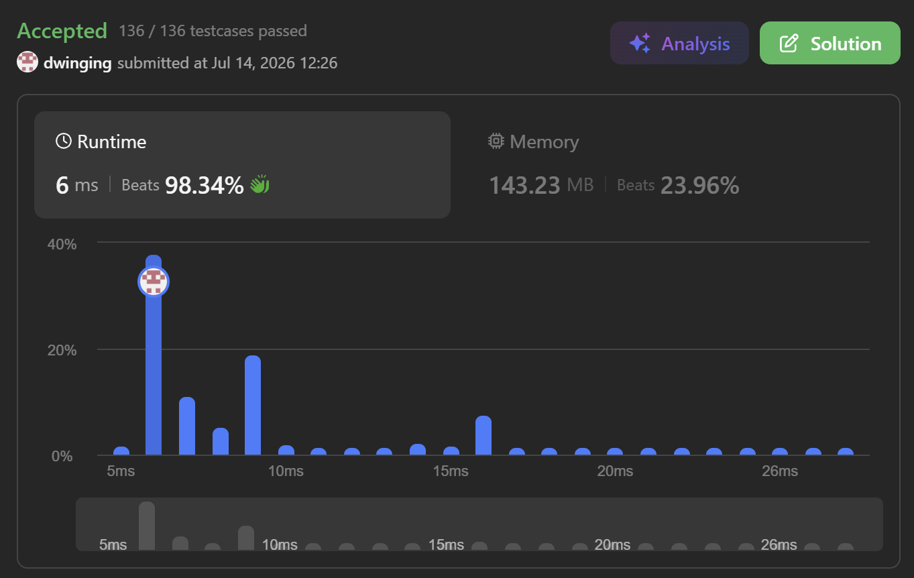

### LeetCode 624 [Maximum Distance in Arrays](https://leetcode.com/problems/maximum-distance-in-arrays/description/) (Java)

> **날짜:** 2026년 7월 14일 <br>
> **알고리즘:** 그리디 <br>
> **언어:**  Java <br>
> **핵심 키워드:** 그리디


## 📌 문제 개요

* **문제명:** Maximum Distance in Arrays
* **설명:** 여러 개의 오름차순 정렬 배열이 주어진다. 서로 다른 두 배열에서 각각 하나의 정수를 선택했을 때, 두 정수 사이의 거리 `|a - b|`가 최대가 되는 값을 반환해야 한다. 각 배열은 오름차순으로 정렬되어 있으므로, 최대 거리 계산에는 각 배열의 첫 번째 원소와 마지막 원소만이 의미를 가진다.
* **제약 조건:**

  * `m == arrays.length`
  * $2 \le m \le 10^5$
  * $1 \le arrays[i].length \le 500$
  * $-10^4 \le arrays[i][j] \le 10^4$
  * 각 `arrays[i]`는 오름차순으로 정렬되어 있다.
  * 전체 원소 개수는 최대 $10^5$개이다.

---

## 💡 풀이 핵심 (Core Logic)

### 1. 정렬 특성을 활용한 양끝값 비교

* 각 배열은 오름차순으로 정렬되어 있으므로, 배열 내부에서 선택 가능한 최솟값은 첫 번째 원소이고 최댓값은 마지막 원소이다.
* 최대 거리는 결국 작은 값 하나와 큰 값 하나의 차이로 결정되므로, 각 배열의 중간 원소들은 최대 거리 계산에 영향을 주지 않는다.
* 따라서 모든 원소를 탐색할 필요 없이, 각 배열마다 다음 두 값만 확인하면 된다.

```java
int curMin = array.get(0);
int curMax = array.get(array.size() - 1);
```

### 2. 이전 배열 기준값과 현재 배열의 교차 비교

* 두 정수는 반드시 서로 다른 배열에서 선택해야 하므로, 현재 배열의 최솟값과 최댓값을 직접 비교해서는 안 된다.
* 이를 방지하기 위해 현재 배열을 처리하기 전까지의 배열들에서 얻은 전체 최솟값 `minVal`과 전체 최댓값 `maxVal`을 유지한다.
* 현재 배열에서 만들 수 있는 최대 거리 후보는 다음 두 가지이다.

$$
curMax - minVal
$$

$$
maxVal - curMin
$$

* 첫 번째 식은 현재 배열의 최댓값과 이전 배열들 중 최솟값을 비교하는 경우이다.
* 두 번째 식은 이전 배열들 중 최댓값과 현재 배열의 최솟값을 비교하는 경우이다.
* 두 경우 모두 현재 배열과 이전 배열을 교차 비교하므로, 서로 다른 배열에서 값을 선택해야 한다는 조건을 만족한다.

### 3. 거리 계산 이후 기준값 갱신

* 현재 배열과 이전 배열들의 최솟값·최댓값을 교차 비교한 뒤, 현재 배열의 양끝값을 전체 기준값에 반영한다.

```java
answer = Math.max(answer, maxVal - curMin);
answer = Math.max(answer, curMax - minVal);

minVal = Math.min(minVal, curMin);
maxVal = Math.max(maxVal, curMax);
```

* 이때 반드시 거리 계산을 먼저 수행한 뒤 `minVal`, `maxVal`을 갱신해야 한다.
* 기준값을 먼저 갱신하면 현재 배열의 최솟값과 최댓값이 동시에 사용될 수 있어, 서로 다른 배열에서 값을 선택해야 한다는 조건을 위반할 수 있다.

---


## 🧠 회고 및 결론

문제 요구사항을 분석하면 간단하게 풀리는 문제다.

---

### 📂 소스 코드
*   [Solution.java](./Solution.java)
 
---

### 🖥️ 실행 결과



---