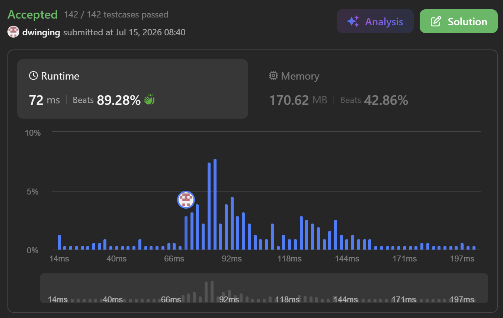

### LeetCode 2246 [Longest Path With Different Adjacent Characters](https://leetcode.com/problems/longest-path-with-different-adjacent-characters/description/) (Java)

> **날짜:** 2026년 7월 15일  
> **알고리즘:** 트리에서의 DP, DFS  
> **언어:**  Java  
> **핵심 키워드:** 트리에서의 DP, DFS

## 📌 문제 개요

* **설명:** `0`번 노드를 루트로 하는 트리가 주어진다. 각 노드에는 문자 하나가 할당되어 있으며, 경로상에서 **인접한 두 노드의 문자가 서로 달라야 한다**는 조건을 만족하는 가장 긴 경로의 길이를 반환해야 한다. 경로의 길이는 경로에 포함된 노드의 개수로 계산한다.
* **제약 조건:**
  * `n == parent.length == s.length`
  * $1 \le n \le 10^5$
  * `parent[0] == -1`
  * `parent`는 유효한 트리를 나타낸다.
  * `s`는 영어 소문자로만 구성된다.

---

## 💡 풀이 핵심 (Core Logic)

### 1. 인접 문자 조건을 만족하는 경로 탐색

* 문제의 조건은 경로 전체의 문자가 모두 달라야 한다는 것이 아니라, **인접한 두 노드의 문자만 서로 다르면 된다**는 것이다.
* 따라서 현재 노드와 자식 노드의 문자가 다른 경우에만 두 노드를 하나의 경로로 연결할 수 있다.
* 문자가 같은 자식 노드는 현재 노드와 이어지는 경로 후보에서는 제외한다.

### 2. 각 노드에서 가장 긴 자식 경로 두 개 선택

* 하나의 노드를 중심으로 하는 경로는 서로 다른 두 자식 방향을 연결하여 만들 수 있다.
* 따라서 각 노드에서는 연결 가능한 자식 경로 중 가장 긴 값 두 개를 유지한다.
* 현재 노드를 포함한 최장 경로 후보는 다음과 같다.

$$
가장 긴 자식 경로 + 두 번째로 긴 자식 경로 + 1
$$

* 여기서 `1`은 현재 노드 자신을 의미한다.
* 이 값을 전역 정답과 비교하여 갱신한다.

### 3. 부모에게는 한 갈래 경로만 반환

* 현재 노드를 중심으로 정답을 계산할 때는 두 개의 자식 경로를 사용할 수 있다.
* 하지만 부모 노드로 이어질 때는 경로가 한 방향으로만 연결될 수 있으므로, 가장 긴 자식 경로 하나만 사용할 수 있다.
* 따라서 DFS는 현재 노드를 포함해 아래로 이어지는 최장 단일 경로 길이를 반환한다.

$$
가장 긴 자식 경로 + 1
$$

* 최종 정답은 루트에서 시작하는 경로가 아니라, 모든 노드를 기준으로 갱신한 전역 최댓값이다.

---

## 🧠 회고 및 결론
 
문제를 잘 못 해석해서 잠시 돌아갔던 문제다. 트리에서의 DP 유형으로 서브 트리를 이해하면 쉽게 풀린다.

DFS 풀이 방식을 적용하되, 서브 트리의 결과값을 관리하기 위해 전역변수를 적절히 활용하는 것이 핵심이다.

Hard라고 하기에는 쉬운 편이고, 무난한 유형의 문제다.

---

### 📂 소스 코드
*   [Solution.java](./Solution.java)
 
---

### 🖥️ 실행 결과

---