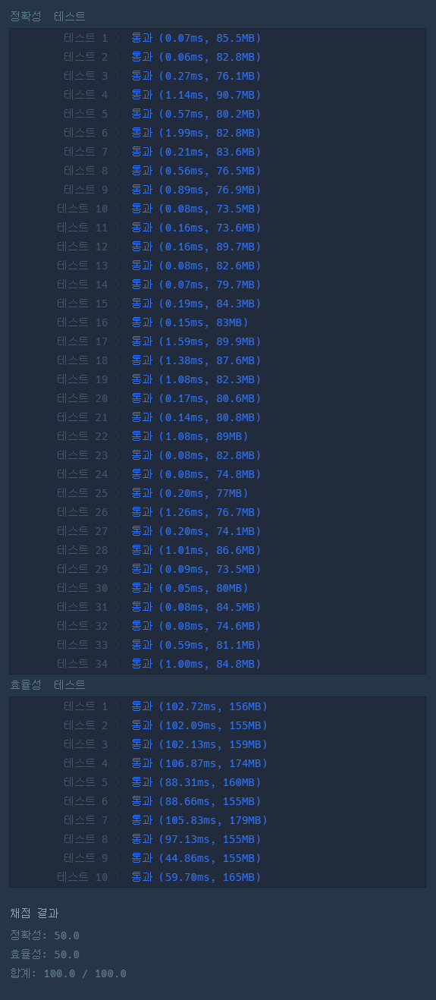

### 프로그래머스 Lv4 [동굴 탐험](https://school.programmers.co.kr/learn/courses/30/lessons/67260) (Java)

> **날짜:** 2026년 7월 19일 <br>
> **알고리즘:** BFS, 자료구조<br>
> **언어:**  Java <br>
> **핵심 키워드:** BFS, 연결리스트, 자료구조, 상태 관리

## 📌 문제 개요

* **설명:** `0`번 방에서 시작해 모든 방을 방문해야 하는 동굴 탐험 문제이다. 동굴은 `n`개의 방과 `n - 1`개의 양방향 통로로 이루어진 연결 그래프이며, 임의의 두 방 사이의 경로는 하나만 존재한다. 일부 방은 방문하기 전에 반드시 먼저 방문해야 하는 선행 방이 정해져 있으며, 해당 조건을 모두 만족하면서 모든 방을 방문할 수 있는지 판단해야 한다.

* **제약 조건:**

  * $2 \le n \le 200,000$
  * `path.length == n - 1`
  * `path[i]`는 두 방을 연결하는 양방향 통로를 의미한다.
  * `order.length <= n / 2`
  * `order[i] = [A, B]`는 `A`번 방을 먼저 방문한 후 `B`번 방을 방문해야 함을 의미한다.
  * 각 방은 선행 조건 또는 후행 조건에 최대 한 번만 등장한다.
  * 어떤 방이 선행 방이면서 동시에 후행 방인 경우는 없다.

---

## 💡 풀이 핵심 (Core Logic)

### 1. 선행 조건 기반 BFS

* 이 문제는 방문 순서를 모두 탐색하는 백트래킹 문제가 아니라, 각 방의 선행 조건이 해제되었는지 확인하며 탐색하는 문제이다.
* BFS로 현재 방문 가능한 방을 순회하고, 아직 선행 조건이 풀리지 않은 방은 즉시 방문하지 않고 대기 후보로 관리한다.

### 2. 선행/후행 관계를 1차원 배열로 압축

* 문제 조건상 하나의 방은 선행 방 또는 후행 방으로 최대 한 번만 등장한다.
* 따라서 선행 관계와 후행 관계를 별도의 배열로 분리하지 않고, `key[]` 하나로 표현할 수 있다.

```java
key[front] = next;   // front를 방문하면 next 방의 조건이 해제됨
key[next] = -front;  // next는 front를 먼저 방문해야 함
```

* 상태는 다음과 같이 해석한다.

```text
key[x] > 0 : x를 방문하면 key[x] 방의 선행 조건을 해제할 수 있음
key[x] < 0 : x는 아직 선행 조건이 풀리지 않은 방
key[x] == 0 : 선행 조건 없음 또는 이미 해제됨
```

### 3. 대기 후보 관리

* BFS 중 인접 방을 확인했을 때, 해당 방이 잠긴 상태라면 큐에 넣지 않고 `Set`에 보관한다.
* 이후 선행 방을 방문했을 때, 후행 방이 이미 대기 후보에 있다면 즉시 큐에 삽입한다.
* 아직 발견되지 않은 방이라면 `key[후행 방] = 0`으로 변경해, 나중에 발견했을 때 바로 방문할 수 있도록 처리한다.

```java
if (key[cur] > 0) {
    int val = key[cur];

    if (set.contains(val)) {
        que[tail++] = val;
        visited[val] = true;
    } else {
        key[val] = 0;
    }
}
```

---

## 🛠 성능 최적화 인사이트 (Performance Insights)

### 1. 입력 크기를 고려한 BFS 선택

* `n`의 최대값이 `200,000`이므로 방문 순서를 모두 탐색하는 방식은 사용할 수 없다.
* 각 방과 통로를 한 번씩 확인하는 BFS 기반 탐색으로 처리해야 한다.
* 전체 시간 복잡도는 그래프 순회와 선행 조건 처리 기준으로 $O(n)$에 가깝다.

### 2. `key[]`를 활용한 상태 압축

* `before[]`, `after[]`처럼 선행 조건 배열과 후행 조건 배열을 분리할 수도 있다.
* 하지만 문제 조건상 선행/후행 관계가 1:1로만 등장하므로, `key[]` 하나에 양수와 음수로 상태를 압축할 수 있다.
* 이를 통해 배열 개수를 줄이고, 조건 해제 대상도 `key[cur]`로 바로 찾을 수 있다.

### 3. `Set`을 활용한 대기 후보 확인

* 잠긴 방을 리스트로 관리하면 선행 조건이 해제될 때마다 후보 목록을 순회해야 한다.
* `HashSet`을 사용하면 특정 방이 대기 중인지 $O(1)$에 가깝게 확인할 수 있다.

```java
Set<Integer> set = new HashSet<>();
```

### 4. 커스텀 큐를 활용한 방문 수 판정

* `int[] que`와 `head`, `tail`을 사용해 BFS 큐를 직접 구현했다.
* 큐에 삽입되는 시점은 방문 가능이 확정된 시점이므로, `tail`은 방문 확정된 방의 수로 사용할 수 있다.
* 따라서 별도의 방문 카운트 변수를 두지 않고, 마지막에 `tail == n`으로 모든 방 방문 여부를 판정할 수 있다.

```java
return tail == n;
```

---

## 🛠 트러블 슈팅

### 1. 시작 노드가 선행 조건의 후행 방인 경우 누락

* 기존 구현에서는 BFS 시작 시 `0`번 방을 무조건 큐에 넣고 방문 처리했다.

```java
que[tail++] = start;
visited[start] = true;
```

* 하지만 문제 조건상 `order = [x, 0]`처럼 `0`번 방을 방문하기 전에 먼저 방문해야 하는 방이 존재할 수 있다.

* 이 경우 탐험은 반드시 `0`번 방에서 시작해야 하므로, 조건을 만족하는 탐험이 불가능하다.

* 기존 코드는 이 예외를 확인하지 않아 정확성 테스트 하나에서 실패했다.

* 해결 방법은 BFS 시작 전에 시작 노드가 잠긴 상태인지 확인하는 것이다.

```java
if (key[start] < 0) return false;
```

* `0`을 기본 상태값으로 활용해 초기화와 조건문을 단순화했지만, 시작 노드 역시 선행 조건의 대상이 될 수 있다는 점을 별도로 처리해야 했다.

---

## 🧠 회고 및 결론

이전에 풀었던 양과 늑대 문제와 비슷하다고 생각했지만, 문제를 읽고 분석해보니 전혀 다른 유형이었다. 방문 후보와 상태 관리를 한다는 관점에서는 비슷하지만, 사용하는 로직은 전혀 달랐다.

문제의 조건을 모두 분석하였지만, 0번은 항상 방문 가능하다고 생각한 판단 미스가 있었고 아쉽지만 한번에 풀지 못했다.

---

### 📂 소스 코드
*   [Solution.java](./Solution.java)
 
---

### 🖥️ 실행 결과



---