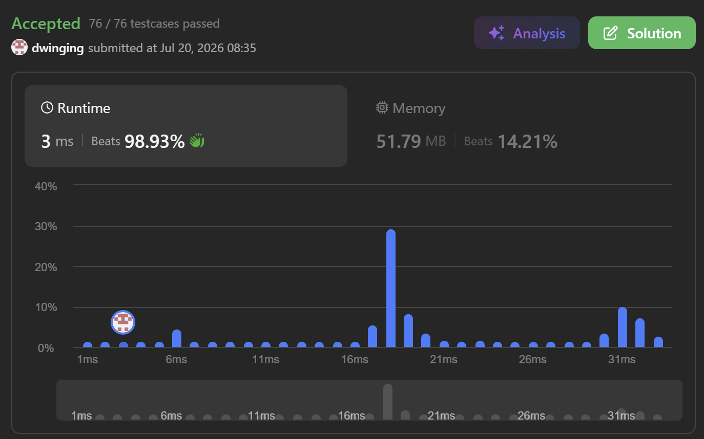

### LeetCode 85 [Maximal Rectangle](https://leetcode.com/problems/maximal-rectangle/description/) (Java)

> **날짜:** 2026년 7월 20일 <br>
> **알고리즘:** 스택, DP <br>
> **언어:**  Java <br>
> **핵심 키워드:** 스택, DP, 히스토그램

## 📌 문제 개요

* **설명:** `0`과 `1`로 구성된 이진 행렬이 주어질 때, 모든 원소가 `1`로 이루어진 직사각형 중 가장 넓은 직사각형의 넓이를 구하는 문제이다.

* 각 행을 직사각형의 아랫변으로 가정하고, 해당 행까지 세로로 연속된 `1`의 개수를 높이로 변환하면 각 행을 하나의 히스토그램으로 표현할 수 있다.

* **제약 조건:**

  * `rows == matrix.length`
  * `cols == matrix[i].length`
  * $1 \le rows, cols \le 200$
  * `matrix[i][j]`는 `'0'` 또는 `'1'`이다.

---

## 💡 풀이 핵심 (Core Logic)

### 1. 연속된 `1`의 높이 누적

* 각 열을 위에서 아래로 순회하며 현재 위치까지 연속된 `1`의 개수를 누적한다.
* 현재 값이 `'1'`이면 이전 높이에 `1`을 더하고, `'0'`이면 직사각형이 이어질 수 없으므로 높이를 `0`으로 초기화한다.

```java
if (matrix[j][i] == '0') {
    height = 0;
} else {
    arr[j][i] = ++height;
}
```

* 이를 통해 각 행은 해당 행을 아랫변으로 하는 히스토그램으로 변환된다.

```text
1 0 1 0 0
2 0 2 1 1
3 1 3 2 2
4 0 0 3 0
```

### 2. 각 행을 히스토그램으로 변환

* 행렬에서 만들 수 있는 모든 직사각형은 특정 행을 아랫변으로 가진다.
* 따라서 누적된 높이 배열의 각 행에 대해 히스토그램에서 가장 큰 직사각형을 구하면 전체 행렬의 최대 직사각형을 확인할 수 있다.
* 각 행의 계산 결과 중 최댓값을 최종 결과로 반환한다.

```java
for (int i = 0; i < row; i++) {
    int area = calculateArea(arr[i], col);
    result = Math.max(result, area);
}
```

### 3. 높이와 누적 너비를 저장하는 모노톤 스택

* 스택에는 각 막대의 높이와 해당 높이가 확장될 수 있는 누적 너비를 함께 저장한다.

```java
stack[index][0] = height;
stack[index][1] = width;
```

* 현재 높이보다 높거나 같은 막대가 스택의 위에 있다면, 해당 막대는 현재 위치 이후로 확장할 수 없으므로 스택에서 제거하며 넓이를 계산한다.
* 제거된 막대의 너비는 현재의 낮은 막대가 포함할 수 있으므로 누적하여 함께 저장한다.

```java
int count = 1;

while (top >= 0 && stack[top][0] >= arr[i]) {
    count += stack[top][1];

    int height = stack[top][0];
    int width = count - 1;

    result = Math.max(result, height * width);
    top--;
}

stack[++top][0] = arr[i];
stack[top][1] = count;
```

* 낮은 높이는 제거된 막대의 구간까지 확장할 수 있으므로, 누적된 너비를 가지고 스택에 남는다.
* 해당 높이의 최종 넓이는 이후 더 낮은 높이를 만나거나 현재 히스토그램 구간이 종료될 때 계산한다.

### 4. 높이가 `0`인 지점에서 구간 종료 처리

* 높이가 `0`이면 해당 위치를 포함하여 직사각형을 확장할 수 없다.
* 따라서 현재까지 스택에 저장된 막대들을 모두 정산하고, 새로운 히스토그램 구간을 시작한다.

```java
if (arr[i] == 0) {
    result = Math.max(result, finishStack(top));
    top = -1;
}
```

* 하나의 행 안에서도 `0`을 기준으로 여러 개의 독립된 히스토그램 구간이 만들어질 수 있다.

```text
3 2 1 0 2 3
└─────┘   └───┘
```

### 5. 행 탐색 종료 후 남은 스택 처리

* 끝까지 더 낮은 높이를 만나지 않은 막대는 스택에 남아 있으므로, 행 탐색이 끝난 후 별도로 넓이를 계산해야 한다.
* 스택의 위에서부터 누적 너비를 더하며 각 높이가 행의 끝까지 확장될 수 있는 넓이를 계산한다.

```java
private int finishStack(int top) {
    int width = 0;
    int result = 0;

    for (int i = top; i >= 0; i--) {
        int height = stack[i][0];
        width += stack[i][1];

        result = Math.max(result, height * width);
    }

    return result;
}
```

* `finishStack()`은 다음 두 경우에 공통으로 사용한다.

```text
1. 높이가 0인 지점을 만났을 때
2. 현재 행의 탐색이 끝났을 때
```

### 6. 시간 및 공간 복잡도

* 높이 누적 배열 생성에는 $O(rows \times cols)$가 필요하다.
* 각 행의 히스토그램 계산에서 모든 막대는 스택에 최대 한 번 삽입되고 한 번 제거되므로 $O(cols)$가 필요하다.
* 전체 시간 복잡도는 다음과 같다.

```text
O(rows × cols)
```

* 누적 높이를 모든 행에 저장하는 경우 공간 복잡도는 $O(rows \times cols)$이며, 스택에는 최대 `cols`개의 원소가 저장된다.

---

## 🧠 회고 및 결론

사각형의 크기를 구하는 DP 유형은 자주 풀어봤지만, 이번 문제는 행렬을 히스토그램으로 변환해 해결하는 새로운 형태였다. 행렬의 크기가 최대 200 × 200으로 작고, 값이 0과 1로만 구성된다는 점에서 각 행까지 연속된 1의 높이를 누적하는 방식을 떠올릴 필요가 있었다.

기존에 풀었던 사각형 DP 문제와 달리 0을 기준으로 구간이 분리되며, 각 행을 히스토그램으로 해석한 뒤 모노톤 스택으로 최대 직사각형을 계산하는 것이 핵심이었다.

---

### 📂 소스 코드
*   [Solution.java](./Solution.java)
 
---

### 🖥️ 실행 결과



---