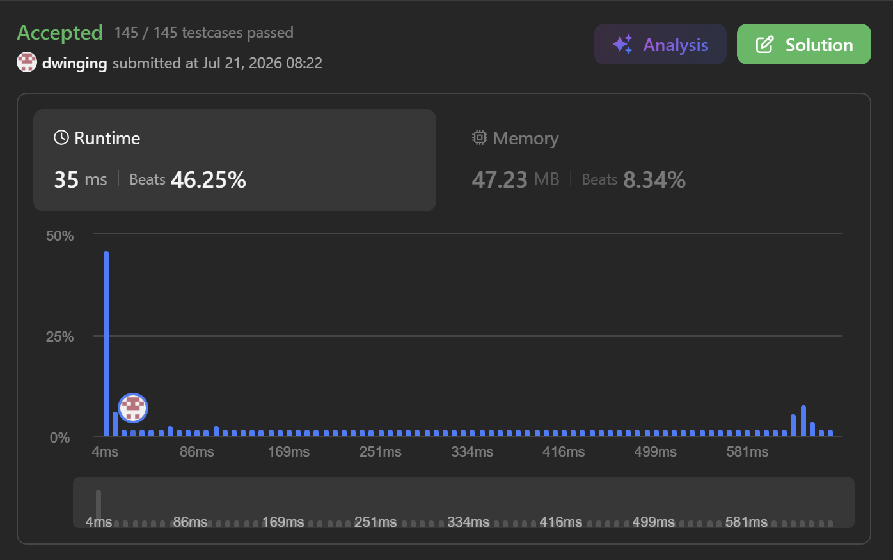

### LeetCode 494 [Target Sum](https://leetcode.com/problems/target-sum/description/) (Java)

> **날짜:** 2026년 7월 21일 <br>
> **알고리즘:** DP <br>
> **언어:**  Java <br>
> **핵심 키워드:** DP

## 📌 문제 개요

* **설명:** 정수 배열 `nums`와 정수 `target`이 주어질 때, 각 원소 앞에 `+` 또는 `-` 기호를 하나씩 배치하여 계산 결과가 `target`이 되는 표현식의 개수를 구하는 문제이다.

* 각 원소마다 `+`와 `-` 중 하나를 선택할 수 있으므로, 모든 선택을 탐색하면 이진 선택 트리 형태로 표현할 수 있다.

* 서로 다른 선택 경로라도 동일한 인덱스에서 동일한 누적 합에 도달할 수 있으므로, 해당 상태의 결과를 저장하여 재사용할 수 있다.

* **제약 조건:**

  * $1 \le nums.length \le 20$
  * $0 \le nums[i] \le 1000$
  * $0 \le \sum nums[i] \le 1000$
  * $-1000 \le target \le 1000$

---

## 💡 풀이 핵심 (Core Logic)

### 1. 각 원소에 `+` 또는 `-` 기호 선택

* 현재 인덱스의 원소에 `+`를 적용하는 경우와 `-`를 적용하는 경우를 각각 탐색한다.
* `idx`는 다음에 처리할 원소의 위치이며, `sum`은 현재까지 선택한 기호를 적용한 누적 합이다.

```java
dfs(nums, idx + 1, sum + nums[idx], n, target);
dfs(nums, idx + 1, sum - nums[idx], n, target);
```

* 모든 원소를 처리할 때까지 두 가지 선택을 반복한다.

### 2. DP 상태 정의

* 동일한 인덱스와 동일한 누적 합에 도달하면 이후에 사용할 원소와 선택지가 모두 동일하다.
* 따라서 해당 상태에서 `target`을 만들 수 있는 경우의 수도 동일하다.

```text
상태: (idx, sum)

idx  : 현재까지 처리한 원소의 개수
sum  : 현재까지 계산된 누적 합
결과 : 남은 원소를 사용하여 target을 만드는 경우의 수
```

* DP는 인덱스별로 누적 합과 경우의 수를 저장한다.

```java
Map<Integer, Integer>[] dp; // key : sum, value : count
```

* `dp[idx].get(sum)`은 다음을 의미한다.

```text
앞의 idx개 원소를 처리하여 현재 합이 sum일 때,
남은 원소로 target을 만들 수 있는 경우의 수
```

### 3. 중복 상태 재사용

* 단순 DFS는 각 원소마다 두 가지 선택을 수행하므로 최대 $2^n$개의 경로를 탐색한다.
* 그러나 서로 다른 선택 경로가 동일한 `(idx, sum)` 상태에 도달할 수 있다.

```text
+1 → -1 → (2, 0)
-1 → +1 → (2, 0)
```

* 두 상태는 이후에 처리할 원소와 현재 합이 동일하므로 결과를 다시 계산할 필요가 없다.
* 이미 계산된 상태라면 저장된 경우의 수를 즉시 반환한다.

```java
if (dp[idx].containsKey(sum)) {
    return dp[idx].get(sum);
}
```

* 이를 통해 선택 트리에서 반복되는 상태를 하나로 합쳐 계산할 수 있다.

### 4. 두 선택의 경우의 수 합산

* 현재 원소에 `+`를 적용한 경우와 `-`를 적용한 경우는 서로 다른 표현식이다.
* 따라서 두 하위 상태에서 반환된 경우의 수를 합산한다.

```java
int val =
        dfs(nums, idx + 1, sum + nums[idx], n, target)
      + dfs(nums, idx + 1, sum - nums[idx], n, target);
```

* 계산된 결과는 현재 상태에 저장한 후 반환한다.

```java
dp[idx].put(sum, val);
return val;
```

### 5. 종료 조건

* `idx == n`이면 모든 원소에 기호를 적용한 상태이다.
* 최종 누적 합이 `target`과 같으면 하나의 유효한 표현식이므로 `1`을 반환한다.
* 일치하지 않으면 유효한 표현식이 아니므로 `0`을 반환한다.

```java
if (idx == n) {
    return sum == target ? 1 : 0;
}
```

### 6. 탑다운 DP

* 필요한 상태를 DFS로 탐색하고, 계산된 결과를 저장하여 재사용하므로 탑다운 DP 방식에 해당한다.

```text
DFS + Memoization = Top-down DP
```

* 재귀 호출 자체는 이진트리 형태로 진행되지만, 동일한 `(idx, sum)` 상태가 여러 경로에서 등장한다.
* 중복 상태를 하나로 합치면 전체 구조는 인덱스가 증가하는 방향성 비순환 그래프 형태로 볼 수 있다.

### 7. 시간 및 공간 복잡도

* 모든 원소의 합을 `S`라고 하면 누적 합의 범위는 `-S`부터 `S`까지이다.
* 각 인덱스에서 가능한 누적 합 상태를 최대 한 번씩 계산하므로 시간 복잡도는 다음과 같다.

```text
O(n × S)
```

* DP에는 실제로 도달한 `(idx, sum)` 상태만 저장된다.
* 최악의 경우 공간 복잡도는 다음과 같다.

```text
O(n × S)
```

* 재귀 호출 스택에는 최대 `n`개의 상태가 저장된다.

---

## 🧠 회고 및 결론

탑 다운 DP의 대표적인 형태다. 합에 따른 경우의 수를 관리하는 문제이다 보니 Map을 사용하면 상태를 편하게 관리할 수 있다.

---

### 📂 소스 코드
*   [Solution.java](./Solution.java)
 
---

### 🖥️ 실행 결과



---