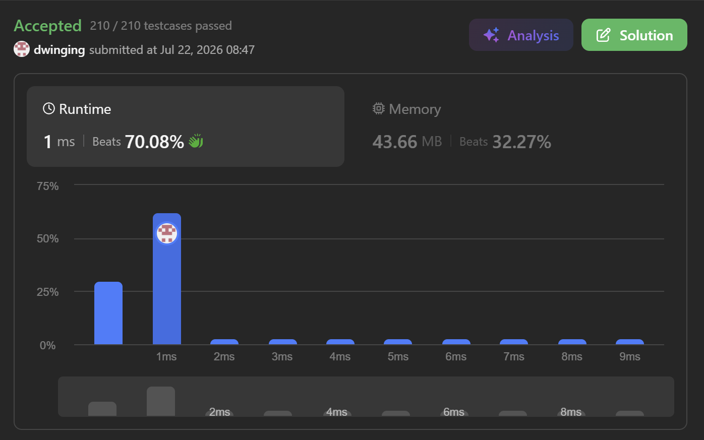

### SWEA 309 [Best Time to Buy and Sell Stock with Cooldown](https://leetcode.com/problems/best-time-to-buy-and-sell-stock-with-cooldown/description/) (Java)

> **날짜:** 2026년 7월 22일 <br>
> **알고리즘:** DP <br>
> **언어:**  Java <br>
> **핵심 키워드:** DP

## 📌 문제 개요

* **설명:** 주식 가격 배열 `prices`가 주어질 때, 여러 번의 매수와 매도를 통해 얻을 수 있는 최대 수익을 구하는 문제이다.

* 하나의 주식을 보유한 상태에서 추가로 매수할 수 없으며, 반드시 보유한 주식을 매도한 이후에 다시 매수해야 한다.

* 주식을 매도한 다음 날에는 주식을 매수할 수 없으며, 하루 동안의 쿨다운이 적용된다.

* 각 날짜에서는 현재 주식 보유 여부에 따라 다음 행동을 선택할 수 있다.

```text
주식을 보유하지 않은 경우 : 매수 또는 대기
주식을 보유한 경우       : 매도 또는 대기
```

* **제약 조건:**

  * $1 \le prices.length \le 5000$
  * $0 \le prices[i] \le 1000$

---

## 💡 풀이 핵심 (Core Logic)

### 1. 날짜와 주식 보유 여부를 상태로 정의

* 각 날짜에서 가능한 행동은 현재 주식을 보유하고 있는지에 따라 달라진다.
* 따라서 DFS의 상태를 현재 날짜와 주식 보유 여부로 정의한다.

```text
상태: (idx, holding)

idx      : 현재 확인할 날짜
holding  : 주식 보유 여부
           0이면 주식을 보유하지 않은 상태
           1이면 주식을 보유한 상태

결과     : 현재 상태부터 마지막 날까지 얻을 수 있는 최대 수익
```

* 동일한 날짜에 동일한 보유 상태로 도달하면 이후에 선택할 수 있는 행동이 동일하므로, 계산 결과 역시 동일하다.

### 2. 주식을 보유하지 않은 경우

* 주식을 보유하지 않은 상태에서는 현재 가격으로 주식을 매수하거나, 아무 행동도 하지 않고 다음 날로 이동할 수 있다.

```java
int res = dfs(idx + 1, 0, prices);
res = Math.max(
        res,
        -prices[idx] + dfs(idx + 1, 1, prices)
);
```

* 주식을 매수하면 현재 가격만큼 비용이 발생하므로 `prices[idx]`를 수익에서 차감한다.
* 매수한 이후에는 주식을 보유한 상태가 되므로 `holding`을 `1`로 변경한다.

```text
매수 : -prices[idx] + dfs(idx + 1, 1)
대기 : dfs(idx + 1, 0)
```

* 두 선택 중 더 큰 수익을 현재 상태의 결과로 사용한다.

### 3. 주식을 보유한 경우

* 주식을 보유한 상태에서는 현재 가격으로 주식을 매도하거나, 주식을 계속 보유한 채 다음 날로 이동할 수 있다.

```java
int res = dfs(idx + 1, 1, prices);
res = Math.max(
        res,
        prices[idx] + dfs(idx + 2, 0, prices)
);
```

* 주식을 매도하면 현재 가격만큼 수익을 얻는다.
* 매도한 다음 날에는 주식을 매수할 수 없으므로, 다음 탐색 위치를 `idx + 2`로 이동하여 하루의 쿨다운을 처리한다.

```text
매도 : prices[idx] + dfs(idx + 2, 0)
대기 : dfs(idx + 1, 1)
```

* 쿨다운 여부를 별도의 DP 상태로 관리하지 않고, 매도 시 인덱스를 두 칸 이동하는 방식으로 처리한다.

### 4. 대기 선택을 통한 최대 수익 보장

* 모든 상태에서는 아무 행동도 하지 않고 다음 날로 이동하는 선택이 가능하다.

```java
int res = dfs(idx + 1, holding, prices);
```

* 매수 또는 매도를 수행한 결과가 손해인 경우에는 대기 상태의 결과가 선택된다.

* 따라서 각 DP 상태에는 현재 상태에서 얻을 수 있는 최대 수익이 저장되며, 최종 결과는 항상 `0` 이상이 된다.

* 이를 이용하면 `-1`을 아직 계산하지 않은 상태를 나타내는 값으로 사용할 수 있다.

```java
if (dp[idx][holding] > -1) {
    return dp[idx][holding];
}
```

### 5. 중복 상태 재사용

* 서로 다른 거래 경로를 거치더라도 동일한 날짜와 동일한 주식 보유 상태에 도달할 수 있다.

```text
상태: (idx, holding)
```

* 해당 상태 이후에 고려할 주식 가격과 가능한 행동은 모두 동일하다.
* 따라서 이미 계산된 상태라면 저장된 최대 수익을 즉시 반환한다.

```java
if (dp[idx][holding] > -1) {
    return dp[idx][holding];
}
```

* 계산이 완료된 결과는 현재 상태에 저장한 후 반환한다.

```java
return dp[idx][holding] = res;
```

* 메모이제이션 저장이 누락되면 동일한 상태를 반복해서 계산하게 되어 DFS가 완전탐색에 가까운 형태로 동작할 수 있다.

### 6. 종료 조건

* `idx`가 배열의 길이 이상이면 더 이상 거래할 수 있는 날짜가 남아 있지 않은 상태이다.

```java
if (idx >= prices.length) {
    return 0;
}
```

* 매도 이후에는 `idx + 2`로 이동하므로, 인덱스가 배열 길이를 초과할 수 있다.

* 따라서 종료 조건은 `idx == prices.length`가 아니라 `idx >= prices.length`로 정의한다.

* 남은 날짜가 없으면 추가로 얻을 수 있는 수익이 없으므로 `0`을 반환한다.

### 7. 탑다운 DP

* 필요한 상태를 DFS로 탐색하고, 각 상태의 결과를 저장하여 재사용하므로 탑다운 DP 방식에 해당한다.

```text
DFS + Memoization = Top-down DP
```

* 각 상태에서는 다음과 같은 두 가지 선택만 수행한다.

```text
holding == 0 : 매수 또는 대기
holding == 1 : 매도 또는 대기
```

* 인덱스는 항상 증가하므로 상태 전이는 순환하지 않으며, 전체 구조는 방향성 비순환 그래프로 볼 수 있다.

### 8. 시간 및 공간 복잡도

* 가능한 상태는 날짜 `n`개와 주식 보유 여부 `2개`의 조합으로 구성된다.

```text
상태의 수: n × 2
```

* 각 상태는 메모이제이션을 통해 최대 한 번만 계산되며, 하나의 상태에서 수행하는 연산은 상수 시간이다.

```text
시간 복잡도: O(n)
```

* DP 배열에는 각 날짜별 두 개의 상태가 저장된다.

```text
공간 복잡도: O(n)
```

* 재귀 호출은 인덱스가 증가하는 방향으로 진행되므로 호출 스택의 최대 깊이는 `n`이다.

```text
재귀 스택: O(n)
```

---


## 🧠 회고 및 결론
 
주식을 산다, 판다, 쉰다 3가지 상태를 DP로 관리하는 유형의 문제다. 산다와 쉰다를 구분하지 않는 것이 핵심이다.

판매를 선택한 경우 다음날은 반드시 쉬어야하므로 idx + 1이 아닌 idx + 2로 관리하면 편하다.

---

### 📂 소스 코드
*   [Solution.java](./Solution.java)
 
---

### 🖥️ 실행 결과



---