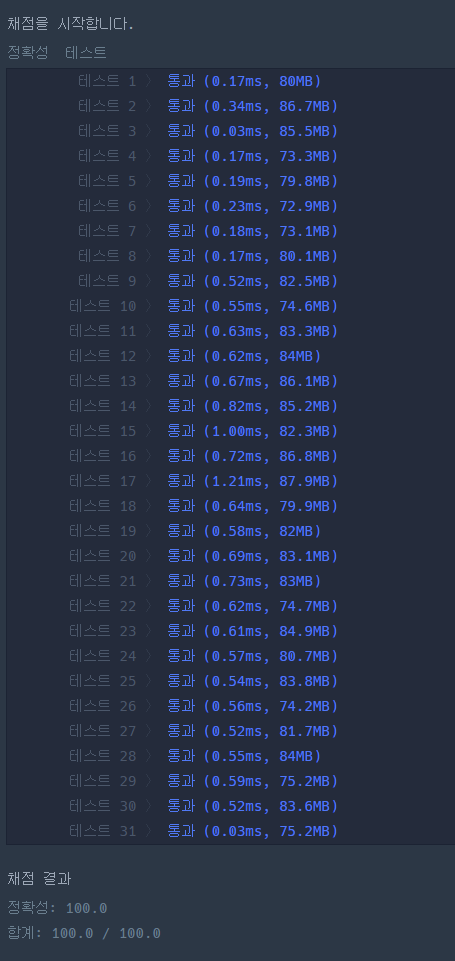

### 프로그래머스 Lv3 [미로 탈출 명령어](https://school.programmers.co.kr/learn/courses/30/lessons/150365) (Java)

> **날짜:** 2026년 7월 23일 <br>
> **알고리즘:** 격자 그래프, 그리디<br>
> **언어:** Java <br>
> **핵심 키워드:** 격자 그래프, 그리디, 사전순 정렬

## 📌 문제 개요

* **설명:** `n × m` 크기의 격자에서 출발 지점 `(x, y)`부터 도착 지점 `(r, c)`까지 정확히 `k`번 이동하여 도달하는 경로를 구하는 문제이다.

* 격자 내부에서는 상하좌우로 한 칸씩 이동할 수 있으며, 동일한 위치를 여러 번 방문할 수 있다.

* 이동 경로는 각 방향을 나타내는 문자로 표현한다.

```text
d : 아래쪽으로 한 칸 이동
l : 왼쪽으로 한 칸 이동
r : 오른쪽으로 한 칸 이동
u : 위쪽으로 한 칸 이동
```

* 가능한 경로가 여러 개라면 이동 문자열이 사전순으로 가장 앞서는 경로를 반환해야 한다.

```text
사전순 우선순위: d → l → r → u
```

* 출발 지점에서 도착 지점까지 이동할 수 없거나, 정확히 `k`번 이동하여 도착할 수 없는 경우에는 `"impossible"`을 반환한다.

* **제약 조건:**

  * $2 \le n, m \le 50$
  * $1 \le x, r \le n$
  * $1 \le y, c \le m$
  * $(x, y) \neq (r, c)$
  * $1 \le k \le 2500$

---

## 💡 풀이 핵심 (Core Logic)

### 1. 장애물이 없는 격자로 문제 단순화

* 격자에는 이동을 방해하는 장애물이 존재하지 않는다.

* 따라서 현재 위치에서 목적지까지 필요한 최소 이동 횟수는 맨해튼 거리로 계산할 수 있다.

```text
세로 이동 거리: |r - x|
가로 이동 거리: |c - y|

최소 이동 거리: |r - x| + |c - y|
```

* 장애물이 존재하지 않으므로 특정 방향으로 이동한 이후에도 반대 방향으로 되돌아오는 것이 가능하다.

* 이에 따라 현재 선택한 이동을 이후에 취소하거나 다른 경로를 다시 탐색할 필요가 없다.

* 만약 장애물이 존재한다면 현재의 사전순 선택이 이후 경로를 막을 수 있으므로, DFS와 백트래킹을 이용하여 선택 가능성을 검증해야 한다.

```text
장애물 없음 : 현재 이동을 즉시 확정할 수 있음
장애물 있음 : 이후 도달 가능성을 탐색해야 함
```

* 이 문제는 장애물이 없다는 조건을 통해 탐색 문제를 방향별 이동 횟수 관리 문제로 단순화할 수 있다.

### 2. 탈출 가능 여부 확인

* 출발 지점에서 도착 지점까지의 최소 이동 거리를 `dist`라고 정의한다.

```java
int vertical = Math.abs(r - x);
int horizontal = Math.abs(c - y);
int dist = vertical + horizontal;
```

* 최소 이동 거리보다 `k`가 작으면 목적지에 도달할 수 없다.

```text
dist > k
```

* 최소 거리보다 남는 이동 횟수는 제자리로 돌아오기 위한 왕복 이동으로 사용해야 한다.

* 한 방향으로 이동한 뒤 반대 방향으로 돌아오려면 항상 두 번의 이동이 필요하므로, 남는 이동 횟수는 짝수여야 한다.

```java
int remain = k - dist;

if (dist > k || (remain & 1) == 1) {
    return "impossible";
}
```

* 따라서 탈출 가능 조건은 다음과 같다.

```text
최소 이동 거리 ≤ k
(k - 최소 이동 거리)는 짝수
```

### 3. 목적지까지 필요한 방향별 이동 횟수 계산

* 목적지까지 도달하기 위해 반드시 수행해야 하는 이동 횟수를 방향별로 저장한다.

```text
도착 지점이 아래쪽에 위치 : d 횟수 증가
도착 지점이 위쪽에 위치 : u 횟수 증가
도착 지점이 왼쪽에 위치 : l 횟수 증가
도착 지점이 오른쪽에 위치 : r 횟수 증가
```

* 예를 들어 출발 지점보다 도착 지점의 행 번호가 크다면 아래쪽으로 이동해야 한다.

```java
dir[(r > x) ? DOWN : UP].cnt = Math.abs(r - x);
```

* 출발 지점보다 도착 지점의 열 번호가 작다면 왼쪽으로 이동해야 한다.

```java
dir[(c < y) ? LEFT : RIGHT].cnt = Math.abs(c - y);
```

* 각 방향의 `cnt`는 앞으로 반드시 수행해야 하는 이동 횟수를 의미한다.

### 4. 방향 정보를 클래스로 관리

* 하나의 방향에는 여러 정보가 함께 필요하다.

```text
출력할 이동 문자
반대 방향의 인덱스
앞으로 수행해야 할 이동 횟수
```

* 해당 정보들을 각각의 배열로 분리하지 않고 `Direction` 클래스로 묶어 관리한다.

```java
private class Direction {
    int opposite;
    int cnt;
    char command;

    Direction(int opposite, char command) {
        this.opposite = opposite;
        this.command = command;
    }
}
```

* 방향과 관련된 데이터를 하나의 객체로 관리하면 현재 방향의 반대 방향을 조건문 없이 바로 확인할 수 있다.

```java
int opposite = dir[i].opposite;
```

* 추가 이동을 수행한 경우 반대 방향 이동을 예약하는 코드도 다음과 같이 표현할 수 있다.

```java
dir[dir[i].opposite].cnt++;
```

* 이는 단순히 클래스를 사용한 것이 아니라, 문제에서 필요한 방향 상태를 하나의 자료구조로 정의한 것이다.

### 5. 사전순을 방향 배열 순서로 표현

* 이동 문자열의 사전순은 다음과 같다.

```text
d → l → r → u
```

* 방향 배열을 사전순과 동일한 순서로 구성한다.

```java
Direction[] dir = new Direction[4];

dir[0] = new Direction(3, 'd');
dir[1] = new Direction(2, 'l');
dir[2] = new Direction(1, 'r');
dir[3] = new Direction(0, 'u');
```

* 각 이동 단계마다 배열을 처음부터 순회하면 별도의 문자열 비교 없이 사전순으로 가장 앞선 방향을 선택할 수 있다.

```java
for (int i = 0; i < 4; i++) {
    // d, l, r, u 순서로 확인
}
```

* 자료구조의 순서 자체가 그리디 선택의 우선순위를 나타낸다.

### 6. 필수 이동 횟수 소비

* 현재 확인 중인 방향에 반드시 수행해야 할 이동 횟수가 남아 있다면 해당 방향으로 이동한다.

```java
if (dir[i].cnt > 0) {
    dir[i].cnt--;
}
```

* 방향별 `cnt`는 목적지에 도달하기 위해 반드시 수행해야 하는 이동량이므로, 해당 값을 하나 감소시키고 현재 위치를 갱신한다.

```java
sb.append(dir[i].command);
x = nx;
y = ny;
```

* 한 번 선택한 이동은 최종 경로에 즉시 추가되며, 이후 다시 취소하거나 수정하지 않는다.

### 7. 추가 이동과 반대 방향 예약

* 현재 방향의 필수 이동 횟수가 없더라도 `remain`이 남아 있다면 사전순을 앞당기기 위해 해당 방향으로 추가 이동할 수 있다.

* 추가 이동을 수행하면 최종적으로 목적지에 도달하기 위해 반대 방향으로 한 번 돌아와야 한다.

```java
int opposite = dir[i].opposite;
dir[opposite].cnt++;
remain -= 2;
```

* 예를 들어 아래쪽으로 한 칸 추가 이동했다면, 이후 위쪽으로 한 칸 이동해야 하므로 `u` 방향의 `cnt`를 증가시킨다.

```text
현재 이동 : d
예약 이동 : u

사용되는 추가 이동 횟수: 2
```

* `remain`은 항상 짝수이므로 `remain > 0`인 경우 최소 두 번의 이동이 남아 있다.

```java
else if (remain > 0) {
    dir[dir[i].opposite].cnt++;
    remain -= 2;
}
```

* 이 방식은 추가 이동 경로를 별도로 저장하지 않고, 반대 방향의 필수 이동 횟수를 증가시키는 형태로 관리한다.

### 8. 격자 범위 확인

* 사전순으로 앞선 방향이라도 격자 바깥으로 이동하는 경우에는 선택할 수 없다.

```java
int nx = x + dx[i];
int ny = y + dy[i];

if (!check(nx, ny, n, m)) {
    continue;
}
```

* 현재 위치에서 실제로 이동할 수 있는 방향만 후보로 사용한다.

```java
private static boolean check(int x, int y, int n, int m) {
    return x > 0 && x <= n && y > 0 && y <= m;
}
```

* 장애물은 존재하지 않지만 격자의 경계는 존재하므로, 추가 왕복 이동을 수행할 때 반드시 범위를 확인해야 한다.

### 9. 매 단계 경로 확정

* 총 `k`번의 이동을 수행하며, 각 단계에서 사전순으로 가장 앞선 유효한 방향 하나를 선택한다.

```java
for (int step = 0; step < k; step++) {
    for (int i = 0; i < 4; i++) {
        // 이동 가능 여부 확인
        // 필수 이동 또는 추가 이동 수행
        // 이동이 결정되면 break
    }
}
```

* 하나의 방향이 선택되면 해당 문자를 결과 문자열에 추가하고 내부 반복문을 종료한다.

```java
sb.append(dir[i].command);
x = nx;
y = ny;
break;
```

* 장애물이 없으므로 현재 이동을 선택하는 순간 해당 경로를 확정할 수 있다.

* 따라서 모든 경로를 생성하거나, 선택한 경로를 다시 취소하는 백트래킹 과정이 필요하지 않다.

### 10. 문제 재해석

* 원래 문제는 정확히 `k`번 이동하여 목적지에 도착하는 사전순 최소 경로를 구하는 문제이다.

* 이를 방향별 이동 횟수의 관점으로 재해석할 수 있다.

```text
cnt    : 목적지에 도달하기 위해 앞으로 반드시 수행해야 하는 이동
remain : 아직 특정 방향에 배치되지 않은 추가 왕복 이동
```

* 현재 방향으로 추가 이동하면 반대 방향의 `cnt`가 증가한다.

```text
추가 이동 수행
→ 목적지에서 한 칸 멀어짐
→ 반대 방향 이동 의무 발생
→ 반대 방향 cnt 증가
```

* 따라서 경로 전체를 탐색하는 대신, 방향별로 남아 있는 이동 의무를 사전순으로 처리하면서 정답을 생성할 수 있다.

### 11. 시간 및 공간 복잡도

* 결과 문자열의 길이는 정확히 `k`이다.

* 각 이동 단계에서는 최대 네 방향만 확인한다.

```text
시간 복잡도: O(4k) = O(k)
```

* 방향 정보는 항상 네 개만 사용하므로 상수 공간을 사용한다.

```text
방향 정보: O(1)
```

* 결과 문자열을 저장하기 위해 `k` 길이의 `StringBuilder`가 필요하다.

```text
공간 복잡도: O(k)
```

* 각 이동을 선택하는 순간 경로가 확정되므로 이미 생성한 문자열을 다시 탐색하거나 수정하지 않는다.

---

## 🛠 성능 최적화 인사이트 (Performance Insights)

### 1. 추가 왕복 이동을 한 번에 처리하는 방법

* 현재 구현은 `remain`이 남아 있을 때 추가 이동을 한 칸씩 수행한다.

```java
dir[dir[i].opposite].cnt++;
remain -= 2;
```

* `remain`은 항상 짝수이므로, 추가 이동 가능한 횟수를 계산하여 여러 번의 왕복 이동을 한 번에 예약하는 방식도 사용할 수 있다.

* 예를 들어 아래쪽으로 추가 이동할 수 있는 최대 횟수는 현재 위치에서 아래쪽 경계까지의 거리와 `remain / 2` 중 작은 값이다.

```java
int additional = Math.min(n - x, remain / 2);
```

* 해당 값을 이용하면 아래쪽 이동과 이후 필요한 위쪽 이동을 한 번에 예약할 수 있다.

```java
dir[DOWN].cnt += additional;
dir[UP].cnt += additional;
remain -= additional * 2;
```

* 동일한 방식으로 왼쪽, 오른쪽, 위쪽 이동도 방향별 경계까지의 거리를 계산하여 여러 번의 이동을 한 번에 처리할 수 있다.

### 2. 점프 방식의 장점

* 추가 이동을 한 칸씩 처리하지 않으므로 반복 횟수를 줄일 수 있다.

* 이동 횟수가 매우 큰 경우에는 방향별 추가 이동량을 한 번에 계산하는 방식이 더 효율적일 수 있다.

```text
한 칸씩 처리 : 추가 이동 횟수만큼 반복
점프 처리    : 방향별 최대 추가량을 계산하여 한 번에 반영
```

### 3. 점프 방식의 단점

* 각 방향마다 현재 위치에서 경계까지 이동할 수 있는 최대 횟수를 별도로 계산해야 한다.

* 기존 필수 이동 횟수와 반대 방향에 예약된 이동 횟수를 함께 고려해야 한다.

* 방향에 따라 행과 열의 계산식이 달라지므로 분기와 상태 갱신 코드가 증가한다.

```text
현재 위치
격자 경계
방향별 필수 이동량
반대 방향 예약량
남은 추가 이동량
```

* 단순 반복을 줄이기 위해 추가되는 계산과 조건이 많아지며, 코드의 길이와 구현 난이도가 증가한다.

### 4. 현재 제약 조건에서는 최적화 필요성이 낮음

* 문제에서 `k`의 최대값은 `2500`이다.

* 현재 구현은 각 이동마다 최대 네 방향만 확인하므로 최악의 경우에도 연산량은 매우 작다.

```text
최대 방향 확인 횟수: 2500 × 4
```

* 따라서 추가 이동을 한 번에 점프하는 최적화를 적용하더라도 실제 실행 시간 차이는 의미 있는 수준으로 나타나기 어렵다.

* 반면 점프 방식을 적용하면 방향별 경계 계산과 이동량 갱신 과정이 복잡해져 코드 난이도와 오류 가능성이 높아진다.

* 이에 따라 현재 제약 조건에서는 한 칸씩 경로를 확정하는 방식이 성능과 가독성 사이에서 더 적절한 선택이다.

```text
점프 방식
장점 : 반복 횟수 감소
단점 : 코드 복잡도와 구현 난이도 증가

현재 방식
장점 : 로직이 단순하고 이동 과정이 명확함
성능 : O(k)로 제한사항을 충분히 만족함
```

* 최적화 가능성은 존재하지만, 입력 범위와 코드 복잡도를 함께 고려하면 적용할 실질적인 필요성은 낮다.


## 🧠 회고 및 결론

문제가 길지만, 내용은 없는 전형적인 카카오 기출 문제였다. 문제의 핵심을 확인하는 스킬이 주요하게 작용하였으며, 설계가 중요한 문제다.

제약사항을 보니까 다양한 풀이가 가능할 것 같기도 하다.

---

### 📂 소스 코드
*   [Solution.java](./Solution.java)
 
---

### 🖥️ 실행 결과



---