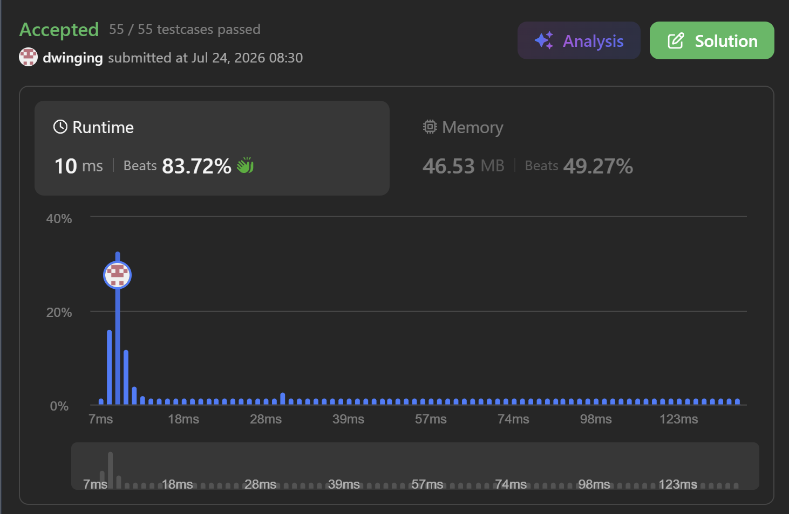

### LeetCode 847 [Shortest Path Visiting All Nodes](https://leetcode.com/problems/shortest-path-visiting-all-nodes/description/) (Java)

> **날짜:** 2026년 7월 24일 <br>
> **알고리즘:** 그래프 탐색, 비트마스킹<br>
> **언어:**  Java <br>
> **핵심 키워드:** 그래프 탐색, 비트마스킹, BFS

## 📌 문제 개요

* **설명:** 무방향 연결 그래프에서 임의의 정점에서 출발하여 모든 정점을 최소 한 번 이상 방문하는 최단 경로의 길이를 구하는 문제이다.

* 시작 정점과 종료 정점은 자유롭게 선택할 수 있으며, 정점과 간선은 여러 번 방문할 수 있다.

* **제약 조건:**

  * $1 \le n \le 12$
  * 그래프는 항상 연결되어 있다.

---

## 💡 풀이 핵심 (Core Logic)

### 1. 현재 정점과 방문 집합을 상태로 관리

* 같은 정점에 도착하더라도 지금까지 방문한 정점이 다르면 서로 다른 상태이다.

```text
현재 정점 + 방문한 정점 집합
```

* 따라서 방문 여부를 다음과 같이 관리한다.

```java
visited[node][bit]
```

### 2. 방문 집합을 비트마스킹으로 표현

* `i`번 정점 방문 여부를 `i`번 비트로 저장한다.

```java
int nextBit = bit | (1 << next);
```

* 모든 정점을 방문한 상태는 다음과 같다.

```java
int end = (1 << n) - 1;
```

### 3. 모든 정점에서 동시에 BFS 시작

* 시작 정점을 자유롭게 선택할 수 있으므로 모든 정점을 초기 상태로 큐에 삽입한다.

```java
for (int i = 0; i < n; i++) {
    int bit = 1 << i;

    que.add(new int[]{i, bit, 0});
    visited[i][bit] = true;
}
```

* BFS에서 처음으로 `bit == end`가 되는 순간의 이동 횟수가 최단 거리이다.

### 4. 중복 정점 방문과 중복 상태 구분

* 이미 방문한 정점을 다시 방문하는 것은 허용된다.

* 다만 현재 정점과 방문 집합이 모두 같은 상태는 다시 탐색하지 않는다.

```text
정점 중복 방문: 허용
상태 중복 방문: 방지
```

### 5. 시간 및 공간 복잡도

* 현재 정점은 `n`개, 방문 집합은 최대 $2^n$개이다.

```text
시간 복잡도: O((n + E) × 2^n)
공간 복잡도: O(n × 2^n)
```

---

## 🧠 회고 및 결론

외판원 순회처럼 방문했던 모든 지점을 비트로 관리하는 유형의 문제다. 외판원 순회 문제를 자주 풀어보지 않아서 발상을 떠올리는 것이 어려웠다.

새로운 개념을 배웠으니 응용문제를 풀면서 외판원 순회까지 정복하고 싶다.

오랜만에 신선하고 재밌는 문제였다.

---

### 📂 소스 코드
*   [Solution.java](./Solution.java)
 
---

### 🖥️ 실행 결과



---