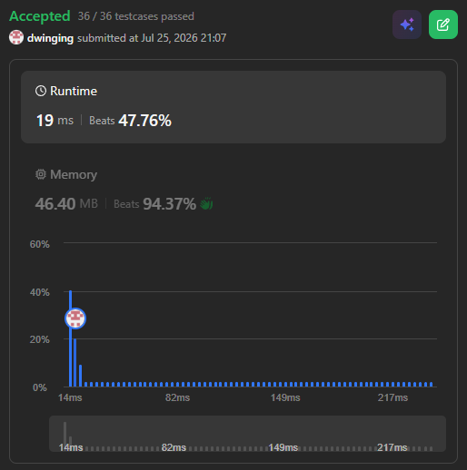

### LeetCode 864 [Shortest Path to Get All Keys](https://leetcode.com/problems/shortest-path-to-get-all-keys/description/) (Java)

> **날짜:** 2026년 7월 25일 <br>
> **알고리즘:** 그래프 탐색, 비트마스킹<br>
> **언어:**  Java <br>
> **핵심 키워드:** 그래프 탐색, 비트마스킹

## 📌 문제 개요

* **설명:** 시작 지점에서 출발하여 격자를 이동하면서 모든 열쇠를 획득하는 데 필요한 최소 이동 횟수를 구하는 문제이다.

* 자물쇠는 대응하는 열쇠를 보유한 경우에만 통과할 수 있다.

* 모든 자물쇠를 여는 것이 아니라, **모든 열쇠를 획득하는 것**이 목표이다.

* **제약 조건:**

  * $1 \le m, n \le 30$
  * 열쇠의 개수는 $1$개 이상 $6$개 이하이다.
  * 각 열쇠와 자물쇠는 하나씩 존재한다.

---

## 💡 풀이 핵심 (Core Logic)

### 1. 위치와 열쇠 집합을 하나의 상태로 정의

* 같은 위치에 도착하더라도 현재 보유한 열쇠가 다르면 통과할 수 있는 자물쇠와 이후의 이동 경로가 달라진다.

```text
현재 위치 + 보유한 열쇠 집합
```

* 따라서 좌표만으로 방문 여부를 확인할 수 없으며, 열쇠 상태까지 함께 관리해야 한다.

```java
visited[y][x][bit]
```

### 2. 상태 확장 BFS로 모든 열쇠를 획득하는 최단 거리 탐색

* 열쇠 집합을 비트마스킹으로 표현하고, 격자의 각 위치에서 현재 열쇠 상태에 따라 이동 가능한 다음 상태를 탐색한다.

* 열쇠를 획득하면 해당 비트를 추가하고, 자물쇠를 만났다면 대응하는 비트를 가지고 있는 경우에만 이동한다.

```java
int nextBit = bit | (1 << (key - 'a'));
```

* 모든 이동 비용이 `1`이므로 BFS를 사용하며, 모든 열쇠를 획득한 상태에 처음 도달한 순간의 이동 횟수가 정답이다.

```java
int end = (1 << keyCount) - 1;
```

---

## 🧠 회고 및 결론

키를 비트로 관리하는 것이 핵심인 문제다. 보통은 키를 가지고 문을 여는 형태가 많지만, 그냥 키만 획득하면 되는 단순한 문제다.

이 문제에서 한단계 난이도를 높인다면, 모든 자물쇠를 열어야한다는 조건을 추가하면 된다. 그렇게 되면 자물쇠를 열였는지에 대한 상태관리가 추가로 필요하여 4차원 배열로 상태를 관리해야한다.

---

### 📂 소스 코드
*   [Solution.java](./Solution.java)
 
---

### 🖥️ 실행 결과



---