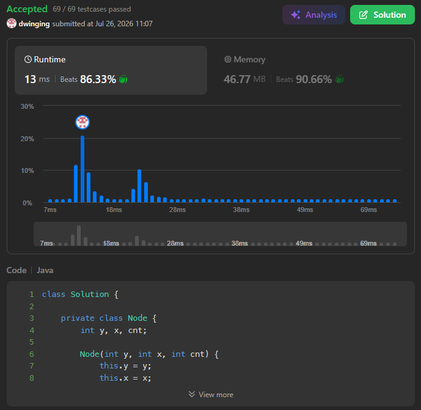

### LeetCode 1368 [Minimum Cost to Make at Least One Valid Path in a Grid](https://leetcode.com/problems/minimum-cost-to-make-at-least-one-valid-path-in-a-grid/description/) (Java)

> **날짜:** 2026년 7월 26일 <br>
> **알고리즘:** 그래프 탐색, 0-1 BFS, 다익스트라<br>
> **언어:**  Java <br>
> **핵심 키워드:** 0-1BFS

## 📌 문제 개요

* **설명:** 각 칸에 이동 방향이 지정된 격자에서 `(0, 0)`부터 `(m - 1, n - 1)`까지 도달하기 위해 변경해야 하는 방향의 최소 개수를 구하는 문제이다.

* 현재 칸이 가리키는 방향으로 이동하는 경우에는 비용이 발생하지 않는다.

* 현재 칸이 가리키는 방향과 다른 방향으로 이동하려면 해당 칸의 방향을 변경해야 하며, 비용 `1`이 발생한다.

* 격자에 표시된 방향이 격자 바깥을 가리킬 수도 있다.

* **제약 조건:**

  * $1 \le m, n \le 100$
  * `grid[i][j]`는 `1` 이상 `4` 이하이다.
  * 방향은 다음과 같이 주어진다.

    * `1`: 오른쪽
    * `2`: 왼쪽
    * `3`: 아래쪽
    * `4`: 위쪽

---

## 💡 풀이 핵심 (Core Logic)

### 1. 이동 방향에 따라 간선 비용을 정의

* 각 칸을 하나의 정점으로 보고, 상하좌우 인접한 칸으로 이동하는 과정을 그래프의 간선으로 표현한다.

* 현재 칸에 표시된 방향과 이동하려는 방향이 같다면 비용은 `0`이다.

* 현재 칸에 표시된 방향과 이동하려는 방향이 다르다면 방향을 변경해야 하므로 비용은 `1`이다.

```text
현재 방향과 이동 방향이 같음  → 비용 0
현재 방향과 이동 방향이 다름 → 비용 1
```

* 따라서 각 간선의 가중치는 `0` 또는 `1`로만 구성된다.

### 2. 0-1 BFS로 최소 변경 비용 탐색

* 간선의 가중치가 `0`과 `1`로만 구성되므로 0-1 BFS를 사용한다.

* 비용이 `0`인 이동은 덱의 앞쪽에 추가하여 우선적으로 탐색한다.

* 비용이 `1`인 이동은 덱의 뒤쪽에 추가한다.

```java
if (grid[cy][cx] == direction) {
    deque.addFirst(new Node(ny, nx, cost));
} else {
    deque.addLast(new Node(ny, nx, cost + 1));
}
```

* 이를 통해 일반 다익스트라의 우선순위 큐 없이도 최소 비용 순서로 상태를 탐색할 수 있다.

### 3. 각 좌표까지의 최소 비용 관리

* 단순 방문 여부가 아니라, 각 좌표까지 도달하는 데 필요한 최소 변경 비용을 저장한다.

```java
visited[y][x] = (0, 0)에서 (y, x)까지 이동하는 최소 비용
```

* 같은 좌표에 다시 도달하더라도 기존보다 더 적은 비용이라면 값을 갱신하고 다시 탐색한다.

```java
if (visited[ny][nx] > nextCost) {
    visited[ny][nx] = nextCost;
}
```

* 모든 상태 탐색이 끝난 뒤 `visited[m - 1][n - 1]`에 저장된 값이 도착점까지 필요한 최소 방향 변경 비용이다.

---

## 🧠 회고 및 결론

0-1BFS 알고리즘을 알고 있다면 쉽게 풀리는 문제다. 계속해서 LeetCode Hard 문제를 풀고 있는데, 난이도 편차가 생각보다 많이 심하다.

---

### 📂 소스 코드
*   [Solution.java](./Solution.java)
 
---

### 🖥️ 실행 결과



---