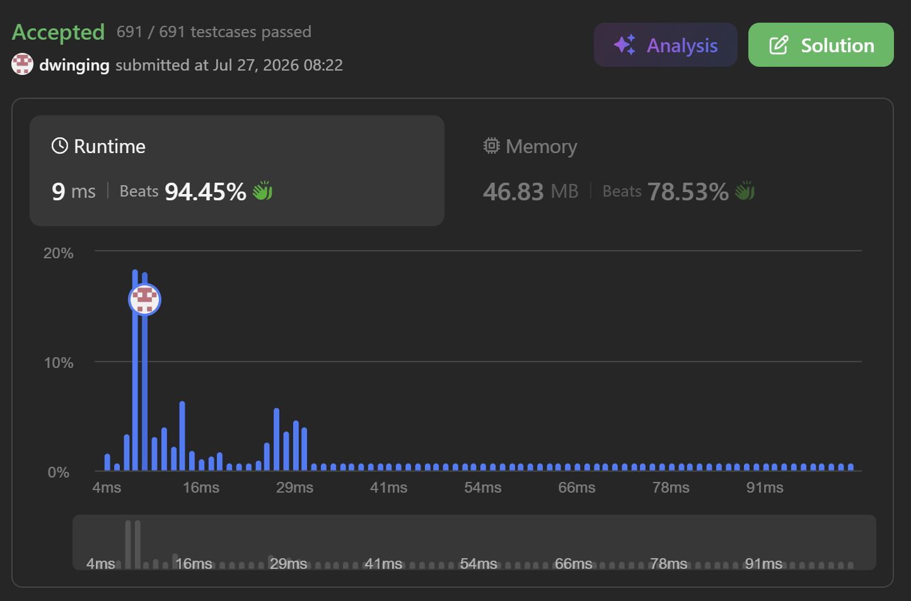

### LeetCode 3286 [Find a Safe Walk Through a Grid](https://leetcode.com/problems/find-a-safe-walk-through-a-grid/description/) (Java)

> **날짜:** 2026년 7월 27일 <br>
> **알고리즘:** 그래프 탐색, 0-1 BFS<br>
> **언어:**  Java <br>
> **핵심 키워드:** 0-1 BFS

## 📌 문제 개요

* **설명:** `0`과 `1`로 구성된 격자에서 `(0, 0)`부터 `(m - 1, n - 1)`까지 이동할 수 있는지 판단하는 문제이다.

* 상하좌우로 이동할 수 있으며, 값이 `1`인 칸에 진입하면 체력이 `1` 감소한다.

* 이동 중 체력은 항상 양수여야 하며, 도착점에 도달했을 때 체력이 `1` 이상 남아 있어야 한다.

* 시작 칸이 `1`인 경우에도 시작과 동시에 체력이 감소한다.

---

## 💡 풀이 핵심 (Core Logic)

### 1. 칸의 값을 이동 비용으로 정의

* 값이 `0`인 칸으로 이동하면 체력이 감소하지 않으므로 비용은 `0`이다.

* 값이 `1`인 칸으로 이동하면 체력이 `1` 감소하므로 비용은 `1`이다.

```text
0인 칸으로 이동 → 비용 0
1인 칸으로 이동 → 비용 1
```

* 이동 비용이 `0`과 `1`로만 구성되므로 0-1 BFS를 사용한다.

### 2. 0-1 BFS로 체력 소모가 적은 경로부터 탐색

* 값이 `0`인 칸은 덱의 앞쪽에 추가한다.

* 값이 `1`인 칸은 덱의 뒤쪽에 추가한다.

```java
if (grid.get(ny).get(nx) == 0) {
    deque.addFirst(new Node(ny, nx, health));
} else {
    deque.addLast(new Node(ny, nx, health - 1));
}
```

* 이를 통해 체력 소모가 적은 경로부터 탐색할 수 있다.

* 다음 칸으로 이동한 이후에도 체력이 양수인 경우에만 탐색을 진행한다.

```java
health - grid.get(ny).get(nx) > 0
```

### 3. 입력 격자를 방문 배열로 재사용

* 이 문제는 최소 체력 소모량이 아니라 도착 가능 여부만 판단하면 된다.

* 0-1 BFS에서는 체력 소모가 적은 경로가 먼저 탐색되므로, 처음 방문한 칸을 다시 탐색할 필요가 없다.

* 따라서 별도의 `visited` 배열을 사용하지 않고, 방문한 칸의 값을 `health + 1`로 변경한다.

```java
grid.get(ny).set(nx, health + 1);
```

* 하나의 격자 값으로 칸의 비용과 방문 여부를 동시에 관리할 수 있다.

```text
0          → 안전한 미방문 칸
1          → 위험한 미방문 칸
health + 1 → 방문한 칸
```

* 방문한 칸은 현재 체력보다 큰 값을 가지므로 기존 이동 조건에서 자동으로 제외된다.

```java
health - grid.get(ny).get(nx) > 0
```

* 이를 통해 별도의 방문 배열과 방문 여부 조건 없이 탐색할 수 있다.

---

## 🧠 회고 및 결론

일반적인 0-1BFS 유형의 문제다. 보통은 시작점에서 체력을 감소시키지 않는데, LeetCode는 시작점 예외처리가 중요하다. 문제에 명시되어 있지 않는데, 자주 실수한다.

---

### 📂 소스 코드
*   [Solution.java](./Solution.java)
 
---

### 🖥️ 실행 결과



---