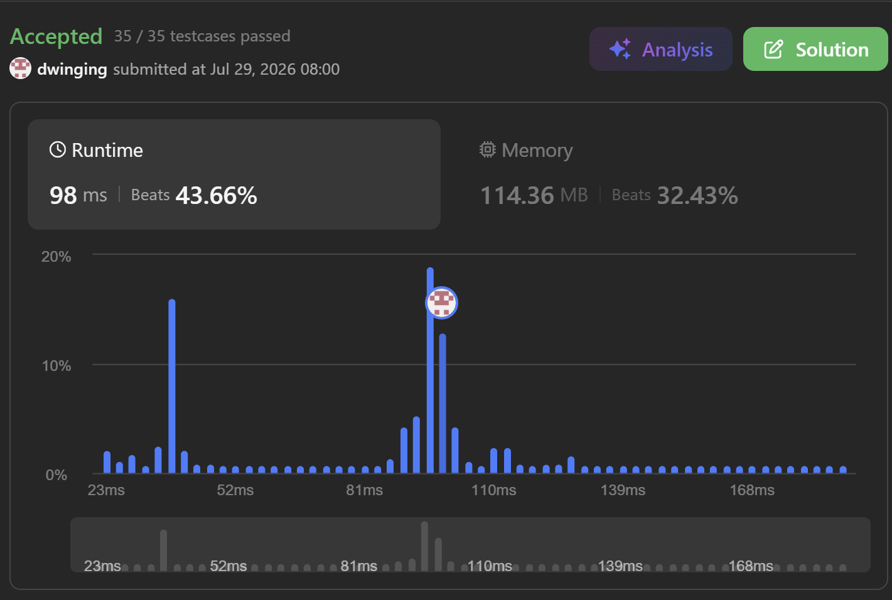
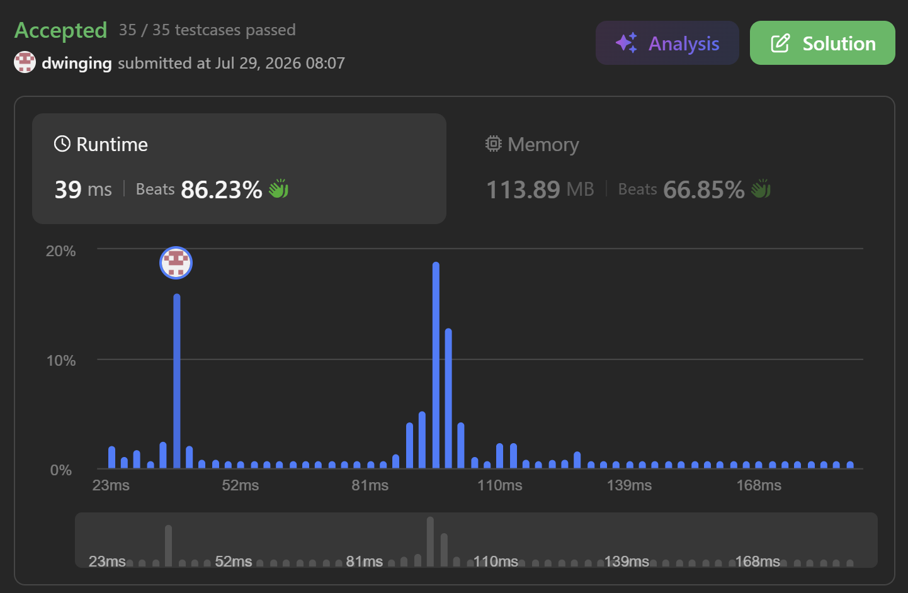

### LeetCode 2406 [Divide Intervals Into Minimum Number of Groups](https://leetcode.com/problems/divide-intervals-into-minimum-number-of-groups/description/) (Java)

> **날짜:** 2026년 7월 29일 <br>
> **알고리즘:** 우선순위 큐, 누적합, 차분 배열 트릭 <br>
> **언어:**  Java <br>
> **핵심 키워드:** 작업 스케줄링, 차분 배열 트릭

## 📌 문제 개요

* **설명:** 여러 개의 닫힌 구간 `[left, right]`이 주어질 때, 서로 겹치는 구간이 같은 그룹에 포함되지 않도록 구간을 나누고 필요한 최소 그룹 수를 구하는 문제이다.

* 하나의 구간은 정확히 하나의 그룹에 포함되어야 한다.

* 같은 그룹에 속한 두 구간은 서로 겹치면 안 된다.

* 구간은 양 끝점을 포함하므로, 이전 구간의 종료 지점과 다음 구간의 시작 지점이 같은 경우에도 두 구간은 겹친다.

```text
[1, 5]와 [5, 8]은 5를 공통으로 포함하므로 서로 겹친다.
```

* 필요한 최소 그룹 수는 특정 지점에서 동시에 겹치는 구간의 최대 개수와 같다.

* **제약 조건:**

  * 구간의 개수는 최대 `100,000`개이다.
  * 각 구간의 시작점과 종료점은 `1` 이상 `1,000,000` 이하이다.
  * 모든 구간은 `left <= right`를 만족한다.

---

## 💡 풀이 핵심 (Core Logic)

### 1. 최소 그룹 수를 최대 중첩 개수로 변환

* 같은 시점에 겹치는 구간들은 서로 같은 그룹에 포함될 수 없다.

* 따라서 어떤 지점에서 `k`개의 구간이 동시에 겹친다면 최소 `k`개의 그룹이 필요하다.

* 반대로 구간을 종료 시점에 따라 적절히 배치하면 최대 중첩 개수만큼의 그룹으로 모든 구간을 나눌 수 있다.

```text
최소 그룹 수 = 모든 지점에서의 최대 구간 중첩 개수
```

### 2. 차분 배열에 구간 변화 기록

* 각 좌표에서 현재 포함되는 구간의 개수를 직접 계산하면 시간복잡도가 커질 수 있다.

* 차분 배열을 사용하여 구간의 시작점에는 `1`을 더하고, 종료점 다음 위치에는 `1`을 뺀다.

```java
count[left]++;
count[right + 1]--;
```

* 구간이 양 끝점을 모두 포함하는 닫힌 구간이므로, `right`가 아닌 `right + 1`에서 구간이 종료되도록 처리한다.

* 최대 좌표가 `1,000,000`이므로 `right + 1` 위치까지 접근할 수 있도록 배열 크기를 넉넉하게 선언한다.

```java
int[] count = new int[1_000_002];
```

### 3. 누적합으로 현재 중첩 개수 계산

* 차분 배열을 앞에서부터 누적하면 각 좌표에서 동시에 포함되는 구간의 개수를 구할 수 있다.

```java
int current = 0;
int answer = 0;

for (int i = 1; i < count.length; i++) {
    current += count[i];
    answer = Math.max(answer, current);
}
```

* 누적합 과정에서 확인한 최댓값이 필요한 최소 그룹 수가 된다.

### 4. 시간복잡도

* 모든 구간을 차분 배열에 기록하는 데 `O(N)`이 필요하다.

* 전체 좌표 범위를 누적합으로 탐색하는 데 `O(K)`가 필요하다.

```text
O(N + K)
```

* 여기서 `N`은 구간의 개수이고, `K`는 최대 좌표 범위인 `1,000,000`이다.

---

## 🧠 회고 및 결론

사실 평소에 이런 유형을 보면 우선순위 큐를 2개 쓰는 방식을 떠올리는 편이다. 조건이 많을 수록 더 그렇게 하는데, 생각해보니 한개만 있어도 풀린다는 것을 알 수 있었다.

그리고 조건이 적은 상황에서는 우선순위 큐가 아닌, 차분 배열 트릭으로도 풀 수 있다는 것을 배웠다.

간단한 문제였지만, 오랜만에 기본기를 다시 다지는 문제였다.

---

### 📂 소스 코드
*   [우선순위 큐](./Solution1.java)
*   [차분 배열 트릭](./Solution2.java)
 
---

### 🖥️ 실행 결과

 <br> 우선순위 큐 풀이 <br><br>

 <br> 차분 배열 트릭 풀이
---