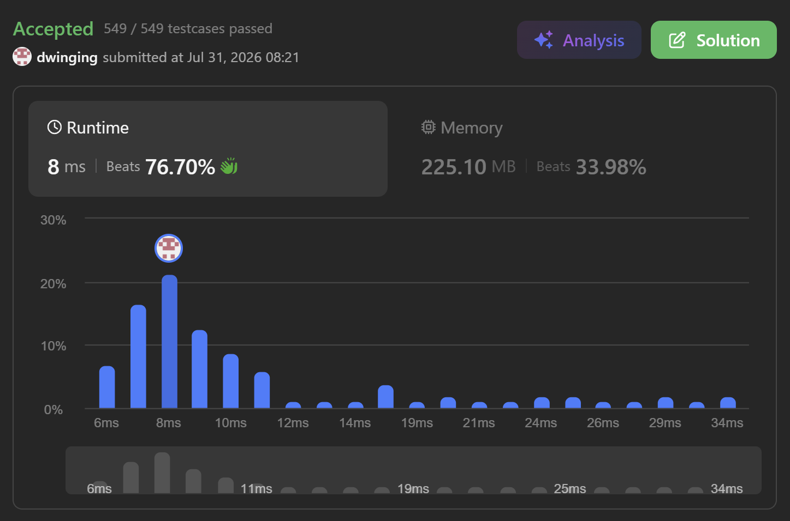

### LeetCode 3108 [Minimum Cost Walk in Weighted Graph](https://leetcode.com/problems/minimum-cost-walk-in-weighted-graph/description/) (Java)

> **날짜:** 2026년 7월 31일 <br>
> **알고리즘:** 분리 집합 <br>
> **언어:**  Java <br>
> **핵심 키워드:** Union-Find


## 📌 문제 개요

* **설명:** 무방향 가중 그래프에서 두 정점 사이를 이동하는 `walk`의 최소 비용을 구하는 문제이다.

* `edges[i] = [u, v, w]`는 정점 `u`와 `v`를 연결하는 가중치 `w`의 무방향 간선을 의미한다.

* `walk`는 정점과 간선을 여러 번 방문할 수 있으며, 동일한 간선을 반복해서 사용하는 것도 허용된다.

* 하나의 `walk`에 대한 비용은 이동하면서 사용한 모든 간선 가중치를 비트 AND 연산한 값이다.

```text
cost = w0 & w1 & w2 & ... & wk
```

* 각 쿼리 `query[i] = [s, t]`에 대해 정점 `s`에서 `t`까지 이동 가능한 `walk` 중 최소 비용을 구한다.

* 두 정점 사이에 이동 가능한 경로가 존재하지 않는 경우 `-1`을 반환한다.

* 비트 AND 연산은 새로운 값을 추가할수록 결과가 증가하지 않는다.

```text
a & b <= a
```

* 따라서 최소 비용을 만들기 위해서는 이동 가능한 간선의 가중치를 최대한 많이 AND 연산에 포함해야 한다.

* 무방향 그래프이며 정점과 간선의 반복 방문이 허용되므로, 같은 연결 컴포넌트에 속한 모든 간선을 순회한 뒤 목적지로 이동하는 것이 가능하다.

* 같은 간선을 여러 번 지나더라도 다음 성질에 의해 결과에는 영향을 주지 않는다.

```text
w & w = w
```

* 따라서 같은 연결 컴포넌트에 속한 두 정점 사이의 최소 비용은 해당 컴포넌트에 포함된 모든 간선 가중치를 AND한 값이 된다.

* **제약 조건:**

  * 정점의 개수 `n`은 `2` 이상 `100,000` 이하이다.
  * 간선의 개수는 `0`개 이상 `100,000`개 이하이다.
  * 간선 가중치 `w`는 `0` 이상 `100,000` 이하이다.
  * 쿼리의 개수는 `1`개 이상 `100,000`개 이하이다.
  * 모든 간선은 서로 다른 두 정점을 연결한다.
  * 각 쿼리의 시작 정점과 도착 정점은 서로 다르다.

---

## 💡 풀이 핵심 (Core Logic)

### 1. Union-Find로 연결 컴포넌트 구성

* 간선을 하나씩 순회하며 두 정점을 같은 집합으로 합친다.

* 각 집합의 루트 정점은 해당 연결 컴포넌트를 대표한다.

* 경로 압축과 Rank 기반 Union을 사용하여 `find`와 `union` 연산의 효율을 높인다.

```java
private int find(int node, int[] parents) {
    if (node == parents[node]) {
        return node;
    }

    return parents[node] = find(parents[node], parents);
}
```

### 2. 컴포넌트별 간선 가중치 AND 누적

* 각 루트에 해당 연결 컴포넌트의 모든 간선 가중치를 AND한 값을 저장한다.

* AND 연산의 초기값은 모든 비트가 `1`인 `-1`로 설정한다.

```text
-1 & w = w
```

```java
Arrays.fill(weight, -1);
```

* 서로 다른 두 컴포넌트를 합칠 때는 두 컴포넌트의 기존 누적값과 현재 간선의 가중치를 함께 AND 연산한다.

```java
int mergedWeight =
        weight[rootA] & weight[rootB] & edgeWeight;
```

* 두 정점이 이미 같은 컴포넌트에 속해 있다면, 현재 간선의 가중치만 기존 누적값에 추가한다.

```java
if (rootA == rootB) {
    weight[rootA] &= edgeWeight;
    return;
}
```

### 3. Rank 기반으로 두 집합 병합

* Rank가 낮은 트리를 Rank가 높은 트리 아래에 연결한다.

* 병합 이후 계산된 AND 값은 실제로 루트가 된 정점에 저장한다.

```java
if (rank[rootA] < rank[rootB]) {
    parents[rootA] = rootB;
    weight[rootB] = mergedWeight;
} else if (rank[rootA] > rank[rootB]) {
    parents[rootB] = rootA;
    weight[rootA] = mergedWeight;
} else {
    parents[rootB] = rootA;
    rank[rootA]++;
    weight[rootA] = mergedWeight;
}
```

### 4. 쿼리 처리

* 각 쿼리의 시작 정점과 도착 정점에 대해 루트를 확인한다.

* 두 정점의 루트가 다르면 서로 다른 연결 컴포넌트이므로 이동할 수 없다.

```java
answer[i] = rootS == rootT
        ? weight[rootS]
        : -1;
```

* 두 정점의 루트가 같다면 해당 연결 컴포넌트의 누적 AND 값이 최소 비용이 된다.

---

## ⏱️ 시간 복잡도

* 모든 간선에 대해 Union-Find 연산을 수행한다.

```text
O(E × α(N))
```

* 모든 쿼리에 대해 두 번의 `find` 연산을 수행한다.

```text
O(Q × α(N))
```

* 전체 시간 복잡도는 다음과 같다.

```text
O((E + Q) × α(N))
```

* `α(N)`은 역 아커만 함수로, 일반적인 입력 범위에서는 거의 상수에 가깝다.

---

## 🧠 회고 및 결론
 
AND 연산의 특징을 활용하여 Union-Find로 문제를 해결하는 방식이 새롭고 재미었다.

자주 등장하는 유형은 아니지만, 가끔은 이런 발상 중심의 문제를 풀면서 리프레시하는 것도 좋은 것 같다.

---

### 📂 소스 코드
*   [Solution.java](./Solution.java)
 
---

### 🖥️ 실행 결과



---