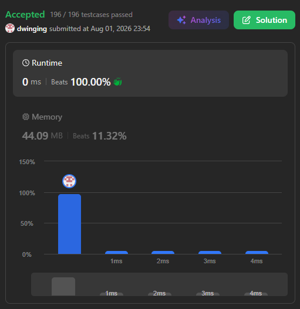

### LeetCode 33 [Search in Rotated Sorted Array](https://leetcode.com/problems/search-in-rotated-sorted-array/description/) (Java)

> **날짜:** 2026년 08월 01일 <br>
> **알고리즘:** 이진 탐색 <br>
> **언어:**  Java <br>
> **핵심 키워드:** 이진 탐색

## 📌 문제 개요

* **설명:** 오름차순으로 정렬된 서로 다른 정수 배열이 특정 지점을 기준으로 회전되어 있을 때, 주어진 `target`의 인덱스를 찾는 문제이다.

* 배열은 다음과 같이 두 개의 오름차순 구간이 이어진 형태가 될 수 있다.

```text
[4, 5, 6, 7, 0, 1, 2]
```

* `target`이 배열에 존재하면 해당 인덱스를 반환하고, 존재하지 않으면 `-1`을 반환한다.

* 배열의 모든 값은 서로 다르며, 전체 시간 복잡도는 `O(log N)`을 만족해야 한다.

---

## 💡 풀이 핵심 (Core Logic)

### 1. 정렬된 절반 구간 판별

* 현재 탐색 범위를 `mid`를 기준으로 나누면, 왼쪽과 오른쪽 구간 중 적어도 하나는 반드시 오름차순으로 정렬되어 있다.

* 다음 조건을 통해 왼쪽 구간이 정렬되어 있는지 확인한다.

```java
nums[left] <= nums[mid]
```

* 위 조건이 참이면 `[left, mid]` 구간이 정렬된 상태이며, 거짓이면 `[mid, right]` 구간이 정렬된 상태이다.

### 2. 정렬된 구간 내 Target 포함 여부 확인

* 왼쪽 구간이 정렬된 경우, `target`이 해당 구간의 값 범위에 포함되는지 확인한다.

```java
nums[left] <= target && target < nums[mid]
```

* 조건을 만족하면 왼쪽 구간을 탐색하고, 만족하지 않으면 오른쪽 구간을 탐색한다.

* 오른쪽 구간이 정렬된 경우에는 다음 조건을 확인한다.

```java
nums[mid] < target && target <= nums[right]
```

* 조건을 만족하면 오른쪽 구간을 탐색하고, 만족하지 않으면 왼쪽 구간을 탐색한다.

### 3. 탐색 범위 축소

* `target`이 포함될 수 없는 절반 구간을 제거하며 탐색 범위를 반복적으로 축소한다.

* 회전 지점을 직접 찾지 않고도, 정렬된 구간의 양 끝값을 기준으로 `target`의 포함 여부를 판단할 수 있다.

* 매 반복마다 탐색 범위가 절반으로 감소하므로 시간 복잡도는 `O(log N)`이다.

---

## 🧠 회고 및 결론

시간복잡도가 O(log n) 인 풀이를 강제하는 문제다. 만약에 정렬을 하고, 이진 탐색을 수행한다고 하면 정렬 과정이 O(n log n) 이기 때문에 시간 초과가 발생한다.

따라서 이진 탐색을 바로 수행하는 것이 키 포인트였다. 이분 탐색을 수행할 때 왼쪽과 오른쪽 구간 중 정렬된 구간을 먼저 찾고, 해당 구간에 target이 포함되는지 확인한다는 접근이 어려웠다.

---

### 📂 소스 코드
*   [Solution.java](./Solution.java)
 
---

### 🖥️ 실행 결과



---