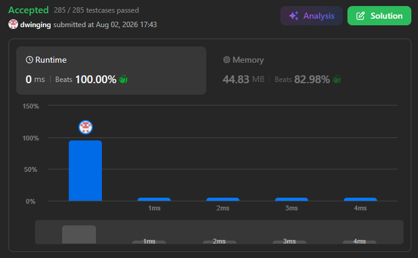

### LeetCode 81 [Search in Rotated Sorted Array II](https://leetcode.com/problems/search-in-rotated-sorted-array-ii/description/) (Java)

> **날짜:** 2026년 08월 02일  
> **알고리즘:** 이진 탐색  
> **언어:**  Java  
> **핵심 키워드:** 이진 탐색

## 📌 문제 개요

* **문제명:** Search in Rotated Sorted Array II
* **설명:** 중복 값을 포함할 수 있는 오름차순 배열이 특정 지점을 기준으로 회전되어 있을 때, 주어진 `target`이 배열에 존재하는지 확인해야 한다.
* **제약 조건:**

  * 배열은 하나의 오름차순 배열을 특정 지점에서 회전한 형태이다.
  * 배열에는 중복 값이 포함될 수 있다.
  * `target`이 존재하면 `true`, 존재하지 않으면 `false`를 반환한다.
  * 전체 연산 횟수를 최대한 줄여야 한다.

---

## 💡 풀이 핵심 (Core Logic)

### 1. 정렬된 구간을 기준으로 탐색 범위 설정

* 현재 탐색 범위를 `mid`를 기준으로 나누고, 왼쪽과 오른쪽 구간 중 정렬된 구간을 확인한다.
* `target`이 정렬된 구간의 값 범위에 포함되면 해당 구간을 탐색한다.
* 포함되지 않으면 반대쪽 구간을 탐색하여 탐색 범위를 절반씩 줄인다.

### 2. 중복 값으로 인해 구간을 판별할 수 없는 경우 처리

* `nums[left]`, `nums[mid]`, `nums[right]`가 모두 같으면 어느 구간이 정렬되어 있는지 판별할 수 없다.
* 이 경우 이미 `nums[mid]`가 `target`이 아님을 확인했으므로, `left`와 `right`를 한 칸씩 이동하여 중복 값을 제거한다.
* 중복 값이 연속되는 경우 탐색 범위를 절반으로 줄일 수 없으므로, 최악의 경우 시간 복잡도는 `O(N)`이 된다.

---

## 🧠 회고 및 결론

이전에 풀었던 문제와 같은 로직이라고 생각했지만, 중복 데이터가 불러오는 파장을 예상하지 못했다.

---

### 📂 소스 코드
*   [Solution.java](./Solution.java)
 
---

### 🖥️ 실행 결과

---