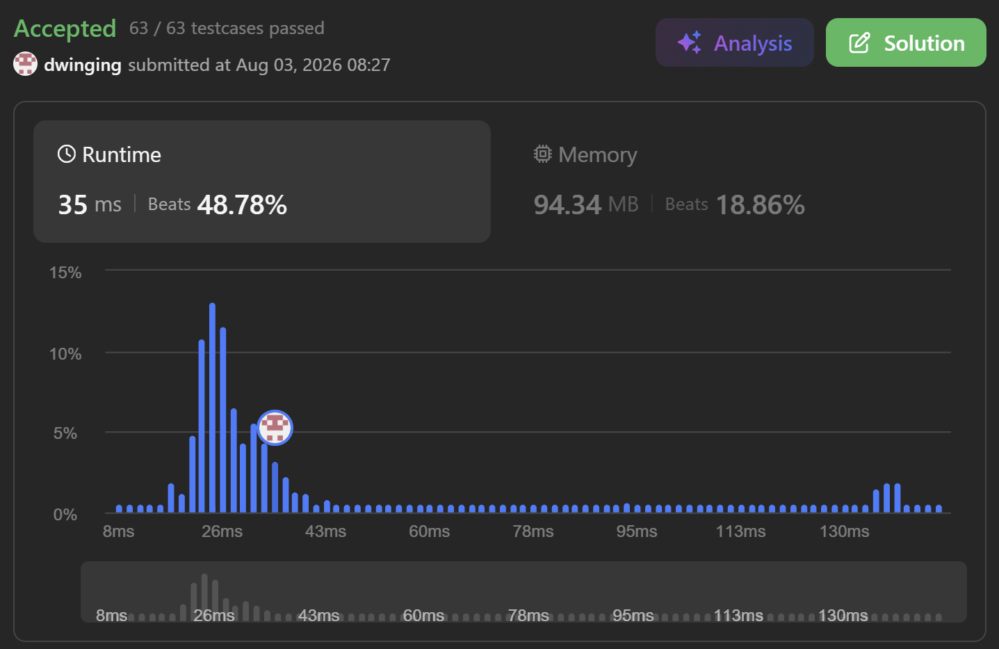

### LeetCode 1438 [Longest Continuous Subarray With Absolute Diff Less Than or Equal to Limit](https://leetcode.com/problems/longest-continuous-subarray-with-absolute-diff-less-than-or-equal-to-limit/description/) (Java)

> **날짜:** 2026년 8월 3일  
> **알고리즘:** 두 포인터, 모노톤 덱 
> **언어:**  Java  
> **핵심 키워드:** 두 포인터, 모노톤 덱

## 📌 문제 개요

* **문제명:** Longest Continuous Subarray With Absolute Diff Less Than or Equal to Limit
* **설명:** 정수 배열 `nums`와 정수 `limit`가 주어질 때, 부분 배열 내 임의의 두 원소 차이의 절댓값이 `limit` 이하인 가장 긴 연속 부분 배열의 길이를 구해야 한다.
* **제약 조건:**

  * 부분 배열은 하나 이상의 원소를 포함하는 연속 구간이어야 한다.
  * 부분 배열 내 두 원소의 최대 절댓값 차이는 해당 구간의 최댓값과 최솟값의 차이와 같다.
  * 배열의 길이는 최대 `10^5`이므로, 모든 부분 배열을 직접 확인하는 방식은 사용할 수 없다.
  * `nums[i]`와 `limit`의 값이 최대 `10^9`이므로, 값 자체보다 구간 내 최댓값과 최솟값을 효율적으로 관리해야 한다.

---

## 💡 풀이 핵심 (Core Logic)

### 1. 투 포인터를 사용하여 유효한 연속 구간 관리

* `left`와 `right` 포인터를 사용하여 현재 부분 배열의 범위를 관리한다.
* `right`를 증가시키며 새로운 원소를 구간에 포함하고, 현재 구간의 최댓값과 최솟값 차이가 `limit` 이하인지 확인한다.
* 조건을 만족하지 않는 경우 `left`를 증가시켜 구간의 크기를 줄인다.
* 조건을 다시 만족하게 되면 현재 구간의 길이를 계산하여 최댓값을 갱신한다.

### 2. 모노톤 덱을 사용하여 최댓값과 최솟값 관리

* 현재 구간의 최댓값과 최솟값을 빠르게 확인하기 위해 두 개의 `Deque`를 사용한다.
* 최댓값을 관리하는 덱은 값이 내림차순이 되도록 유지한다.

  * 새로운 값보다 작은 값은 이후 최댓값 후보가 될 수 없으므로 덱의 뒤에서 제거한다.
* 최솟값을 관리하는 덱은 값이 오름차순이 되도록 유지한다.

  * 새로운 값보다 큰 값은 이후 최솟값 후보가 될 수 없으므로 덱의 뒤에서 제거한다.
* 각 덱의 앞에는 현재 구간의 최댓값과 최솟값에 해당하는 인덱스가 위치한다.

### 3. 구간을 벗어난 인덱스 제거

* `left`가 증가하여 특정 원소가 현재 부분 배열에서 제외되면, 해당 인덱스가 덱의 앞에 있는지 확인한다.
* 덱의 앞 인덱스가 `left`와 같다면 해당 값을 제거한다.
* 인덱스를 저장하므로 중복 값이 존재하더라도 각 원소의 유효 범위를 정확하게 관리할 수 있다.

### 4. 시간 복잡도

* 각 원소는 두 덱에 최대 한 번 삽입되고 한 번 제거된다.
* `left`와 `right` 포인터 역시 배열 전체에서 각각 한 방향으로만 이동한다.
* 따라서 전체 시간 복잡도는 `O(N)`이며, 공간 복잡도는 `O(N)`이다.

---

## 🧠 회고 및 결론

두 포인터와 모노톤 덱을 활용하는 문제였다. 모노톤 스택 문제는 자주 풀어봤지만, 모노톤 덱을 2개 쓰는 문제는 처음이라 낯설었다.

---

### 📂 소스 코드
*   [Solution.java](./Solution.java)
 
---

### 🖥️ 실행 결과

---