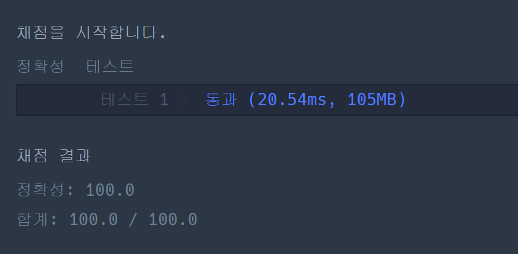

### 프로그래머스 Lv3 [GPS](https://school.programmers.co.kr/learn/courses/30/lessons/1837/) (Java)

> **날짜:** 2026년 8월 4일 <br>
> **알고리즘:** 다익스트라, 0-1 BFS<br>
> **언어:**  Java <br>
> **핵심 키워드:** 다익스트라, 0-1 BFS

## 📌 문제 개요

* 여러 거점과 양방향 도로로 구성된 그래프에서, 시간대별로 기록된 GPS 이동 경로를 실제로 이동 가능한 경로로 수정하는 문제이다.
* 택시는 매 시간마다 현재 거점에 그대로 머무르거나, 도로로 직접 연결된 인접 거점으로 이동할 수 있다.
* GPS 기록의 시작 거점과 도착 거점은 수정할 수 없으며, 중간 기록만 변경할 수 있다.
* 각 시간대의 GPS 위치를 다른 거점으로 변경한 횟수를 오류 수정 횟수로 계산하고, 이동 가능한 경로를 만들기 위한 최소 수정 횟수를 구해야 한다.
* 어떠한 방식으로도 시작 거점에서 출발하여 정해진 시간에 도착 거점까지 이동할 수 없다면 `-1`을 반환한다.

---

## 💡 풀이 핵심 (Core Logic)

### 1. 시간과 위치를 결합한 상태 그래프 구성

* 일반적인 도로 그래프의 정점만으로는 GPS 기록의 순서와 수정 횟수를 함께 표현하기 어렵다.
* 따라서 탐색 상태를 `(현재 시간, 현재 거점)`으로 정의하여, 동일한 거점이라도 도착한 시간이 다르면 서로 다른 상태로 구분한다.
* 시간 `t`에 거점 `e`에 있다면, 다음 시간 `t+1`에는 다음 두 종류의 거점으로 이동할 수 있다.

  * 현재 거점 `e`에 그대로 머무르는 경우
  * 도로로 연결된 인접 거점으로 이동하는 경우
* 제자리 이동 역시 하나의 이동 가능한 간선으로 처리하기 위해 각 거점에 자기 자신을 연결하는 Self-loop를 추가할 수 있다.

### 2. GPS 기록 일치 여부를 간선 가중치로 변환

* 다음 시간에 이동한 거점이 원래 GPS 기록과 동일하다면 해당 기록은 수정할 필요가 없으므로 비용은 `0`이다.
* 다음 시간의 거점이 GPS 기록과 다르다면 해당 위치 기록을 수정해야 하므로 비용은 `1`이다.

```text
next == gps_log[t + 1] → 가중치 0
next != gps_log[t + 1] → 가중치 1
```

* 결국 문제는 시작 상태 `(0, gps_log[0])`에서 도착 상태 `(k-1, gps_log[k-1])`까지 이동하는 최소 비용 경로를 구하는 최단 경로 문제로 변환된다.
* 시작 위치와 도착 위치는 변경할 수 없으므로 탐색의 시작점과 최종 도착점은 각각 고정된다.

### 3. 0-1 BFS를 이용한 최소 수정 횟수 탐색

* 모든 간선의 가중치가 `0` 또는 `1`로만 구성되므로 우선순위 큐 기반 다익스트라보다 0-1 BFS를 적용할 수 있다.
* GPS 기록과 일치하여 추가 비용이 없는 상태는 덱의 앞쪽에 삽입하여 우선적으로 탐색한다.
* GPS 기록과 달라 수정 비용이 `1` 증가하는 상태는 덱의 뒤쪽에 삽입한다.
* `dist[e][t]`에는 시간 `t`에 거점 `e`에 도착하기 위해 필요한 최소 수정 횟수를 저장한다.
* 동일한 `(거점, 시간)` 상태에 더 큰 비용으로 다시 도착한 경우에는 탐색하지 않으며, 기존 최소 비용보다 작은 경우에만 값을 갱신하고 덱에 삽입한다.
* 최종 시간에 도착 거점까지 도달한 최소 비용을 반환하고, 도달할 수 없다면 `-1`을 반환한다.

---

## 📊 풀이 방식 비교 (다익스트라 vs 0-1 BFS)

| 비교 항목          | 다익스트라                                        | 0-1 BFS                                       |
| -------------- | -------------------------------------------- | --------------------------------------------- |
| **알고리즘 성격**    | 비음수 가중치 그래프의 일반적인 최단 경로 탐색                   | 가중치가 `0`과 `1`로 제한된 그래프에 특화된 최단 경로 탐색          |
| **상태 정의**      | `(시간, 거점)`                                   | `(시간, 거점)`                                    |
| **가중치 처리**     | GPS 기록 일치 여부에 따라 `0` 또는 `1`의 비용을 우선순위 큐로 정렬  | 비용 `0`은 덱 앞쪽, 비용 `1`은 덱 뒤쪽에 삽입                |
| **자료구조**       | `PriorityQueue`                              | `Deque`                                       |
| **시간 복잡도**     | 약 $O(K(N+M)\log(KN))$                        | $O(K(N+M))$                                   |
| **공간 복잡도**     | $O(KN + N + M)$                              | $O(KN + N + M)$                               |
| **장점**         | 일반적인 최단 경로 구조로 이해하기 쉽고, 가중치 범위가 확장되어도 적용 가능  | 별도의 정렬 과정 없이 가중치 우선순위를 처리하여 더 효율적             |
| **단점**         | 모든 간선 가중치가 `0` 또는 `1`임에도 우선순위 큐 삽입·삭제 비용이 발생 | 가중치가 `0`과 `1`이 아닌 값으로 확장되면 그대로 적용할 수 없음       |
| **이 문제에서의 결론** | 정답을 구할 수 있지만 문제의 제한된 가중치 구조를 충분히 활용하지 못함     | GPS 기록의 일치 여부가 정확히 `0/1` 비용으로 변환되므로 가장 적합한 방식 |

---

## 🧠 회고 및 결론

발상이 까다로운 문제였다. `gps_log`를 가중치로 활용한다는 발상을 떠올리면 쉽게 풀 수 있지만, 그 과정까지 도달하는 것이 까다로웠다.

처음에는 GPS에 오류가 발생한 지점을 기준으로 정상적인 경로가 여러 집합으로 나뉜다고 생각해 분리 집합으로 접근했다. 하지만 집합 내부에서 어떤 값을 수정해야 하는지 고민해보니, 분리 집합만으로는 해결할 수 없다는 결론이 나왔다.

그다음에는 다익스트라를 떠올렸다. 시간별 위치가 GPS 기록과 일치하면 가중치를 `0`, 일치하지 않으면 가중치를 `1`로 설정했다. 로그가 일치하지 않을 때마다 1회의 수정이 필요하므로, 이를 경로의 비용으로 활용할 수 있다고 생각했다.

다만 문제에서 항상 도착 지점까지 도달할 수 있다고 보장하지 않으므로, 경우에 따라 우선순위 큐의 원소를 끝까지 확인해야 한다. 이때 발생하는 정렬 비용을 고려하면, 우선순위 큐보다 `Deque`를 사용하는 방식이 더 효율적이라고 판단했다.

마침 가중치가 `0`과 `1` 두 가지로만 구성되어 있으므로, 0-1 BFS가 적합하다고 최종 결론을 내렸다.
 

---

### 📂 소스 코드
*   [Solution.java](./Solution.java)
 
---

### 🖥️ 실행 결과



---