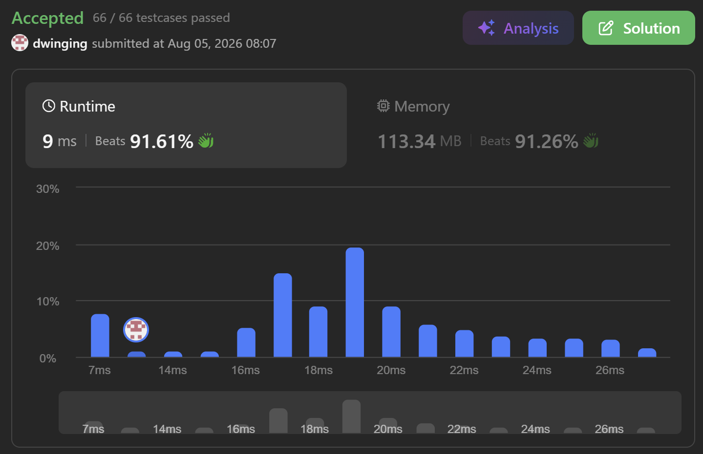

### LeetCode 1499 [Max Value of Equation](https://leetcode.com/problems/max-value-of-equation/description/) (Java)

> **날짜:** 2026년 8월 5일 <br>
> **알고리즘:** 모노톤 덱 <br>
> **언어:**  Java <br>
> **핵심 키워드:** 모노톤 덱

## 📌 문제 개요

* `x` 좌표를 기준으로 오름차순 정렬된 점들이 주어질 때, 두 점 `(xi, yi)`, `(xj, yj)`를 선택하여 다음 식의 최댓값을 구하는 문제이다.

```text
yi + yj + |xi - xj|
```

* 두 점은 반드시 `i < j`를 만족해야 하며, 두 점의 `x` 좌표 차이는 `k` 이하여야 한다.

```text
|xi - xj| <= k
```

* 모든 점의 `x` 좌표는 서로 다르며, 배열에는 `x` 좌표가 증가하는 순서로 저장되어 있다.
* 조건을 만족하는 점의 쌍이 최소 하나 이상 존재하는 것이 보장된다.
* 전체 점의 개수가 최대 `100,000`개이므로, 모든 점의 쌍을 확인하는 `O(N²)` 방식으로는 해결하기 어렵다.

---

## 💡 풀이 핵심 (Core Logic)

### 1. 정렬 조건을 이용한 절댓값 제거

* 점들은 `x` 좌표를 기준으로 오름차순 정렬되어 있으며, 항상 `i < j`인 두 점을 선택한다.
* 따라서 다음 관계가 항상 성립한다.

```text
xi < xj
```

* 이에 따라 절댓값은 다음과 같이 정리할 수 있다.

```text
|xi - xj| = xj - xi
```

* 원래 식은 다음과 같이 변형된다.

```text
yi + yj + |xi - xj|
= yi + yj + xj - xi
= (yi - xi) + (yj + xj)
```

* 현재 점 `j`가 정해져 있다면 `(yj + xj)`는 고정된 값이다.
* 따라서 조건을 만족하는 이전 점들 중 `(yi - xi)`가 가장 큰 점을 찾으면 현재 점과 만들 수 있는 최댓값을 계산할 수 있다.

---

### 2. 유효한 이전 점의 범위 유지

* 현재 점 `j`와 이전 점 `i`는 다음 조건을 만족해야 한다.

```text
xj - xi <= k
```

* 점들이 `x` 좌표 기준으로 정렬되어 있으므로, 현재 점에서 유효한 이전 점들은 배열의 연속된 구간을 이룬다.
* 현재 점을 순서대로 확인하면서 `xj - xi > k`가 된 점은 이후의 어떤 점에서도 현재 점의 후보로 사용할 수 없으므로 제거할 수 있다.
* 이를 통해 현재 점과 `x` 좌표 차이가 `k` 이하인 후보들만 유지한다.

---

### 3. 모노톤 덱을 이용한 최댓값 관리

* 유효한 후보 중 필요한 값은 `(yi - xi)`의 최댓값이다.
* 덱에는 점의 인덱스를 저장하고, 각 인덱스의 `(yi - xi)` 값이 앞에서부터 내림차순이 되도록 유지한다.
* 새로운 점을 후보로 삽입할 때, 덱의 뒤쪽에 있는 점의 `(yi - xi)` 값이 현재 점의 값보다 작거나 같다면 제거한다.

```text
기존 후보의 (yi - xi) <= 현재 점의 (yj - xj)
```

* 해당 후보는 현재 점보다 `(y - x)` 값이 작거나 같고, `x` 좌표도 더 작기 때문에 이후의 점에서도 현재 점보다 유리할 수 없다.
* 따라서 덱의 뒤쪽에서 제거해도 최댓값 계산에 영향을 주지 않는다.
* 이 과정을 반복하면 덱의 맨 앞에는 항상 현재 유효 범위에서 `(yi - xi)`가 가장 큰 점이 위치한다.

---

### 4. 현재 점의 정답 계산 후 후보 삽입

* 각 점 `j`에 대해 다음 순서로 처리한다.

1. 덱의 앞에서 `xj - xi > k`인 범위 밖 후보를 제거한다.
2. 덱이 비어 있지 않다면 맨 앞의 후보를 사용하여 정답을 갱신한다.

```text
answer = max(answer, (yi - xi) + (yj + xj))
```

3. 덱의 뒤에서 현재 점보다 `(y - x)` 값이 작거나 같은 후보를 제거한다.
4. 현재 점의 인덱스를 덱의 뒤에 삽입한다.

* 현재 점을 정답 계산 전에 삽입하면 동일한 점을 두 번 선택할 수 있으므로, 반드시 정답을 계산한 이후에 삽입해야 한다.

---

### 5. 시간 복잡도

* 각 점은 덱에 최대 한 번 삽입된다.
* 각 점은 범위를 벗어나 덱의 앞에서 제거되거나, 더 우수한 후보에 의해 덱의 뒤에서 제거될 수 있으며 각각 최대 한 번만 제거된다.
* 따라서 전체 시간 복잡도는 다음과 같다.

```text
O(N)
```

* 덱과 인덱스 저장을 위한 추가 공간이 필요하므로 공간 복잡도는 다음과 같다.

```text
O(N)
```

---


## 🧠 회고 및 결론

정렬되어 있다는 조건과 절댓값을 활용하는 것이 핵심인 문제다. 모노톤 덱까지는 유추했지만, 최댓값을 유지하는 것이 어려웠다.

---

### 📂 소스 코드
*   [Solution.java](./Solution.java)
 
---

### 🖥️ 실행 결과



---