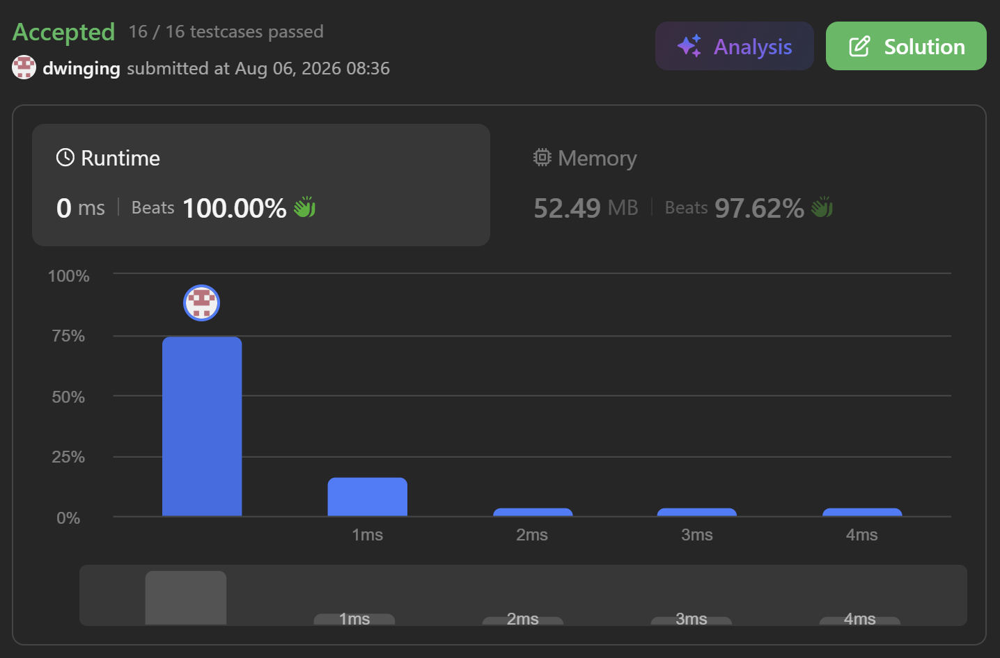

### LeetCode 540 [Single Element in a Sorted Array](https://leetcode.com/problems/single-element-in-a-sorted-array/description/) (Java)

> **날짜:** 2026년 8월 6일 <br>
> **알고리즘:** 이진 탐색<br>
> **언어:**  Java <br>
> **핵심 키워드:** 이진 탐색

## 📌 문제 개요

* 오름차순으로 정렬된 정수 배열에서, 한 원소만 한 번 등장하고 나머지 모든 원소는 정확히 두 번씩 등장한다.
* 배열에서 한 번만 등장하는 원소를 찾아 반환해야 한다.
* 배열은 정렬되어 있으므로 동일한 값은 항상 서로 인접한 위치에 존재한다.
* 배열의 길이는 최대 `100,000`이므로 선형 탐색으로도 값을 찾을 수 있지만, 문제에서는 다음 시간 및 공간 복잡도를 요구한다.

```text
시간 복잡도: O(log N)
공간 복잡도: O(1)
```

* 따라서 추가 자료구조를 사용하지 않고, 이분 탐색을 통해 한 번만 등장하는 원소가 포함된 범위를 지속적으로 좁혀야 한다.

---

## 💡 풀이 핵심 (Core Logic)

### 1. 정렬된 배열의 쌍 구조 활용

* 한 번만 등장하는 원소를 제외한 모든 값은 정확히 두 번씩 등장한다.
* 배열이 정렬되어 있으므로 중복 원소는 반드시 인접한 두 칸을 차지한다.

```text
[a, a] [b, b] [c] [d, d] [e, e]
```

* 한 번만 등장하는 원소가 포함된 구간의 원소 개수는 홀수이고, 해당 원소가 포함되지 않은 구간의 원소 개수는 짝수이다.
* 따라서 중앙값이 속한 중복 쌍을 확인한 뒤, 해당 쌍의 양쪽에 남는 범위의 길이를 비교하면 한 번만 등장하는 원소가 어느 방향에 있는지 판단할 수 있다.

---

### 2. 중앙 원소와 인접 원소 비교

* 현재 탐색 범위의 중앙 인덱스를 `mid`라고 한다.
* `nums[mid]`를 양옆의 원소와 비교하여 중복 여부를 확인한다.

```text
nums[mid] != nums[mid - 1]
nums[mid] != nums[mid + 1]
```

* 두 조건을 모두 만족한다면 `nums[mid]`는 양쪽 어느 원소와도 중복되지 않는다.
* 따라서 해당 값이 한 번만 등장하는 원소이므로 즉시 반환할 수 있다.

---

### 3. 중앙값이 포함된 중복 쌍의 범위 지정

* `nums[mid]`가 왼쪽 또는 오른쪽 원소와 같다면, 중앙값이 포함된 중복 쌍의 시작 위치와 끝 위치를 각각 `m1`, `m2`로 설정한다.

```text
nums[mid] == nums[mid - 1]
m1 = mid - 1
m2 = mid
```

또는

```text
nums[mid] == nums[mid + 1]
m1 = mid
m2 = mid + 1
```

* `[m1, m2]`는 동일한 값으로 구성된 하나의 정상적인 쌍이므로, 한 번만 등장하는 원소가 될 수 없다.
* 따라서 해당 쌍을 제외한 왼쪽 또는 오른쪽 구간 중 하나만 다음 탐색 범위로 선택하면 된다.

---

### 4. 양쪽 범위의 길이로 탐색 방향 결정

* 중복 쌍 `[m1, m2]`를 기준으로 왼쪽 범위와 오른쪽 범위를 구분한다.

```text
왼쪽 범위: left ~ m1 - 1
오른쪽 범위: m2 + 1 ~ right
```

* 한 번만 등장하는 원소가 포함된 범위는 전체 원소 개수가 홀수이다.
* 반대로 모든 원소가 정상적인 쌍으로 구성된 범위는 원소 개수가 짝수이다.

왼쪽 범위의 원소 개수는 다음과 같다.

```text
m1 - left
```

오른쪽 범위의 원소 개수는 다음과 같다.

```text
right - m2
```

* 왼쪽 범위의 길이가 홀수라면 한 번만 등장하는 원소는 왼쪽에 존재한다.

```text
right = m1 - 1
```

* 왼쪽 범위의 길이가 짝수라면 왼쪽은 모두 정상적인 쌍으로 구성되어 있으므로, 한 번만 등장하는 원소는 오른쪽에 존재한다.

```text
left = m2 + 1
```

* 오른쪽 범위의 길이를 기준으로 동일하게 판단해도 같은 결과를 얻을 수 있다.

---

### 5. 탐색 범위 갱신

* 각 반복에서 중앙값이 포함된 중복 쌍을 탐색 범위에서 제외한다.
* 이후 한 번만 등장하는 원소가 포함된 홀수 길이의 구간만 남기도록 `left` 또는 `right`를 갱신한다.
* 탐색 범위의 크기는 매 반복마다 절반 수준으로 감소한다.
* 최종적으로 `left`와 `right`가 같은 위치를 가리키면 해당 위치의 원소가 정답이다.

---

### 6. 시간 복잡도

* 매 탐색마다 확인해야 할 범위가 절반씩 감소하므로 시간 복잡도는 다음과 같다.

```text
O(log N)
```

* 변수만 사용하여 탐색 범위를 관리하므로 추가 공간 복잡도는 다음과 같다.

```text
O(1)
```

---

## 🧠 회고 및 결론

홀짝 규칙을 활용하여 탐색 범위를 선택하는 이진 탐색 문제였다. 코드는 간단하지만, 홀짝 규칙을 찾아야해서 발상이 재밌는 문제였다.

---

### 📂 소스 코드
*   [Solution.java](./Solution.java)
 
---

### 🖥️ 실행 결과



---