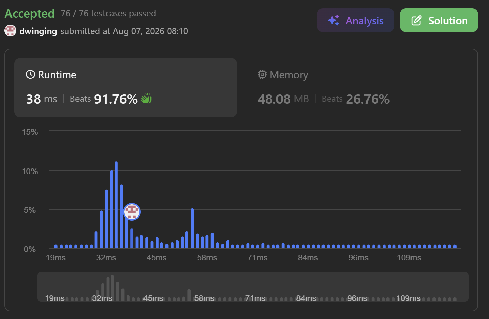

### LeetCode 1631 [Path With Minimum Effort](https://leetcode.com/problems/path-with-minimum-effort/description/) (Java)

> **날짜:** 2026년 8월 7일 <br>
> **알고리즘:** 다익스트라 <br>
> **언어:**  Java <br>
> **핵심 키워드:** 다익스트라

## 📌 문제 개요

* `rows x columns` 크기의 2차원 배열 `heights`가 주어지며, `heights[row][col]`은 해당 위치의 높이를 나타낸다.
* 시작 위치는 좌측 상단인 `(0, 0)`이고, 도착 위치는 우측 하단인 `(rows - 1, columns - 1)`이다.
* 현재 위치에서는 상하좌우로 인접한 칸으로 이동할 수 있다.
* 두 인접한 칸 사이를 이동할 때 발생하는 비용은 두 칸의 높이 차이의 절댓값이다.

```text
이동 비용 = |현재 칸의 높이 - 다음 칸의 높이|
```

* 하나의 경로에서 발생하는 `effort`는 모든 이동 비용의 합이 아니라, 경로에 포함된 이동 중 가장 큰 높이 차이로 정의된다.

```text
경로의 effort = 경로에 포함된 간선 가중치의 최댓값
```

* 따라서 시작점에서 도착점까지 이동할 수 있는 여러 경로 중, 경로의 최대 높이 차이가 가장 작은 값을 구해야 한다.
* 배열의 최대 크기는 `100 x 100`이므로 각 칸을 정점으로 보고, 인접한 칸 사이를 간선으로 구성한 그래프 탐색 방식으로 해결할 수 있다.

---

## 💡 풀이 핵심 (Core Logic)

### 1. 각 칸을 그래프의 정점으로 해석

* `heights`의 각 칸을 하나의 정점으로 본다.
* 상하좌우로 인접한 두 칸 사이에는 이동 가능한 간선이 존재한다.
* 각 간선의 가중치는 두 칸의 높이 차이의 절댓값이다.

```text
edgeWeight = |heights[row][col] - heights[nextRow][nextCol]|
```

* 문제는 일반적인 최단 거리처럼 간선 가중치의 합을 최소화하는 것이 아니다.
* 하나의 경로에서 사용한 간선 중 가장 큰 가중치를 최소화해야 하는 최소 최대 경로 문제이다.

---

### 2. 각 칸까지의 최소 effort 관리

* `effort[row][col]`은 시작점 `(0, 0)`에서 해당 칸까지 이동할 때 필요한 최소 `effort`를 의미한다.
* 시작점은 이동이 발생하지 않으므로 초기값을 `0`으로 설정한다.

```text
effort[0][0] = 0
```

* 나머지 칸은 아직 도달하지 않은 상태이므로 충분히 큰 값으로 초기화한다.

```text
effort[row][col] = INF
```

* 우선순위 큐에는 현재까지의 `effort`가 작은 상태부터 처리할 수 있도록 다음 정보를 저장한다.

```text
현재 effort
현재 행
현재 열
```

---

### 3. 다음 칸으로 이동할 때 기존 effort 유지

* 현재 칸까지 도달하는 데 사용한 `effort`가 `currentEffort`라고 가정한다.
* 인접한 다음 칸으로 이동할 때 새롭게 발생하는 높이 차이는 다음과 같다.

```text
heightDiff =
    |heights[row][col] - heights[nextRow][nextCol]|
```

* 다음 칸까지의 경로 비용은 현재 간선의 높이 차이만으로 결정되지 않는다.
* 이전 경로에서 이미 더 큰 높이 차이가 발생했을 수 있으므로, 기존 `effort`와 현재 높이 차이 중 큰 값을 유지해야 한다.

```text
nextEffort = max(currentEffort, heightDiff)
```

* 즉, 경로를 확장할 때마다 해당 경로에서 지금까지 발생한 최대 높이 차이를 계속 유지한다.

---

### 4. 더 작은 effort를 발견한 경우 갱신

* 계산된 `nextEffort`가 기존에 저장된 다음 칸의 `effort`보다 작다면 더 좋은 경로를 발견한 것이다.

```text
nextEffort < effort[nextRow][nextCol]
```

* 이 경우 다음 칸의 값을 갱신하고, 해당 상태를 우선순위 큐에 추가한다.

```text
effort[nextRow][nextCol] = nextEffort
```

* 반대로 기존 값보다 크거나 같다면 이미 동일하거나 더 적은 effort로 도달한 경로가 존재하므로 갱신하지 않는다.

---

### 5. 우선순위 큐를 이용한 다익스트라 탐색

* 우선순위 큐에서 현재 `effort`가 가장 작은 상태를 먼저 꺼낸다.
* 일반적인 다익스트라 알고리즘은 누적 가중치의 합을 기준으로 탐색하지만, 이 문제에서는 경로에서 발생한 최대 간선 가중치를 기준으로 탐색한다.

```text
일반 다익스트라:
nextCost = currentCost + edgeWeight

현재 문제:
nextEffort = max(currentEffort, edgeWeight)
```

* 비용 계산 방식만 다를 뿐, 더 작은 비용의 상태를 우선 처리하고 이미 저장된 값보다 큰 상태를 무시하는 구조는 동일하다.
* 우선순위 큐에서 꺼낸 값이 해당 칸에 저장된 최소 `effort`보다 크다면 오래된 상태이므로 탐색에서 제외한다.

```text
currentEffort > effort[row][col]
```

---

### 6. 도착점에 도달하면 즉시 종료

* 우선순위 큐는 항상 현재 가능한 상태 중 `effort`가 가장 작은 상태를 먼저 반환한다.
* 따라서 도착점 `(rows - 1, columns - 1)`이 큐에서 처음 꺼내지는 순간, 해당 값은 도착점까지 필요한 최소 `effort`로 확정된다.

```text
row == rows - 1
col == columns - 1
```

* 이후 더 작은 값으로 도착할 수 없으므로 현재 `effort`를 즉시 반환할 수 있다.

---

### 7. 시간 및 공간 복잡도

* 전체 칸의 개수를 `V`라고 하면 다음과 같다.

```text
V = rows × columns
```

* 각 칸은 최대 네 개의 인접 칸과 연결되므로 간선의 개수는 `O(V)`이다.
* 우선순위 큐를 사용하는 다익스트라 알고리즘의 시간 복잡도는 다음과 같다.

```text
시간 복잡도: O(V log V)
```

* 이를 행과 열 기준으로 표현하면 다음과 같다.

```text
O(rows × columns × log(rows × columns))
```

* 각 칸의 최소 `effort`를 저장하는 배열과 우선순위 큐를 사용하므로 공간 복잡도는 다음과 같다.

```text
공간 복잡도: O(rows × columns)
```

---

## 🧠 회고 및 결론

일반적인 다익스트라 문제다. 높이의 최댓값을 유지해야한다는 점만 유의하면 쉽게 풀린다.

---

### 📂 소스 코드
*   [Solution.java](./Solution.java)
 
---

### 🖥️ 실행 결과



---