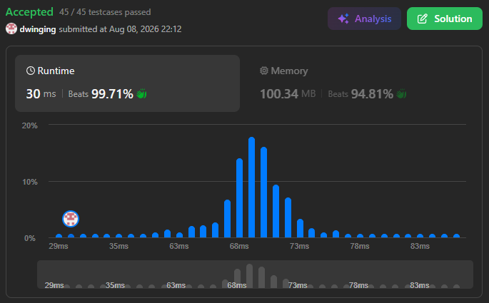

### LeetCode 1353 [Maximum Number of Events That Can Be Attended](https://leetcode.com/problems/maximum-number-of-events-that-can-be-attended/description/) (Java)

> **날짜:** 2026년 8월 8일 <br>
> **알고리즘:** Union-Find<br>
> **언어:**  Java <br>
> **핵심 키워드:** Union-Find, 우선순위 큐, 상태 관리

## 📌 문제 개요

* 각 이벤트는 `[startDay, endDay]` 구간으로 주어지며, 해당 기간 중 하루를 선택해 참석할 수 있다.
* 하루에는 하나의 이벤트에만 참석할 수 있다.
* 따라서 각 이벤트의 범위 안에서 서로 겹치지 않는 날짜를 하나씩 배정하여, 참석 가능한 이벤트의 최대 개수를 구해야 한다.

---

## 💡 풀이 핵심 (Core Logic)

### 1. 종료 날짜를 기준으로 이벤트 정렬

* 선택 가능한 기간이 먼저 끝나는 이벤트부터 처리하기 위해 `endDay`를 기준으로 오름차순 정렬한다.
* 종료 날짜가 같은 경우에는 `startDay`가 큰 이벤트를 먼저 처리하여 선택 가능한 범위가 좁은 이벤트에 우선순위를 둔다.

```text
endDay 오름차순
→ endDay가 같다면 startDay 내림차순
```

### 2. Union-Find로 가장 빠른 미사용 날짜 탐색

* 각 날짜를 하나의 사용 가능한 슬롯으로 보고, `find(startDay)`를 통해 `startDay` 이상에서 아직 사용하지 않은 가장 빠른 날짜를 찾는다.
* 찾은 날짜가 `endDay` 이하면 해당 이벤트에 참석할 수 있다.

```text
day = find(startDay)

day <= endDay
→ 참석 가능
```

### 3. 사용한 날짜를 다음 날짜와 연결

* 이벤트에 날짜를 배정한 뒤에는 해당 날짜를 다시 사용할 수 없으므로 다음 미사용 날짜와 연결한다.

```text
parents[day] = find(day + 1)
```

* 이후 같은 날짜를 탐색하더라도 경로 압축을 통해 이미 사용된 날짜를 건너뛰고 다음 사용 가능한 날짜를 빠르게 찾을 수 있다.

---

## 🧠 회고 및 결론

상태 관리 문제다. 보통 날짜와 범위 내 최댓값을 구하는 유형은 우선순위 큐를 사용하는 경우가 많지만, 이 문제는 Union-Find를 쓰면 쉽게 풀 수 있다.

정해는 우선순위 큐인것 같은데, 이전에 비슷한 문제를 Union-Find로 푼 경험이 있어서, Union-Find 풀이를 먼저 떠올리게 되었다.

---

### 📂 소스 코드
*   [Solution.java](./Solution.java)
 
---

### 🖥️ 실행 결과



---