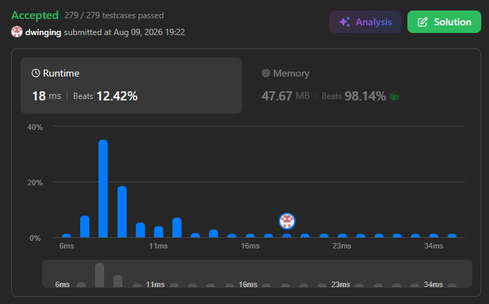

### LeetCode 1946 [Largest Number After Mutating Substring](https://leetcode.com/problems/largest-number-after-mutating-substring/description/) (Java)

> **날짜:** 2026년 8월 9일 <br>
> **알고리즘:** 그리디 <br>
> **언어:**  Java <br>
> **핵심 키워드:** 그리디

=## 📌 문제 개요

* 큰 정수를 나타내는 문자열 `num`과 각 숫자 `0~9`의 변경 값을 나타내는 배열 `change`가 주어진다.
* 숫자 `d`는 `change[d]`로 변경할 수 있다.
* 단, 변경은 `num`의 **하나의 연속된 부분 문자열**에 대해서만 수행할 수 있으며, 아무 구간도 변경하지 않는 것도 가능하다.
* 선택한 구간 내부의 모든 숫자는 반드시 대응되는 `change` 값으로 변경해야 한다.
* 가능한 결과 중 가장 큰 정수를 만들어 문자열 형태로 반환해야 한다.

---

## 💡 풀이 핵심 (Core Logic)

### 1. 실제로 값이 증가하는 위치에서 변경 시작

* 앞자리의 값이 전체 정수의 크기에 더 큰 영향을 주므로 왼쪽부터 순차적으로 확인한다.
* 아직 변경을 시작하지 않은 상태에서는 현재 숫자 `d`에 대해 `change[d] > d`인 경우에만 변경을 시작한다.
* `change[d] == d`인 경우에는 결과가 증가하지 않으므로 변경 구간의 시작점으로 선택하지 않는다.

```text
change[d] > d
→ 변경 시작
```

### 2. 변경 시작 후에는 같거나 큰 값까지 연속 적용

* 한 번 변경을 시작하면 선택 구간은 반드시 연속되어야 한다.
* 따라서 이후 숫자는 `change[d] >= d`인 동안 계속 변경한다.
* 동일한 값으로 변경되는 경우에도 결과가 감소하지 않으므로 현재 변경 구간에 포함할 수 있다.

```text
change[d] >= d
→ 변경 계속
```

### 3. 값이 감소하는 순간 변경 종료

* 변경 도중 `change[d] < d`인 위치가 나오면 해당 숫자까지 변경할 경우 결과가 작아진다.
* 따라서 해당 위치에서 변경 구간을 종료하고, 이후 숫자는 모두 원래 값을 유지한다.
* 문제에서 변경 가능한 부분 문자열은 하나뿐이므로 한 번 종료한 이후에는 다시 변경을 시작할 수 없다.

```text
change[d] < d
→ 변경 종료
→ 이후 원본 유지
```

* 전체 문자열을 한 번만 순회하면 되므로 시간 복잡도는 `O(N)`이다.

---

## 🧠 회고 및 결론

가볍게 풀기 좋은 그리디 문제다.

---

### 📂 소스 코드
*   [Solution.java](./Solution.java)
 
---

### 🖥️ 실행 결과



---