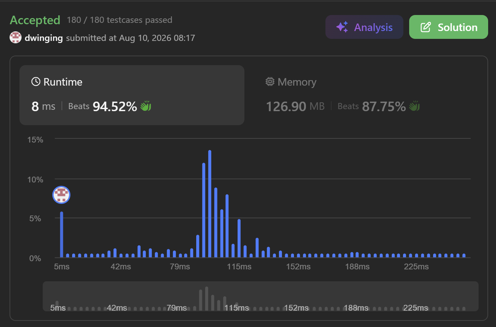

### LeetCode 2007 [Find Original Array From Doubled Array](https://leetcode.com/problems/find-original-array-from-doubled-array/description/) (Java)

> **날짜:** 2026년 8월 10일 <br>
> **알고리즘:** 그리디 <br>
> **언어:**  Java <br>
> **핵심 키워드:** 그리디

## 📌 문제 개요

* 정수 배열 `original`의 각 원소 `x`에 대해 `2 * x`를 추가한 뒤 전체 순서를 섞어 `changed` 배열을 만든다.
* 주어진 `changed`가 이러한 방식으로 만들어질 수 있는지 확인하고, 가능하다면 원본 배열 `original`을 반환해야 한다.
* `changed`의 원소 순서는 임의로 섞여 있으므로 각 값의 등장 횟수를 기준으로 원본 값과 두 배 값의 쌍을 찾아야 한다.
* `changed`의 길이가 홀수라면 원본 값과 두 배 값으로 정확히 나눌 수 없으므로 즉시 빈 배열을 반환한다.
* `changed[i]`의 값이 최대 `100,000`이므로 값의 범위를 이용한 카운팅 배열을 사용할 수 있다.

---

## 💡 풀이 핵심 (Core Logic)

### 1. 각 숫자의 등장 횟수 기록

* `changed`의 모든 값을 카운팅 배열에 저장한다.
* 배열을 직접 정렬하지 않고도 작은 값부터 순서대로 확인할 수 있다.

```text
val[x]
→ changed에서 x가 등장한 횟수
```

* 어떤 값 `x`가 원본에 포함된다면 `changed`에는 반드시 동일한 개수의 `2 * x`가 존재해야 한다.

---

### 2. 작은 값부터 두 배 값과 짝을 구성

* `1`부터 순차적으로 값을 확인한다.
* 현재 `x`가 `temp`개 남아 있다면 이 값들은 모두 원본 배열에 포함되어야 한다.
* 따라서 `2 * x`가 최소 `temp`개 존재하는지 확인한다.

```text
val[2 * x] >= val[x]
→ x를 원본에 추가 가능
```

* 조건을 만족하면 `x`를 `val[x]`개만큼 결과 배열에 추가하고, 사용한 두 배 값의 개수를 차감한다.

```text
val[2 * x] -= val[x]
```

* 작은 값부터 처리하기 때문에 이전 단계에서 어떤 값이 다른 숫자의 두 배 값으로 사용되었다면 이미 해당 개수만큼 제거되어 있다.
* 따라서 현재 남아 있는 `val[x]`는 원본 배열에 포함되어야 하는 `x`의 개수로 볼 수 있다.

---

### 3. `0`은 별도로 처리

* 일반적인 양수와 달리 `0`은 두 배를 해도 동일한 값이다.

```text
0 * 2 = 0
```

* 따라서 `changed`에 존재하는 `0`은 두 개씩 하나의 원본 `0`과 대응되어야 한다.
* `0`의 개수가 홀수라면 정상적인 doubled 배열을 구성할 수 없다.

```text
val[0] % 2 == 1
→ 구성 불가능
```

* 개수가 짝수라면 절반만큼의 `0`을 원본 배열에 추가한다.

---

### 4. 두 배 값을 만들 수 없는 큰 값 처리

* 입력 값의 최댓값이 `100,000`이므로 `x > 50,000`인 경우 `2 * x`는 입력 가능한 범위를 벗어난다.
* 따라서 이러한 값은 다른 작은 값의 두 배로 소비되는 경우에만 `changed`에 존재할 수 있다.
* `1 ~ 50,000`까지 모든 값을 처리한 후에도 결과 배열의 크기가 `changed.length / 2`보다 작다면 정상적으로 짝을 구성하지 못한 값이 남아 있다는 의미이다.

```text
result.length != changed.length / 2
→ 구성 불가능
```

* 모든 값이 정상적으로 짝을 이루었다면 완성된 원본 배열을 반환한다.

---

* `changed` 배열을 한 번 순회하고 값의 범위 `0 ~ 100,000`을 순차적으로 확인하므로 시간 복잡도는 `O(N + M)`이다.
* 여기서 `M`은 값의 최대 범위인 `100,000`이며, 카운팅 배열을 사용하므로 공간 복잡도는 `O(M)`이다.

---

## 🧠 회고 및 결론

문제는 쉬운데 예외처리가 많아서 까다로웠다.

---

### 📂 소스 코드
*   [Solution.java](./Solution.java)
 
---

### 🖥️ 실행 결과



---