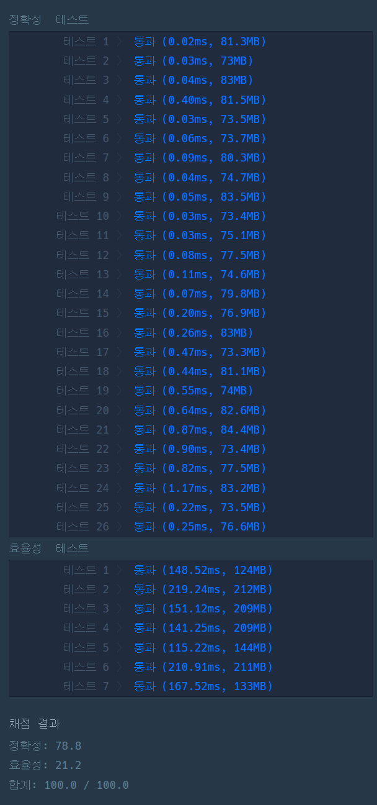

### 프로그래머스 Lv4 [호텔 방 배정](https://school.programmers.co.kr/learn/courses/30/lessons/64063/) (Java)

> **날짜:** 2026년 8월 11일 <br>
> **알고리즘:** 희소 배열, Union-Find, 자료구조<br>
> **언어:**  Java <br>
> **핵심 키워드:** 희소 배열, Union-Find, 자료구조

## 📌 문제 개요

* 호텔에는 `1번`부터 `k번`까지 총 `k`개의 방이 있으며, 처음에는 모든 방이 비어 있다.
* 각 고객은 원하는 방 번호를 하나씩 제출하며, 신청 순서대로 방을 배정한다.
* 고객이 원하는 방이 비어 있다면 해당 방을 그대로 배정한다.
* 원하는 방이 이미 사용 중이라면, 해당 방보다 번호가 크면서 비어 있는 방 중 가장 번호가 작은 방을 배정해야 한다.
* 전체 방의 개수 `k`는 최대 `10^12`이므로, 모든 방의 상태를 배열로 직접 관리할 수 없다.
* 반면 실제 요청의 개수는 최대 `200,000`개이므로, 요청 과정에서 사용된 방만 별도로 관리하는 방식이 필요하다.

---

## 💡 풀이 핵심 (Core Logic)

### 1. 전체 방이 아닌 사용된 방만 관리

* `k`의 범위가 최대 `10^12`이므로 방 번호를 인덱스로 사용하는 배열을 생성할 수 없다.
* 하지만 실제로 배정되는 방의 개수는 `room_number.length`를 넘지 않는다.
* 따라서 모든 방의 상태를 저장하지 않고, 실제로 사용된 방 번호만 `HashMap`에 저장한다.

```text
전체 방 범위: 최대 10^12
실제 관리 대상: 최대 200,000개
```

* 이를 통해 매우 큰 범위의 데이터를 필요한 부분만 저장하는 희소 구조로 관리할 수 있다.

### 2. 방 번호와 배열 인덱스를 매핑

* `HashMap<Long, Integer>`를 사용하여 배정된 방 번호와 해당 방의 인덱스를 연결한다.
* 실제 다음 탐색 위치는 `long[] num` 배열에 저장한다.

```text
map
방 번호 → 배열 인덱스

num[index]
해당 방이 사용 중일 때 다음으로 확인할 방 번호
```

* 새로운 방 `room`이 배정되면 다음 탐색 후보는 `room + 1`이므로 다음과 같이 저장한다.

```text
num[index] = room + 1
```

### 3. 이미 사용된 방은 다음 후보로 이동

* 요청한 방이 `HashMap`에 존재하지 않는다면 아직 비어 있는 방이므로 즉시 반환한다.
* 이미 사용된 방이라면 `num`에 저장된 다음 후보 방으로 이동하여 다시 빈 방을 탐색한다.

```text
room 사용 중
→ num[index] 확인
→ 다음 방 탐색
```

* 이 과정을 반복하면 요청한 방 이상에서 가장 가까운 빈 방을 찾을 수 있다.

### 4. 경로 압축으로 이후 탐색 최적화

* 연속된 방이 이미 배정된 경우 매번 하나씩 이동하면 동일한 구간을 반복해서 탐색할 수 있다.
* 따라서 `find` 과정에서 최종적으로 찾은 빈 방 번호를 이전 노드의 `num`에 바로 저장한다.

```text
1 → 2 → 3 → 4

find(1) 수행 후

1 ─────→ 4
2 ──→ 4
3 → 4
```

* 이후 동일하거나 인접한 방 번호가 다시 요청되면 이미 압축된 경로를 이용하여 빠르게 다음 후보로 이동할 수 있다.
* `HashMap`은 방 번호와 인덱스의 매핑만 유지하고, 경로 압축에 따른 값 변경은 배열에서 수행한다.

### 5. 요청 순서대로 방 배정

* 각 고객의 요청 방 번호에 대해 `find`를 수행하여 실제 배정 가능한 방을 찾는다.
* 찾은 방을 결과 배열에 저장하고, 해당 방을 새로운 노드로 등록한다.

```text
요청 방
→ find
→ 가장 가까운 빈 방 탐색
→ 방 배정
→ 다음 후보 저장
```

* 전체 탐색 과정에서 경로 압축이 적용되므로 이미 확인한 구간을 반복해서 탐색하는 비용을 줄일 수 있다.
* 관리하는 데이터의 크기는 전체 방 개수 `k`가 아니라 실제 고객 수 `N`에 비례한다.

```text
공간 복잡도: O(N)
```

---


## 🧠 회고 및 결론

익숙한 유형의 Union-Find 문제다. 다만, 배열의 최댓값이 10<sup>12</sup>이다 보니 기존에 주로 사용하던 배열 풀이는 사용할 수 없는 것이 특징이었다.

배열을 다른 자료구조를 활용해 표현하는 것에 대한 고민을 많이 했다. 연결 리스트를 사용해서 이분 탐색을 먼저 떠올렸지만, 일단 연결 리스트와 이분 탐색은 서로 효율이 좋지 않다.

그렇다고 연결 리스트를 배열로 변경하면 중간 삽입 과정에서 배열 복사가 발생하기 때문에 이 또한 성능이 좋지 않다.

그래서 떠올린 방법이 연결 관계는 배열에 유지하고, 실제 방 번호는 HashMap을 사용해 배열의 idx와 매핑하는 방식이었다.

결과적으로 10<sup>12</sup> 크기의 배열을 직접 만들지 않고도, 기존 배열 기반 Union-Find와 비슷하게 경로 압축을 적용해서 문제를 해결할 수 있었다.

---

### 📂 소스 코드
*   [Solution.java](./Solution.java)
 
---

### 🖥️ 실행 결과



---