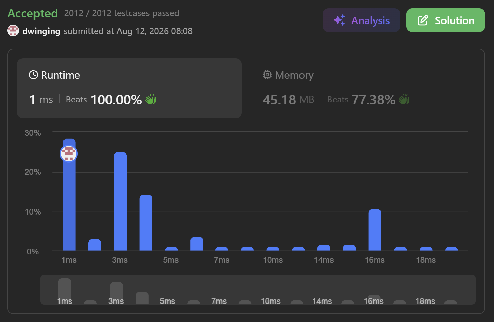

### LeetCode 2708 [Maximum Strength of a Group](https://leetcode.com/problems/maximum-strength-of-a-group/description/) (Java)

> **날짜:** 2026년 8월 12일 <br>
> **알고리즘:** 그리디 <br>
> **언어:**  Java <br>
> **핵심 키워드:** 그리디

## 📌 문제 개요

* 정수 배열 `nums`가 주어지며, 각 원소는 학생의 점수를 의미한다.
* 학생을 한 명 이상 선택하여 하나의 그룹을 구성해야 한다.
* 그룹의 `strength`는 선택한 학생들의 점수를 모두 곱한 값으로 정의된다.
* 전체 학생을 반드시 선택할 필요는 없으며, 일부 학생만 선택할 수 있다.
* 음수가 포함되어 있으므로 음수의 개수에 따라 전체 곱의 부호가 달라질 수 있다.
* `0`을 선택하면 전체 곱이 `0`이 되므로, 양수 결과를 만들 수 있는 경우에는 선택하지 않는 것이 유리하다.
* 가능한 모든 비어 있지 않은 그룹 중 `strength`가 최대가 되는 값을 반환한다.

---

## 💡 풀이 핵심 (Core Logic)

### 1. `0`을 제외한 모든 값을 우선 곱하기

* 최대 곱을 구하는 것이 목적이므로 `0`은 우선 곱셈 대상에서 제외한다.
* `0`이 아닌 값들은 모두 곱하여 전체 결과를 계산한다.

```text
양수 → 곱할수록 결과 증가
음수 2개 → 곱하면 양수

0 → 곱하면 전체 결과가 0
```

* 동시에 실제로 곱한 원소의 개수를 저장하여 이후 예외 상황을 판단한다.

### 2. 가장 큰 음수 값을 함께 저장

* 음수의 개수가 홀수라면 전체 곱은 음수가 된다.
* 이 경우 음수 하나를 제외해야 양수 결과를 만들 수 있다.
* 곱의 크기를 최대한 유지하기 위해 절댓값이 가장 작은 음수, 즉 값이 가장 큰 음수를 제거한다.

```text
음수: -9, -5, -1

제거 대상: -1
```

* 따라서 배열을 순회하면서 가장 큰 음수 값을 함께 저장한다.

### 3. 전체 곱이 음수인 경우 음수 하나 제거

* 모든 `0`이 아닌 값을 곱한 결과가 음수라면 음수의 개수가 홀수라는 의미이다.
* 저장해 둔 가장 큰 음수를 전체 곱에서 제외하여 결과를 양수로 만든다.

```text
res < 0

→ 가장 큰 음수 하나 제거
→ res / val
```

* 다만 `0`이 아닌 값이 음수 하나뿐이라면 해당 값을 제거할 경우 그룹이 비게 된다.
* 이때 배열에 `0`이 존재한다면 음수 하나를 선택하는 것보다 `0` 하나를 선택하는 것이 더 큰 결과가 된다.

```text
[-5, 0]

-5 < 0

최대 strength = 0
```

### 4. `0`만 존재하는 경우 처리

* 배열에 `0`을 제외하고 선택할 수 있는 값이 하나도 없다면 초기 곱셈값만 남게 된다.
* 그룹은 반드시 한 명 이상이어야 하므로 이 경우 `0`을 선택해야 한다.

```text
[0, 0, 0]

최대 strength = 0
```

* 따라서 실제로 곱한 원소의 개수가 `0`인 경우 결과를 `0`으로 처리한다.

### 5. 원소가 하나인 경우 그대로 반환

* 배열의 길이가 `1`이면 선택 가능한 그룹은 해당 원소 하나뿐이다.
* 값이 양수, 음수, `0`인지와 관계없이 해당 값을 그대로 반환한다.

```text
[5]  → 5
[-5] → -5
[0]  → 0
```

* 이를 통해 그룹이 반드시 비어 있지 않아야 한다는 조건을 만족할 수 있다.

---

* 배열을 한 번만 순회하면서 전체 곱과 필요한 값을 함께 계산한다.
* 별도의 정렬이나 추가 탐색이 필요하지 않으므로 시간 복잡도는 다음과 같다.

```text
시간 복잡도: O(N)
공간 복잡도: O(1)
```
---

## 🧠 회고 및 결론
 
문제가 어렵다기보다 예외가 케이스가 많은 문제였다.

---

### 📂 소스 코드
*   [Solution.java](./Solutiion.java)
 
---

### 🖥️ 실행 결과



---